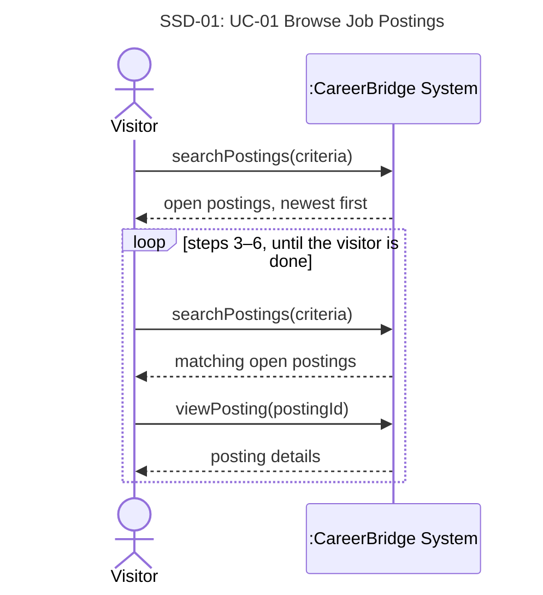

# UC-01 Browse Job Postings — full chain

> Owner: **Oleg Berdyshev** · Jira: FRs SCRUM-46 · UC SCRUM-28 · SSD SCRUM-34 · contracts SCRUM-51
> Chain: **FR + NFR → UC → SSD → operation contracts** ([team-guide.md](../team-guide.md)).
> Working copy: once the team agrees, each part moves into [deliverable-2.md](../deliverable-2.md)
> (§3.1, §3.2, §4.2, §6). The use case is rewritten from Josh's draft in the course format
> (template §4.2 fields; two-column Actor | System scenario with TUCBW / TUCEW, as in Dr. Ren's
> sample documentation); his open issues are settled as assumptions A7–A10.

IDs: `FR-01.n` = functional requirement *n* of UC-01. Business rules BR-1…BR-15 and assumptions
A1…A10 are the team's lists in [deliverable-2.md §2](../deliverable-2.md#business-rules).
An **open posting** is a posting in the *Published* state whose application deadline has not
passed (BR-9, BR-10); filled postings are *Closed* (Close Job Posting).

## 1. Functional requirements

| ID | Requirement | Business rule / assumption | UC-01 step |
|---|---|---|---|
| FR-01.1 | The system shall let any visitor, logged in or not, view the list of open job postings from all organizations. | BR-1, BR-3 | 1–2 |
| FR-01.2 | The system shall show, for each posting in the list, its title, organization, location, employment type and application deadline. | — | 2 |
| FR-01.3 | The system shall order listings and search results by publication date, newest first. | A9 | 2, 4 |
| FR-01.4 | The system shall let a visitor search open postings by keyword and filter them by location, organization and employment type, alone or combined. | A8 | 3–4 |
| FR-01.5 | The system shall show the full details of a selected open posting: title, description, requirements, organization, location, employment type, salary range (if given), deadline and number of openings. | A10 | 5–6 |
| FR-01.6 | The system shall include in listings, searches and posting details only open postings; a posting that is not published is treated as not found. | BR-9, BR-10, A7 | 2, 4, 6, ext. 5a |
| FR-01.7 | The system shall show an Applicant who has already applied to a posting the current stage of that application instead of the offer to apply. | BR-7, A5 | ext. 6b |
| FR-01.8 | The system shall offer to apply for a posting only to visitors who are not logged in and to Applicants. | BR-14 | 6, ext. 6c |

## 2. Non-functional requirements

| ID | Category | Requirement | Business rule |
|---|---|---|---|
| NFR-01.1 | Performance | Search results appear within 2 seconds for up to 10,000 open postings. | — |
| NFR-01.2 | Privacy | Job listings and posting details show no applicant or application data, except that a logged-in Applicant sees the stage of their own application to that posting. | BR-7, BR-15 |
| NFR-01.3 | Compatibility | Job board pages work in the latest versions of the major desktop and mobile browsers (Chrome, Firefox, Safari, Edge). | — |
| NFR-01.4 | Accessibility | Job board pages conform to WCAG 2.1 Level AA. | — |

## 3. Use case

| Field | |
|---|---|
| **Use Case Name** | UC-01 Browse Job Postings |
| **Author** | Oleg Berdyshev |
| **Actor** | Visitor (primary): anyone, logged in or not. Applicants and Recruiters browse as Visitors, since they are specializations of Visitor. |
| **Preconditions** | None. The job board is public; no login is needed (BR-3). |
| **Postconditions** | The visitor has seen the open postings that match their criteria and, optionally, the full details of one posting. Only open postings were shown (BR-9, BR-10, A7). No data in the system has changed. |

**Main Success Scenario**

| Actor: Visitor | System: CareerBridge |
|---|---|
| 1. TUCBW the visitor asks to see the open jobs. | 2. The system shows the open postings of all organizations, newest first (A9), each with its title, organization, location, employment type and application deadline (BR-1, BR-9, BR-10). |
| 3. The visitor enters search criteria: keywords, location, organization and/or employment type (A8). | 4. The system shows the open postings that match all the given criteria, newest first. |
| 5. The visitor chooses a posting to read in full. | 6. The system shows the posting's full details — title, description, requirements, organization, location, employment type, salary range if given (A10), deadline and number of openings — and offers to apply for it. |
| 7. TUCEW the visitor views the full details of the chosen posting. | |

The visitor may repeat steps 3–6 any number of times.

**Extensions**

- **\*a.** The system fails at any step: the system shows an error message and keeps the visitor's
  search criteria; the visitor retries and the use case resumes at the failed step.
- **2a.** No postings are open: the system says there are no open positions right now. The use case
  ends.
- **4a.** No postings match the criteria: the system says so and suggests removing filters; the
  visitor revises the criteria and the use case resumes at step 3.
- **5a.** The chosen posting has closed since the list was shown (deadline passed or filled, BR-10):
  the system says the posting no longer accepts applications; the use case resumes at step 4 with
  the visitor's criteria.
- **6a.** The visitor asks to apply: Apply for Job (UC-04) begins for this posting. (UC-04 asks a
  visitor who is not logged in to log in or register first.)
- **6b.** The visitor is an Applicant who already applied to this posting: instead of offering to
  apply, the system shows the current stage of that application (BR-7) and a way to track it (UC-05).
- **6c.** The visitor is logged in as a Recruiter: the system shows the posting's details without the
  offer to apply, since only Applicants can apply (BR-14).

**Special Requirements**

- No login is needed (BR-3); no applicant or application data is shown, except an Applicant's own
  application stage (BR-7, BR-15) → NFR-01.2.
- Search results appear within 2 seconds for up to 10,000 open postings → NFR-01.1.
- Works in the latest major desktop and mobile browsers and conforms to WCAG 2.1 AA → NFR-01.3,
  NFR-01.4.

## 4. System sequence diagram

**SSD-01: UC-01 Browse Job Postings (main success scenario)**

The system is one black box; only actor ↔ system messages are shown. Steps 1–2 are
`searchPostings(criteria)` with empty criteria, so the use case has two system operations.

## 5. Operation contracts

Both UC-01 system operations are queries: they create, delete or modify no objects or
associations, so the Output row states what they return.

### Contract CO-01.1: searchPostings

| | |
|---|---|
| **Operation** | `searchPostings(criteria: SearchCriteria)` — criteria: keywords, location, organization, employment type; all may be empty (steps 1–2) |
| **Cross-references** | UC-01 steps 1–4, extensions 2a, 4a · FR-01.1, FR-01.2, FR-01.3, FR-01.4, FR-01.6 · NFR-01.1, NFR-01.2 |
| **Preconditions** | None — the job board is public (BR-3). |
| **Postconditions** | None — query operation; no objects are created, deleted or modified, and no associations change. |
| **Output** | Every `JobPosting` in the *Published* state whose deadline has not passed (BR-9, BR-10) and that matches all given criteria (A8), ordered by publication date, newest first (A9); each with title, organization name, location, employment type and deadline. |

### Contract CO-01.2: viewPosting

| | |
|---|---|
| **Operation** | `viewPosting(postingId: PostingID)` |
| **Cross-references** | UC-01 steps 5–6, extensions 5a, 6b, 6c · FR-01.5, FR-01.6, FR-01.7, FR-01.8 · NFR-01.2 |
| **Preconditions** | None — the job board is public (BR-3). |
| **Postconditions** | None — query operation; no objects are created, deleted or modified, and no associations change. |
| **Output** | If the `JobPosting` is *Published* and its deadline has not passed: its full details (FR-01.5), with the offer to apply for visitors who are not logged in and for Applicants (FR-01.8); for an Applicant who has an `Application` to it, that application's current stage instead of the offer (BR-7). If it is *Closed* or past its deadline: a notice that it no longer accepts applications (ext. 5a). If it does not exist or is not published (Pending Approval, Returned): not found (BR-9). |

## 6. Traceability

| FR / NFR | UC-01 | SSD-01 operation | Contract |
|---|---|---|---|
| FR-01.1 | steps 1–2 | `searchPostings(criteria)` | CO-01.1 |
| FR-01.2 | step 2 | `searchPostings(criteria)` | CO-01.1 |
| FR-01.3 | steps 2, 4 | `searchPostings(criteria)` | CO-01.1 |
| FR-01.4 | steps 3–4 | `searchPostings(criteria)` | CO-01.1 |
| FR-01.5 | steps 5–6 | `viewPosting(postingId)` | CO-01.2 |
| FR-01.6 | steps 2, 4, 6, ext. 5a | both | CO-01.1, CO-01.2 |
| FR-01.7 | ext. 6b | `viewPosting(postingId)` | CO-01.2 |
| FR-01.8 | step 6, ext. 6c | `viewPosting(postingId)` | CO-01.2 |
| NFR-01.1 | Special Req. | `searchPostings(criteria)` | CO-01.1 |
| NFR-01.2 | Special Req. | both | CO-01.1, CO-01.2 |
| NFR-01.3 | Special Req. | all operations (quality attribute) | not a contract item |
| NFR-01.4 | Special Req. | all operations (quality attribute) | not a contract item |
