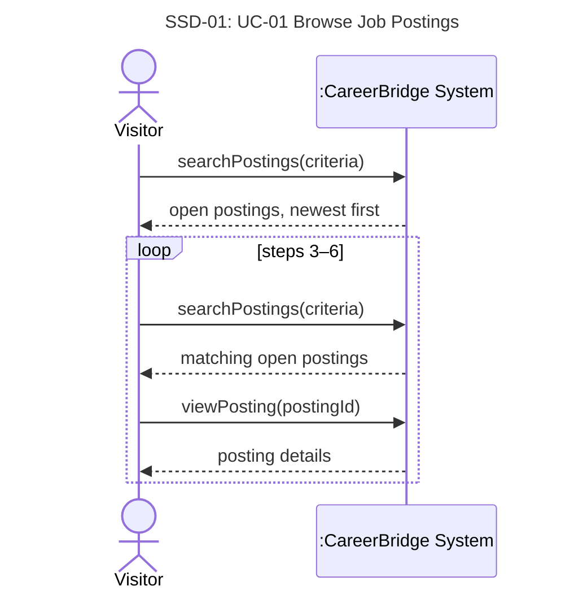

# UC-01 Browse Job Postings — full chain

> Owner: **Oleg Berdyshev** · Jira: FRs SCRUM-46 · UC SCRUM-28 · SSD SCRUM-34 · contracts SCRUM-51
> Chain: **FR + NFR → UC → SSD → operation contracts** ([team-guide.md](../team-guide.md)).
> Goes into the template sections §3.1 (FRs), §3.2 (NFRs), §4.2 (use case), §6 (SSD, contracts).

Business rules (BR) and assumptions (A) are the team's lists in
[deliverable-2.md §2](../deliverable-2.md#business-rules). An **open posting** is a *Published*
posting whose deadline has not passed (BR-9, BR-10).

## 1. Functional requirements

| ID | Requirement | BR / A | UC-01 step |
|---|---|---|---|
| FR-01.1 | The system shall let any visitor, logged in or not, view the open job postings of all organizations, newest first, each with its title, organization, location, employment type and deadline. | BR-1, BR-3, A9 | 1–2 |
| FR-01.2 | The system shall let a visitor search open postings by keyword and filter them by location, organization and employment type. | A8 | 3–4 |
| FR-01.3 | The system shall show the full details of a selected open posting, including salary range (if given) and number of openings. | A2, A10 | 5–6 |
| FR-01.4 | The system shall show only open postings; for a posting that has closed, it shall say that it no longer accepts applications. | BR-9, BR-10, A7 | 2, 4, ext. 5a |
| FR-01.5 | The system shall offer to apply only to visitors who are not logged in and to Applicants; an Applicant who already applied sees the stage of that application instead. | A11, BR-7 | 6, ext. 6b |

## 2. Non-functional requirements

| ID | Category | Requirement | BR |
|---|---|---|---|
| NFR-01.1 | Performance | Search results appear within 2 seconds for up to 10,000 open postings. | — |
| NFR-01.2 | Privacy | Public pages show no applicant or application data (an Applicant sees only their own). | BR-15 |
| NFR-01.3 | Usability | Pages work in current major desktop and mobile browsers and meet WCAG 2.1 AA. | — |

## 3. Use case

| Field | |
|---|---|
| **Use Case Name** | UC-01 Browse Job Postings |
| **Author** | Oleg Berdyshev |
| **Actor** | Visitor (anyone, logged in or not) |
| **Preconditions** | None. The job board is public (BR-3). |
| **Postconditions** | The visitor has seen the open postings matching their criteria and, optionally, the details of one posting. No data has changed. |

**Main Success Scenario**

| Actor: Visitor | System: CareerBridge |
|---|---|
| 1. TUCBW the visitor asks to see the open jobs. | 2. The system shows the open postings of all organizations, newest first, with title, organization, location, employment type and deadline. |
| 3. The visitor enters search criteria (keywords, location, organization, employment type). | 4. The system shows the open postings that match. |
| 5. The visitor chooses a posting. | 6. The system shows the posting's full details and offers to apply. |
| 7. TUCEW the visitor views the posting details. | |

Steps 3–6 may repeat.

**Extensions**

- **4a.** Nothing matches (or nothing is open): the system says so; the visitor changes the criteria
  (step 3).
- **5a.** The posting closed after the list was shown (BR-10): the system says it no longer accepts
  applications (step 4).
- **6a.** The visitor asks to apply: Apply for Job (UC-04) begins; a visitor who is not logged in
  logs in or registers first (UC-02).
- **6b.** The visitor is an Applicant who already applied: the system shows the stage of that
  application instead of the offer to apply (BR-7).

**Special Requirements** — NFR-01.1, NFR-01.2, NFR-01.3.

## 4. System sequence diagram

**SSD-01: UC-01 Browse Job Postings** (main success scenario; the system is a black box)

## 5. Operation contracts

Both operations only read data, so their postconditions are "None" and the **Output** row says what
they return.

### CO-01.1: searchPostings

| | |
|---|---|
| **Operation** | `searchPostings(criteria)` — criteria may be empty (steps 1–2) |
| **Cross-references** | UC-01 steps 1–4 · FR-01.1, FR-01.2, FR-01.4 |
| **Preconditions** | None |
| **Postconditions** | None (query) |
| **Output** | The open `JobPosting`s that match the criteria, newest first. |

### CO-01.2: viewPosting

| | |
|---|---|
| **Operation** | `viewPosting(postingId)` |
| **Cross-references** | UC-01 steps 5–6, ext. 5a, 6b · FR-01.3, FR-01.4, FR-01.5 |
| **Preconditions** | The `JobPosting` exists. |
| **Postconditions** | None (query) |
| **Output** | If open: its full details and the offer to apply — or, for an Applicant who already applied, the stage of their `Application`. If closed: a notice that it no longer accepts applications. |

## 6. Traceability

| Requirement | UC-01 | SSD-01 | Contract |
|---|---|---|---|
| FR-01.1 | steps 1–2 | `searchPostings` | CO-01.1 |
| FR-01.2 | steps 3–4 | `searchPostings` | CO-01.1 |
| FR-01.3 | steps 5–6 | `viewPosting` | CO-01.2 |
| FR-01.4 | steps 2, 4, ext. 5a | both | CO-01.1, CO-01.2 |
| FR-01.5 | step 6, ext. 6b | `viewPosting` | CO-01.2 |
| NFR-01.1–01.3 | Special Req. | all | — |
