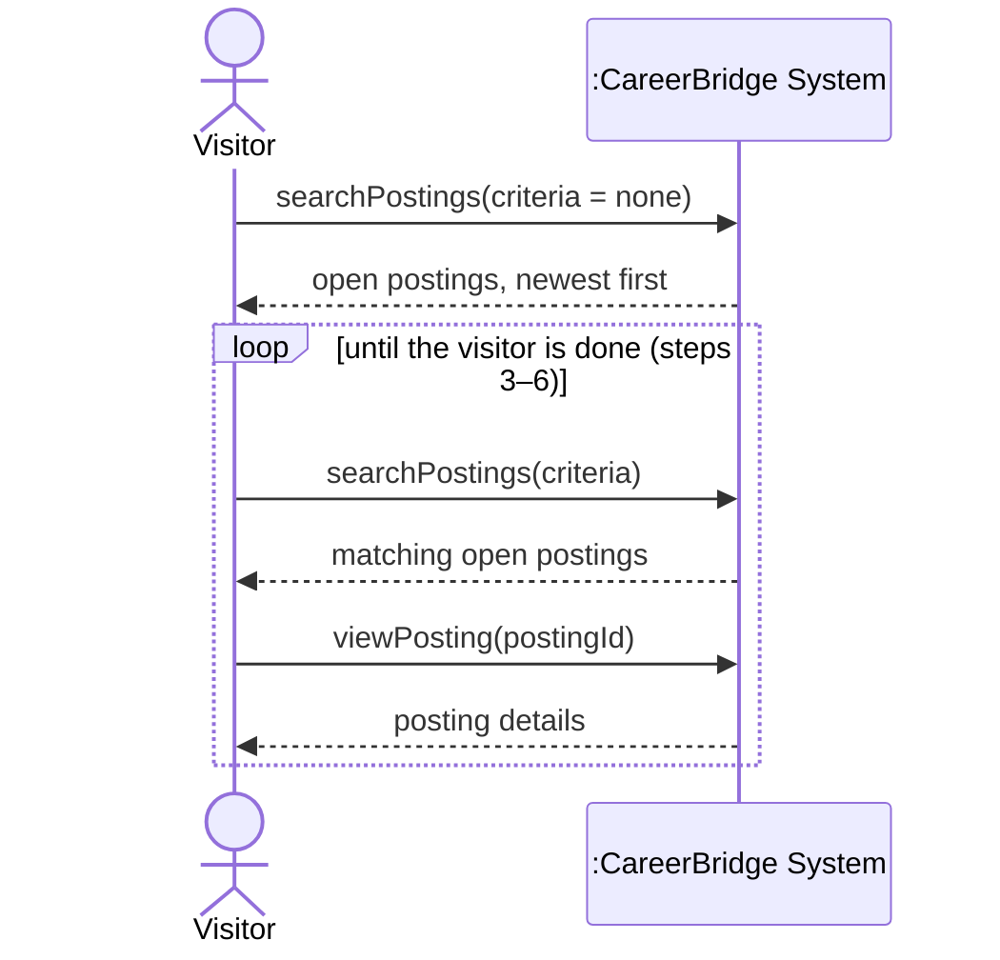

# UC-01 Browse Job Postings — full chain

> Owner: **Oleg Berdyshev** · Jira: FRs SCRUM-46 · UC SCRUM-28 · SSD SCRUM-34 · contracts SCRUM-51
> Chain: **FR + NFR → UC → SSD → operation contracts** ([team-guide.md](../team-guide.md)).
> Draft for review — once agreed, each part moves into [deliverable-2.md](../deliverable-2.md)
> (§3.1, §3.2, §4.2, §6).

IDs: `FR-01.n` = functional requirement *n* of UC-01 (the UC number is built into the ID, so the
link to the use case is visible at a glance). Business rules are the team's BR-1…BR-15
([deliverable-2.md §2](../deliverable-2.md#business-rules)).

## 1. Functional requirements (§3.1)

| ID | Requirement | Business rule | UC-01 step |
|---|---|---|---|
| FR-01.1 | The system shall let any visitor, logged in or not, view the list of open job postings from all organizations, newest first. | BR-1, BR-3 | 1–2 |
| FR-01.2 | The system shall show, for each posting in the list, its title, organization, location, employment type and application deadline. | — | 2 |
| FR-01.3 | The system shall let a visitor search open postings by keyword and filter them by location, organization and employment type, alone or combined. | — | 3–4 |
| FR-01.4 | The system shall show the full details of a selected open posting: description, requirements, organization, location, employment type, deadline and number of openings. | — | 5–6 |
| FR-01.5 | The system shall include in public listings and searches only postings that are approved, before their deadline and not filled. | BR-9, BR-10 | 2, 4, ext. 5a |
| FR-01.6 | The system shall require a visitor to log in or register as an Applicant before applying from a posting. | BR-3, BR-14 | ext. 6a |
| FR-01.7 | The system shall show an Applicant who has already applied to a posting the current stage of that application instead of the option to apply. | BR-7 | ext. 6b |
| FR-01.8 | The system shall allow only Applicant accounts to apply for a posting. | — | ext. 6c |

## 2. Non-functional requirements (§3.2)

From the Special Requirements of UC-01.

| ID | Category | Requirement | Business rule |
|---|---|---|---|
| NFR-01.1 | Performance | Search results appear within 2 seconds for up to 10,000 open postings. | — |
| NFR-01.2 | Privacy / security | Public pages show no applicant or application data. | BR-15 |
| NFR-01.3 | Usability / compatibility | Job board pages work on current desktop and mobile browsers and meet WCAG 2.1 AA. | — |

## 3. Use case (§4.2)

Rewritten from Josh's draft in the course format: the fields of template §4.2, and the two-column
Actor | System scenario with TUCBW / TUCEW from Dr. Ren's *Sample Documentation*. Josh's Open
Issues are settled as team assumptions (below the extensions), so nothing is left as "TBD".

| Field | |
|---|---|
| **Use Case Name** | UC-01 Browse Job Postings |
| **Author** | Oleg Berdyshev |
| **Actor** | Visitor (primary). Applicants and Recruiters can do the same, since they are specializations of Visitor. |
| **Preconditions** | None. The job board is public; no login is needed (BR-3). |
| **Postconditions** | The visitor has seen the open postings that match their criteria and, optionally, the full details of one posting. Only postings that are approved, before their deadline and not filled were shown (BR-9, BR-10). No data in the system has changed. |

**Main Success Scenario**

| Actor: Visitor | System: CareerBridge |
|---|---|
| 1. TUCBW the visitor opens the CareerBridge job board. | 2. The system shows the open postings of all organizations, newest first, each with its title, organization, location, employment type and application deadline (BR-1, BR-9, BR-10). |
| 3. The visitor enters search criteria: keywords, location, organization and/or employment type. | 4. The system shows the open postings that match all the given criteria. |
| 5. The visitor selects a posting. | 6. The system shows the posting's full details — description, requirements, organization, location, employment type, deadline and number of openings — and offers to apply for it. |
| 7. TUCEW the visitor has found the postings they were looking for. Steps 3–6 may repeat. | |

**Extensions**

- **\*a.** The system fails at any step: the system shows an error message and keeps the visitor's
  search criteria; the visitor retries and the use case resumes at the failed step.
- **2a.** No postings are open: the system says there are no open positions right now. The use case
  ends.
- **4a.** No postings match the criteria: the system says so and suggests removing filters; the
  visitor revises the criteria and the use case resumes at step 3.
- **5a.** The selected posting closed after the list was shown (deadline passed or filled, BR-10):
  the system says the posting no longer accepts applications and shows the refreshed list (step 4).
- **6a.** The visitor asks to apply while not logged in: the system asks them to log in or register
  as an Applicant (UC-02, BR-14); after that, Apply for Job (UC-04) begins for this posting.
- **6b.** The visitor is an Applicant who already applied to this posting: instead of offering to
  apply, the system shows the current stage of that application (BR-7) and a way to track it (UC-05).
- **6c.** The visitor is logged in as a Recruiter or Administrator and asks to apply: the system
  explains that only Applicant accounts can apply. The use case ends.

*Team assumptions (from Josh's Open Issues):* closed postings are not shown publicly; the filters
are keyword, location, organization and employment type; results are ordered newest first.

**Special Requirements**

- No login is needed, and no applicant or application data is shown (BR-3, BR-15) → NFR-01.2.
- Search results appear within 2 seconds for up to 10,000 open postings → NFR-01.1.
- Works on current desktop and mobile browsers and meets WCAG 2.1 AA → NFR-01.3.

## 4. System sequence diagram (§6)

Main success scenario. The system is one black box; only actor ↔ system messages (pitfall 5).
Steps 1–2 are `searchPostings` with empty criteria, so the use case has **two system operations**.

## 5. Operation contracts (§6)

UC-01 is read-only, so both operations are **queries**: they return information and change no
objects. In Larman's format that shows as "no state change" in the postconditions. The contracts
with real state changes are in UC-02 (an Applicant account is created) and UC-03 (the profile
and resume change).

### Contract CO-01.1: searchPostings

| | |
|---|---|
| **Operation** | `searchPostings(criteria: SearchCriteria)` — criteria may be empty (keywords, location, organization, employment type) |
| **Cross-references** | UC-01 steps 1–4, extensions 2a, 4a · FR-01.1, FR-01.2, FR-01.3, FR-01.5 · NFR-01.1, NFR-01.2 |
| **Preconditions** | None — the job board is public (BR-3). |
| **Postconditions** | No objects were created, deleted or modified (query). The result contains every `JobPosting` that is approved, before its deadline, not filled (BR-9, BR-10) and matches all given criteria, ordered newest first; each with title, organization name, location, employment type and deadline. |

### Contract CO-01.2: viewPosting

| | |
|---|---|
| **Operation** | `viewPosting(postingId: PostingID)` |
| **Cross-references** | UC-01 steps 5–6, extensions 5a, 6b · FR-01.4, FR-01.5, FR-01.7 · NFR-01.2 |
| **Preconditions** | A `JobPosting` with this `postingId` exists. |
| **Postconditions** | No objects were created, deleted or modified (query). If the posting is approved, before its deadline and not filled, its full details are returned; otherwise the visitor is told it no longer accepts applications (ext. 5a). If the visitor is a logged-in Applicant with an `Application` to this posting, that application's current stage is returned instead of the option to apply (BR-7). |

## 6. Traceability

| FR / NFR | UC-01 | SSD operation | Contract |
|---|---|---|---|
| FR-01.1 | steps 1–2 | `searchPostings(none)` | CO-01.1 |
| FR-01.2 | step 2 | `searchPostings` | CO-01.1 |
| FR-01.3 | steps 3–4 | `searchPostings(criteria)` | CO-01.1 |
| FR-01.4 | steps 5–6 | `viewPosting` | CO-01.2 |
| FR-01.5 | steps 2, 4, ext. 5a | both | CO-01.1, CO-01.2 |
| FR-01.6 | ext. 6a | — (continues in UC-02 / UC-04) | — |
| FR-01.7 | ext. 6b | `viewPosting` | CO-01.2 |
| FR-01.8 | ext. 6c | — (enforced when applying, UC-04) | — |
| NFR-01.1 | Special Req. | `searchPostings` | CO-01.1 |
| NFR-01.2 | Special Req. | both | CO-01.1, CO-01.2 |
| NFR-01.3 | Special Req. | — (all pages) | — |
