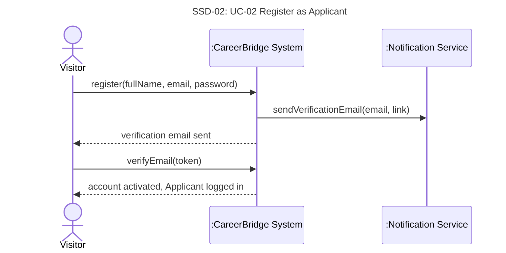

# UC-02 Register as Applicant — full chain

> Owner: **Oleg Berdyshev** · Jira: FRs SCRUM-46 · UC SCRUM-28 · SSD SCRUM-34 · contracts SCRUM-51
> Chain: **FR + NFR → UC → SSD → operation contracts** ([team-guide.md](../team-guide.md)).
> Goes into the template sections §3.1 (FRs), §3.2 (NFRs), §4.2 (use case), §6 (SSD, contracts).

Business rules (BR) and assumptions (A) are the team's lists in
[deliverable-2.md §2](../deliverable-2.md#business-rules).

## 1. Functional requirements

| ID | Requirement | BR / A | UC-02 step |
|---|---|---|---|
| FR-02.1 | The system shall let a visitor create an Applicant account with full name, email address and password, without Administrator approval. | BR-14 | 1–5 |
| FR-02.2 | The system shall reject a registration with a missing field, a malformed or already registered email address, or a password shorter than 10 characters or lacking a letter or a number. | A12 | 4, ext. 4a–4c |
| FR-02.3 | The system shall email the new Applicant a verification link valid for 24 hours and activate the account only when the link is opened before it expires. | A12 | 5–8, ext. 7a |

## 2. Non-functional requirements

| ID | Category | Requirement |
|---|---|---|
| NFR-02.1 | Security | Passwords are stored only as salted hashes, and all traffic uses HTTPS. |
| NFR-02.2 | Performance | The system hands the verification email to the Notification Service within 1 minute of registration. |

## 3. Use case

UC-02 is Josh's use case, simplified: Open Issues settled by A12, UI wording removed, and terms-of-use acceptance, ext. 6a, ext. 7b and the Technology and Data Variations dropped as out of scope:
[deliverable-2.md → UC-02 Register as Applicant](../deliverable-2.md#uc-02-register-as-applicant).
The step and extension numbers in this file refer to that use case.

## 4. System sequence diagram

**SSD-02: UC-02 Register as Applicant** (main success scenario; the system is a black box)

## 5. Operation contracts

### CO-02.1: register

| | |
|---|---|
| **Operation** | `register(fullName, email, password)` |
| **Cross-references** | UC-02 steps 3–5, ext. 4a–4c · FR-02.1, FR-02.2, FR-02.3 |
| **Preconditions** | The visitor is not logged in. |
| **Postconditions** | An `Applicant` was created with the full name, email address and a hashed password, in the Pending Verification state. An empty `ApplicantProfile` was created and associated with the `Applicant`. The `Applicant`'s verification token and its expiry (24 hours after creation) were set. |

### CO-02.2: verifyEmail

| | |
|---|---|
| **Operation** | `verifyEmail(token)` |
| **Cross-references** | UC-02 steps 7–8, ext. 7a · FR-02.3 |
| **Preconditions** | A Pending Verification `Applicant` has this verification token. |
| **Postconditions** | If the token had expired (ext. 7a): a new verification token and its expiry (24 hours later) were set, and the `Applicant` stayed Pending Verification. Otherwise: the `Applicant` changed from Pending Verification to Active, the verification token was cleared, and the `Applicant` is logged in. |

## 6. Traceability

| Requirement | UC-02 | SSD-02 | Contract |
|---|---|---|---|
| FR-02.1 | steps 1–5 | `register` | CO-02.1 |
| FR-02.2 | step 4, ext. 4a–4c | `register` | CO-02.1 |
| FR-02.3 | steps 5–8, ext. 7a | `register`, `verifyEmail` | CO-02.1, CO-02.2 |
| NFR-02.1, NFR-02.2 | Special Req. | all | — |
| NFR-01.2 (WCAG 2.1 AA) | Special Req. | all | — |

UC-02 reuses NFR-01.2 from UC-01.
