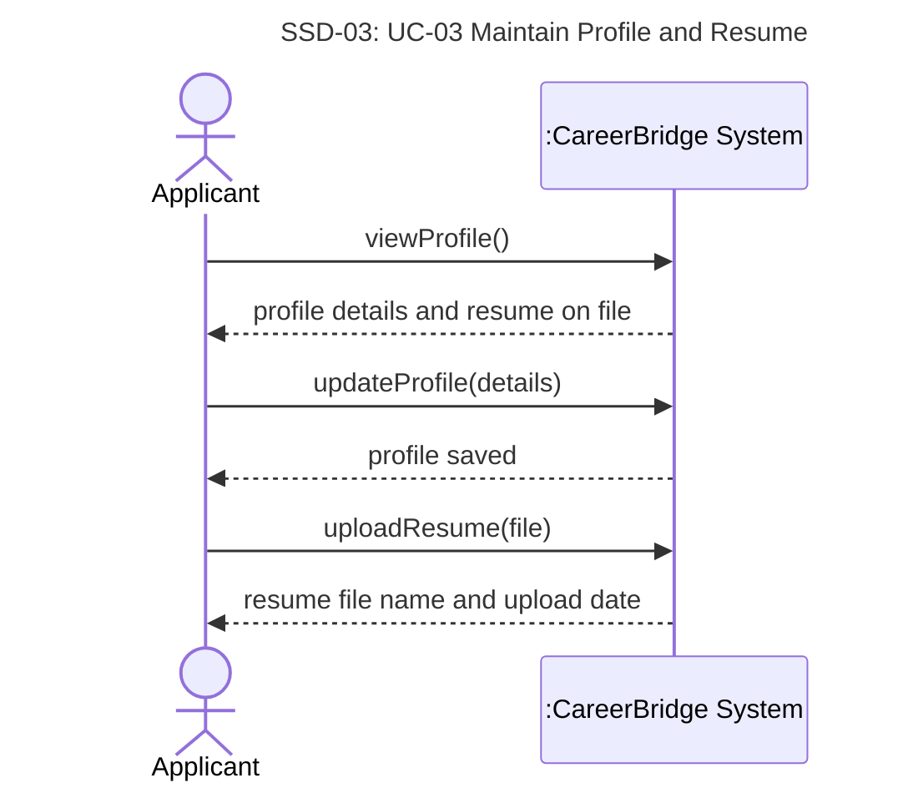

# UC-03 Maintain Profile and Resume — full chain

> Owner: **Oleg Berdyshev** · Jira: FRs SCRUM-46 · UC SCRUM-28 · SSD SCRUM-34 · contracts SCRUM-51
> Chain: **FR + NFR → UC → SSD → operation contracts** ([team-guide.md](../team-guide.md)).
> Goes into the template sections §3.1 (FRs), §3.2 (NFRs), §4.2 (use case), §6 (SSD, contracts).

Business rules (BR) and assumptions (A) are the team's lists in
[deliverable-2.md §2](../deliverable-2.md#business-rules).

## 1. Functional requirements

| ID | Requirement | BR / A | UC-03 step |
|---|---|---|---|
| FR-03.1 | The system shall let an applicant view their profile details and edit their full name, phone, location, headline, skills, education and work experience, and shall reject the changes if the full name is empty or the phone number is malformed. | A13 | 1–4, ext. 4a |
| FR-03.2 | The system shall let an applicant upload one resume, a PDF or DOCX file of up to 5 MB, that replaces any previous resume, and shall reject any other file or a file flagged by the malware scan. | BR-6, A13 | 5–7, ext. 6a, 6b |
| FR-03.3 | The system shall keep the resume copy attached to each submitted application unchanged when the applicant replaces their resume. | BR-5, A6 | step 6, Success Guarantee |

## 2. Non-functional requirements

| ID | Category | Requirement |
|---|---|---|
| NFR-03.1 | Performance | The system validates, scans and stores a 5 MB resume within 10 seconds after receiving it. |
| NFR-03.2 | Security | Resume files are encrypted at rest. Only the applicant and the Administrator can open the resume on file; a recruiter sees only the resume copy attached to an application to their organization's posting (BR-15, A6). |

## 3. Use case

UC-03 is Josh's use case, simplified: Open Issues settled by A6 and A13, UI wording removed, and
ext. 3a, 4b (email is read-only), 5a (replace confirmation), 5b (delete resume), 6c and the Technology and Data Variations dropped as out of scope:
[deliverable-2.md → UC-03 Maintain Profile and Resume](../deliverable-2.md#uc-03-maintain-profile-and-resume).
The step and extension numbers in this file refer to that use case.

## 4. System sequence diagram

**SSD-03: UC-03 Maintain Profile and Resume** (main success scenario; the system is a black box)

## 5. Operation contracts

### CO-03.1: viewProfile

| | |
|---|---|
| **Operation** | `viewProfile()` |
| **Cross-references** | UC-03 steps 1–2 · FR-03.1 |
| **Preconditions** | The `Applicant` is logged in. |
| **Postconditions** | None — query operation |
| **Output** | The `Applicant`'s full name and email address, the `ApplicantProfile` details, and the file name and upload date of the `Resume` on file, if any. |

### CO-03.2: updateProfile

| | |
|---|---|
| **Operation** | `updateProfile(details)` |
| **Cross-references** | UC-03 steps 3–4, ext. 4a · FR-03.1 |
| **Preconditions** | The `Applicant` is logged in. |
| **Postconditions** | The `Applicant`'s full name and the attributes of their `ApplicantProfile` were set to the valid `details`. |

### CO-03.3: uploadResume

| | |
|---|---|
| **Operation** | `uploadResume(file)` |
| **Cross-references** | UC-03 steps 5–7, ext. 6a, 6b · FR-03.2, FR-03.3 |
| **Preconditions** | The `Applicant` is logged in. |
| **Postconditions** | A `Resume` was created for the accepted file, with its file name and upload date, and associated with the `Applicant`'s `ApplicantProfile`. Any previous `Resume` was dissociated from the profile (BR-6). |

## 6. Traceability

| Requirement | UC-03 | SSD-03 | Contract |
|---|---|---|---|
| FR-03.1 | steps 1–4, ext. 4a | `viewProfile`, `updateProfile` | CO-03.1, CO-03.2 |
| FR-03.2 | steps 5–7, ext. 6a, 6b | `uploadResume` | CO-03.3 |
| FR-03.3 | step 6, Success Guarantee | `uploadResume` | CO-03.3 |
| NFR-03.1, NFR-03.2 | Special Req. | `uploadResume` | — |
