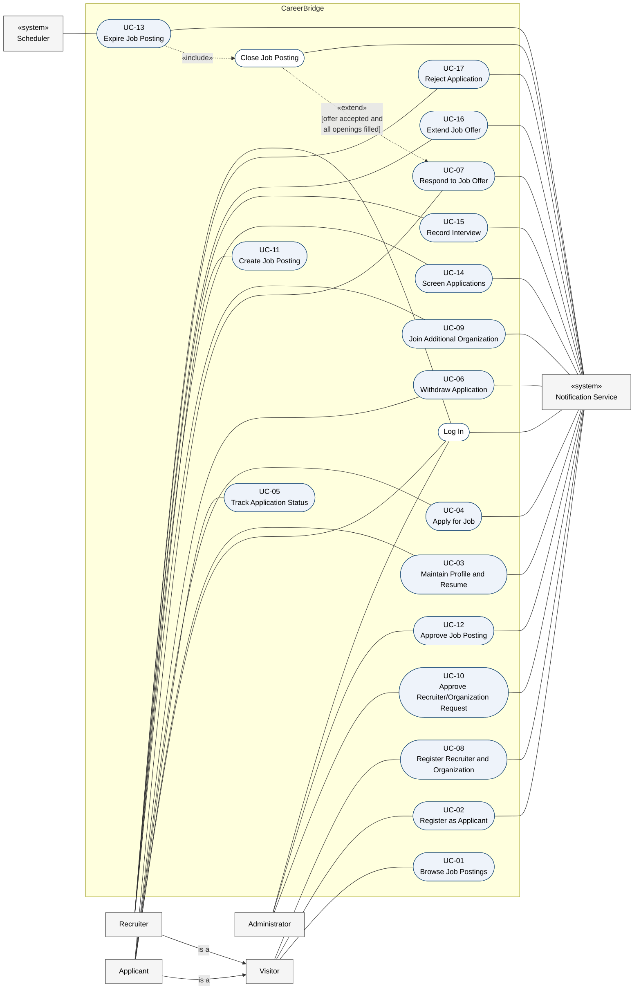
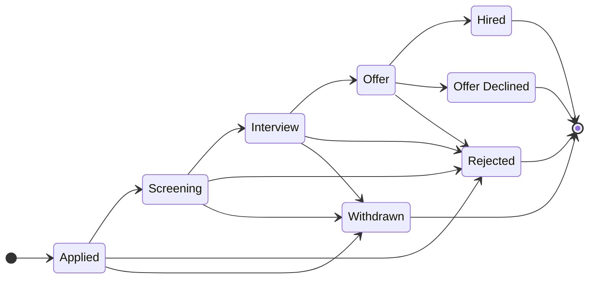

# CSI 5324 — Deliverable 2: Use Cases

> **Working document for Deliverable 2 = Iteration 1** (due Mon Sep 28, 2026). Task: [assignment.md](assignment.md) ·
> status: [status.md](status.md) · checklist: [checklist.md](checklist.md).
>
> **Source of truth:** this file. Team-facing surface: the Word doc
> [CSI 5324 – Deliverable 2 Use Cases.docx](https://baylor0-my.sharepoint.com/:w:/r/personal/josh_joseph3_baylor_edu/Documents/Microsoft%20Teams%20Chat%20Files/CSI%205324%20%E2%80%93%20Deliverable%202%20Use%20Cases.docx?d=wc0e6e8360799410caaeada9754bb7b60&csf=1&web=1&e=7HArpk) on Josh's OneDrive
> (shared in Teams). Keep the two in sync before exporting the PDF.
>
> Starting point: Josh's use-case suggestion, converted verbatim from that doc on 2026-09-25.
> Each member starts from their own use cases here. Not yet agreed by the team.

**Team:** CareerBridge — Zeba Tusnia Towshi (Project Manager), Rabeya Nazara (Requirements
Engineer), Josh Job Joseph (Design Engineer), Reagan Rubio (Quality Assurance Engineer), Oleg
Berdyshev (Project Librarian)

**Project:** Recruiting and Application Management System — a multi-company job board
(LinkedIn-like) where organizations post jobs and applicants apply across companies.

**Contents:** 1. Use-case diagram · 2. Conventions and business rules · 3. Fully-dressed use cases ·
4. Subfunction use cases · 5. Traceability and consistency check

## Use-case index

Seventeen user-goal use cases, fully dressed in Larman's format, with each team member owning at
least three.

| ID | Use case | Primary actor | Owner |
|---|---|---|---|
| UC-01 | Browse Job Postings | Visitor | Oleg Berdyshev |
| UC-02 | Register as Applicant | Visitor | Oleg Berdyshev |
| UC-03 | Maintain Profile and Resume | Applicant | Oleg Berdyshev |
| UC-04 | Apply for Job | Applicant | Rabeya Nazara |
| UC-05 | Track Application Status | Applicant | Rabeya Nazara |
| UC-06 | Withdraw Application | Applicant | Rabeya Nazara |
| UC-07 | Respond to Job Offer | Applicant | Rabeya Nazara |
| UC-08 | Register Recruiter and Organization | Visitor | Reagan Rubio |
| UC-09 | Join Additional Organization | Recruiter | Reagan Rubio |
| UC-10 | Approve Recruiter/Organization Request | Administrator | Reagan Rubio |
| UC-11 | Create Job Posting | Recruiter | Zeba Tusnia Towshi |
| UC-12 | Approve Job Posting | Administrator | Zeba Tusnia Towshi |
| UC-13 | Expire Job Posting | Scheduler | Zeba Tusnia Towshi |
| UC-14 | Screen Applications | Recruiter | Josh Job Joseph |
| UC-15 | Record Interview | Recruiter | Josh Job Joseph |
| UC-16 | Extend Job Offer | Recruiter | Josh Job Joseph |
| UC-17 | Reject Application | Recruiter | Josh Job Joseph |
| — | Log In (subfunction) | Applicant, Recruiter, Administrator | — |
| — | Close Job Posting (subfunction) | System (from UC-07, UC-13) | — |

## 1. Use-case diagram

The rectangle is the CareerBridge system boundary. Human actors stand on the left and «system»
actors on the right. Solid lines are associations; dashed arrows are «include» and «extend»; the
hollow-headed arrow shows that Applicant and Recruiter are specializations of Visitor. White ovals
are subfunctions (section 4).

Notation: filled ovals are user-goal use cases (fully dressed); white ovals are subfunctions
(section 4). "is a" arrows are UML generalization (drawn with a hollow triangle in UML).

## 2. Conventions and business rules

The use cases follow Larman's fully-dressed format (Applying UML and Patterns, ch. 6). Every
customer rule is written as a precondition or an extension and tagged with a business-rule ID
(BR-n) that traces back to the Deliverable 0 clarification answers.

System under discussion: CareerBridge, a multi-organization job board. Actors: Visitor, Applicant,
Recruiter, Administrator (human); Notification Service, Scheduler (system). Applicant and Recruiter
are specializations of Visitor.

### Business rules

| ID | Rule | Source |
|---|---|---|
| BR-1 | Many organizations post jobs; applicants browse and apply across organizations. | D0 Q1 |
| BR-2 | A recruiter may belong to more than one organization. | D0 Q2 |
| BR-3 | Some pages are public: visitors can browse open postings without logging in. | D0 Q3 |
| BR-4 | An applicant may have at most 5 active applications at a time. | D0 Q4 |
| BR-5 | An applicant may withdraw a submitted application but may not edit it. | D0 Q5 |
| BR-6 | Each applicant has exactly one resume on file; no cover letters or per-job resumes. | D0 Q6 |
| BR-7 | Applicants see every pipeline stage of their own applications. | D0 Q7 |
| BR-8 | The recruiting pipeline is fixed for all postings (see diagram below). | D0 Q8 |
| BR-9 | A job posting must be approved before it is published. | D0 Q9 |
| BR-10 | A posting closes automatically when its deadline passes or when all openings are filled. | D0 Q9, Q12 |
| BR-11 | Rejected applicants are notified automatically, and the recorded rejection reason is shared with them. | D0 Q10 |
| BR-12 | The system records that an interview was scheduled and its outcome; it does not coordinate times. | D0 Q11 |
| BR-13 | Offers are extended, accepted and declined inside the system. | D0 Q12 |
| BR-14 | Applicants self-register; recruiter and organization accounts require Administrator approval. | D0 Q13 |
| BR-15 | Recruiters see only applications to their own organizations' postings, never an applicant's applications elsewhere. | D0 Q14 |

### Application pipeline (BR-8)

An application is active while it is in Applied, Screening, Interview or Offer. Hired, Rejected,
Withdrawn and Offer Declined are terminal and free a slot under BR-4.

At the Offer stage the applicant declines through UC-07 rather than withdrawing.

### Working assumptions

These are team assumptions, not confirmed customer requirements. Each use case lists the ones it
depends on under Open Issues.

| ID | Assumption |
|---|---|
| A1 | The Administrator approves job postings. |
| A2 | Each posting has a number of openings (default 1); it is filled when accepted offers equal that number. |
| A3 | When a posting is filled, its remaining active applications are rejected with the reason "Posting closed." When a posting only expires, it stops accepting applications, but those already submitted continue through the pipeline. |
| A4 | The Administrator approves a recruiter joining an additional organization. |
| A5 | An applicant cannot reapply to a posting they already applied to, including after withdrawing. |
| A6 | Each submitted application keeps a copy of the resume as it was at submission, so later resume changes do not alter it (follows from BR-5 and BR-6). |
| A7 | Closed postings (deadline passed or filled) are not shown on public pages. (UC-01) |
| A8 | Job search filters are keyword, location, organization and employment type, alone or combined. (UC-01) |
| A9 | Job listings and search results are ordered by publication date, newest first. (UC-01) |
| A10 | A posting's salary range is shown on its details when the recruiter provided one; it is not a search filter. (UC-01, UC-11) |

## 3. Fully-dressed use cases

### UC-01: Browse Job Postings

**Scope:** CareerBridge job board

**Level:** User goal

**Primary Actor:** Visitor (also Applicant and Recruiter, through generalization)

**Supporting Actors:** None

**Owner:** Oleg Berdyshev

**Stakeholders and Interests:**

- Visitor: wants to find relevant open jobs across all organizations quickly, without creating an account (BR-1, BR-3).
- Applicant: wants the same, plus a direct route to apply and a clear sign of postings they have already applied to.
- Recruiter / Organization: wants its published postings seen by as many qualified people as possible, and never wants drafts or unapproved postings shown.
- Administrator: wants only approved, open postings made public (BR-9, BR-10), and no applicant or application data exposed on public pages (BR-15).

**Preconditions:** None. The job board is a public page (BR-3).

**Success Guarantee (Postconditions):** The visitor has viewed a list of open postings matching their criteria and, optionally, the full details of one posting. No data has changed. Only published postings that are before their deadline and not filled were shown (BR-9, BR-10).

**Main Success Scenario:**

1. Visitor opens the CareerBridge job board.
2. System shows open postings from all organizations, newest first. Each entry shows title, organization, location, employment type and application deadline.
3. Visitor enters search criteria: keywords, location, organization and/or employment type.
4. System shows the open postings that match the criteria.
5. Visitor selects a posting.
6. System shows the posting's full details: description, requirements, organization, location, employment type, deadline, number of openings and an Apply option.

Visitor repeats steps 3–6 until done.

**Extensions:**

- \*a. At any time, the system fails:
   1. System shows an error message and keeps the visitor's search criteria.
   2. Visitor retries; the use case resumes at the failed step.
- 2a. No postings are open:
   1. System shows "No open positions right now." The use case ends.
- 4a. No postings match the criteria:
   1. System shows "No matching postings" and suggests removing filters.
   2. Visitor revises the criteria; the use case resumes at step 3.
- 5a. The selected posting closed after the list was shown (deadline passed or filled, BR-10):
   1. System shows "This posting is no longer accepting applications" and returns to the refreshed list at step 4.
- 6a. Visitor selects Apply while not logged in:
   1. System asks the visitor to log in or register (UC-02).
   2. After the visitor logs in as an Applicant, the Apply for Job use case (UC-04) begins for this posting.
- 6b. A logged-in Applicant already applied to this posting:
   1. System shows the application's current stage instead of the Apply option, with a link to Track Application Status (UC-05).
- 6c. A logged-in Recruiter or Administrator selects Apply:
   1. System explains that only Applicant accounts can apply. The use case ends.

**Special Requirements:**

- Pages in this use case require no login (BR-3) and must show no applicant or application data.
- Search results appear within 2 seconds for up to 10,000 open postings (team target).
- Pages work on current desktop and mobile browsers and meet WCAG 2.1 AA.

**Technology and Data Variations List:**

- 3a. Criteria are entered as free-text keywords plus drop-down filters.
- 4a. Results are paginated, 20 postings per page.

**Frequency of Occurrence:** Continuous. This is the most frequent use case in the system.

**Open Issues:**

- Should closed postings stay viewable, read-only, for a period after closing?
- Which filters are required, and should salary range be shown?
- Should results be sortable by deadline as well as by date posted?

### UC-02: Register as Applicant

**Scope:** CareerBridge job board

**Level:** User goal

**Primary Actor:** Visitor

**Supporting Actors:** Notification Service

**Owner:** Oleg Berdyshev

**Stakeholders and Interests:**

- Visitor: wants to create an account quickly so they can apply, without waiting for anyone's approval (BR-14).
- Administrator: wants one account per email address, valid contact details and securely stored credentials, without reviewing every applicant.
- Recruiter / Organization: wants applicant contact details to be real, so offers and notices reach the right person.

**Preconditions:** The visitor is not logged in.

**Success Guarantee (Postconditions):** An active Applicant account exists with a unique, verified email address and a securely hashed password. An empty applicant profile with no resume has been created. The new Applicant is logged in.

**Main Success Scenario:**

1. Visitor chooses to register as an applicant.
2. System shows the applicant registration form.
3. Visitor enters full name, email address and password, and accepts the terms of use.
4. System validates the data: required fields are present, the email is well formed and not already registered, and the password meets the password policy.
5. System creates the Applicant account in Pending Verification state and asks the Notification Service to send a verification email with a link valid for 24 hours.
6. Notification Service delivers the verification email.
7. Visitor opens the verification link.
8. System activates the account, logs the Applicant in and shows the profile page with a prompt to upload a resume (UC-03).

**Extensions:**

- \*a. At any time, the system fails:
   1. System shows an error message. No partial account is saved unless step 5 completed.
- 3a. Visitor wants a recruiter account instead:
   1. System directs the visitor to Register Recruiter and Organization (UC-08). This use case ends.
- 4a. A required field is missing or malformed:
   1. System highlights each invalid field with the reason.
   2. Visitor corrects the data; the use case resumes at step 4.
- 4b. The email address is already registered:
   1. System says an account already exists for that email and offers Log In or password reset. No new account is created.
- 4c. The password does not meet the policy:
   1. System shows the policy (at least 10 characters, including a letter and a number).
   2. Visitor enters a new password; the use case resumes at step 4.
- 6a. The Notification Service is unavailable:
   1. System keeps the account in Pending Verification, queues the email and retries.
   2. System tells the visitor the email may take a few minutes and offers a Resend option.
- 7a. The verification link has expired:
   1. System offers to send a new link; the use case resumes at step 5.
- 7b. The visitor never verifies:
   1. After 7 days, the system deletes the unverified account, and the email address becomes available again.

**Special Requirements:**

- Passwords are stored only as salted hashes (for example, bcrypt), and all traffic uses HTTPS.
- The verification email arrives within 1 minute under normal load.
- The registration form meets WCAG 2.1 AA.

**Technology and Data Variations List:**

- 3a. The email address serves as the login ID.
- 5a. Verification uses a single-use random token embedded in the link.

**Frequency of Occurrence:** Often. Every new applicant does this once.

**Open Issues:**

- Email verification is a team decision, not a customer requirement. Confirm that it is wanted.
- Should sign-in with Google or LinkedIn be supported later?
- Is 7 days the right retention period for unverified accounts?

### UC-03: Maintain Profile and Resume

**Scope:** CareerBridge job board

**Level:** User goal

**Primary Actor:** Applicant

**Supporting Actors:** Notification Service (extension 4b only)

**Owner:** Oleg Berdyshev

**Stakeholders and Interests:**

- Applicant: wants profile details and their resume to stay current and easy to replace.
- Recruiter / Organization: wants an accurate resume for each application it reviews, and wants that resume to stay the same after submission (BR-5).
- Administrator: wants uploaded files to be safe (correct type, limited size, no malware) and resumes visible only to people entitled to see them (BR-15).

**Preconditions:** The Applicant is logged in (Log In).

**Success Guarantee (Postconditions):** The applicant's profile details are saved. The applicant has at most one resume on file (BR-6); an uploaded resume has replaced any previous one. Resume copies attached to already-submitted applications are unchanged (BR-5, A6).

**Main Success Scenario:**

1. Applicant opens their profile.
2. System shows the current profile (name, email, phone, location, headline, skills, education and work experience) and the resume on file, if any.
3. Applicant edits profile details.
4. System validates and saves the details and confirms the save.
5. Applicant uploads a resume file.
6. System checks the file type and size, scans the file for malware, and stores it as the applicant's only resume.
7. System shows the resume's file name and upload date.

**Extensions:**

- \*a. At any time, the system fails:
   1. System shows an error message. Profile data saved before the failure is kept, and the previous resume stays on file.
- 3a. Applicant only wants to change the resume:
   1. The use case continues at step 5.
- 4a. A field is invalid (for example, name left empty or phone number malformed):
   1. System highlights the field with the reason.
   2. Applicant corrects it; the use case resumes at step 4.
- 4b. Applicant changes the email address:
   1. System sends a verification link to the new address through the Notification Service.
   2. The old address stays active until the new one is verified.
- 5a. Applicant already has a resume on file (BR-6):
   1. System warns that the new file will replace the current resume, because only one resume is allowed.
   2. Applicant confirms, and the use case continues at step 6, or cancels, and the current resume is kept.
- 5b. Applicant deletes the resume instead of uploading one:
   1. System asks for confirmation and warns that the applicant cannot apply for jobs without a resume (UC-04).
   2. Applicant confirms; System removes the resume. Submitted applications keep their copies (A6).
- 6a. The file is not a PDF or DOCX, or is larger than 5 MB:
   1. System rejects the file, states the accepted types and size limit, and keeps the current resume.
- 6b. The malware scan flags the file:
   1. System rejects the file, keeps the current resume and logs the incident for the Administrator.
- 6c. The upload is interrupted:
   1. System discards the partial file and keeps the current resume.

**Special Requirements:**

- Resume files are encrypted at rest.
- Only the applicant, recruiters of organizations the applicant applied to, and the Administrator can open the resume (BR-15).
- Upload and scan finish within 10 seconds for a 5 MB file.

**Technology and Data Variations List:**

- 6a. Accepted resume formats are PDF and DOCX.
- 6b. Files are kept in object storage; the database stores only a reference to each file.

**Frequency of Occurrence:** Occasional. Usually once after registration, then a few times a year.

**Open Issues:**

- A6: confirm that each application keeps the resume as it was at submission, instead of always showing the current resume.
- Which profile fields are required, and which are optional?
- BR-6 rules out cover letters. Confirm that there is no free-text "message to recruiter" field either.

### UC-04: Apply for Job

**Scope:** CareerBridge job board

**Level:** User goal

**Primary Actor:** Applicant

**Supporting Actors:** Notification Service

**Owner:** Rabeya Nazara

**Stakeholders and Interests:**

- Applicant: wants to apply quickly using the resume on file, get a confirmation, and know how many application slots remain (BR-4).
- Recruiter / Organization: wants complete applications only for open postings, with no duplicates, and visible only to its own recruiters (BR-15).
- Administrator: wants the 5-application limit enforced consistently, even under simultaneous submissions.
- Other applicants: benefit from the limit, which keeps applicant pools focused.

**Preconditions:**

- The Applicant is logged in (Log In).
- The Applicant has a resume on file (BR-6).
- The posting is published and open: approved, before its deadline and not filled (BR-9, BR-10).
- The Applicant has fewer than 5 active applications (BR-4).

**Success Guarantee (Postconditions):** A new application exists in the Applied stage, linked to the Applicant and the posting, with a copy of the resume as it was at submission (A6). The Applicant has at most 5 active applications. A confirmation has been sent to the Applicant. The application is visible only to the Applicant, the Administrator and recruiters of the posting's organization (BR-15).

**Main Success Scenario:**

1. Applicant selects Apply on an open posting (from UC-01).
2. System shows an application summary: posting title and organization, the applicant's contact details, the resume on file and the applicant's active application count (for example, "3 of 5 active").
3. Applicant confirms the submission, acknowledging that a submitted application cannot be edited (BR-5).
4. System verifies that the posting is still open, that the applicant still has fewer than 5 active applications and that the applicant has not applied to this posting before.
5. System creates the application in the Applied stage, stores a copy of the resume and records the submission time.
6. System asks the Notification Service to send the Applicant a confirmation.
7. System shows the confirmation with the updated count (for example, "4 of 5 active") and a link to Track Application Status (UC-05).

**Extensions:**

- \*a. At any time, the system fails before step 5 completes:
   1. No application is created, and the applicant's count is unchanged. System asks the applicant to try again.
- 1a. Applicant is not logged in:
   1. System asks the visitor to log in or register (UC-02), then the use case resumes at step 2.
- 2a. Applicant has no resume on file (BR-6):
   1. System explains that a resume is required and opens Maintain Profile and Resume (UC-03).
   2. After the upload, the use case resumes at step 2.
- 2b. Applicant already has 5 active applications (BR-4):
   1. System blocks the application and lists the applicant's active applications.
   2. System explains that a slot frees up when an application is withdrawn (UC-06) or reaches Hired, Rejected or Offer Declined. The use case ends.
- 3a. Applicant wants to update the resume first:
   1. Applicant opens Maintain Profile and Resume (UC-03); the use case then resumes at step 2.
- 3b. Applicant cancels:
   1. Nothing is saved. The use case ends.
- 4a. The posting closed after step 1 (deadline passed or filled, BR-10):
   1. System reports that the posting is no longer accepting applications. No application is created.
- 4b. The applicant reached 5 active applications after step 2, for example through a submission in another browser tab (BR-4):
   1. The use case continues as in 2b.
- 4c. Applicant has already applied to this posting, including a withdrawn application (A5):
   1. System shows the existing application's stage and does not create a new one.
- 6a. The Notification Service is unavailable:
   1. The application stays saved. System queues the confirmation and retries; the confirmation is also shown in-app at step 7.

**Special Requirements:**

- Steps 4 and 5 run as one database transaction, so simultaneous submissions can never exceed 5 active applications.
- The confirmation email arrives within 1 minute under normal load.

**Technology and Data Variations List:**

- 4a. An application counts as active in the Applied, Screening, Interview and Offer stages (BR-8).
- 5a. The resume copy is stored as a new file reference, so later changes under UC-03 do not affect it.

**Frequency of Occurrence:** High. Several times per applicant, with peaks right after postings are published.

**Open Issues:**

- A5: confirm that an applicant cannot reapply to a posting after withdrawing.
- Should recruiters also get a notice for each new application, or only see new applications in their queue?
- Does an application at the Offer stage count toward the limit? This model assumes it does until the offer is accepted or declined.

### UC-05: Track Application Status

**Scope:** CareerBridge job board

**Level:** User goal

**Primary Actor:** Applicant

**Supporting Actors:** None

**Owner:** Rabeya Nazara

**Stakeholders and Interests:**

- Applicant: wants to see every pipeline stage of each application (BR-7), know why an application was rejected (BR-11) and reach the next action, such as withdrawing or responding to an offer.
- Recruiter / Organization: wants applicants kept informed, which cuts status inquiries, while its internal review notes stay private.
- Other applicants and organizations: want no application visible to anyone other than its owner and the posting organization's recruiters (BR-15).

**Preconditions:** The Applicant is logged in (Log In).

**Success Guarantee (Postconditions):** The Applicant has viewed the current stage and stage history of their own applications, and only their own. No data has changed.

**Main Success Scenario:**

1. Applicant opens My Applications.
2. System lists all of the applicant's applications, active ones first, with the active count (for example, "3 of 5 active"). Each entry shows posting title, organization, submission date, current stage and date of the last change.
3. Applicant selects an application.
4. System shows the application's stage history: each pipeline stage reached (Applied, Screening, Interview, Offer, Hired) with the date it was entered, and any recorded interview details (date and format, BR-12).
5. System shows the actions allowed at the current stage.

Applicant repeats steps 3–5 until done.

**Extensions:**

- \*a. Applicant tries to open an application that is not theirs, for example by editing the URL (BR-15):
   1. System shows "Application not found" and logs the attempt. No data about the application is revealed.
- 2a. Applicant has no applications:
   1. System shows an empty state with a link to Browse Job Postings (UC-01). The use case ends.
- 2b. Applicant filters the list to active or closed applications:
   1. System shows only the matching applications; the use case continues at step 3.
- 4a. The application was rejected (BR-11):
   1. System shows the rejection date, the stage at which it was rejected and the reason the recruiter recorded.
- 4b. The posting was filled while the application was active (BR-10, A3):
   1. System shows the application as Rejected with the reason "Posting closed."
- 4c. The application was withdrawn:
   1. System shows the withdrawal date. No further actions are offered.
- 5a. The application is active (Applied, Screening or Interview):
   1. System offers Withdraw (UC-06). No Edit option is shown (BR-5).
- 5b. The application is at the Offer stage (BR-13):
   1. System shows the offer details with Accept and Decline options (UC-07).

**Special Requirements:**

- A stage change made by a recruiter appears to the applicant within 1 minute.
- The page loads within 2 seconds for an applicant with up to 200 applications.
- Recruiters' internal notes are never shown to applicants.

**Technology and Data Variations List:**

- 1a. Applicant may reach step 4 directly from a link in a notification email.

**Frequency of Occurrence:** Very high. Several times a week for each applicant with active applications.

**Open Issues:**

- BR-7 says applicants see all stages. Confirm that this means stage names and dates only, not recruiter notes or recruiter names.
- Should rejection reasons come from a fixed list with an optional comment, to keep them professional, or be free text?
- A3: confirm that applications to a filled posting are rejected with the reason "Posting closed."

### UC-06: Withdraw Application

**Scope:** CareerBridge job board

**Level:** User goal

**Primary Actor:** Applicant

**Supporting Actors:** Notification Service

**Owner:** Rabeya Nazara

**Stakeholders and Interests:**

- Applicant: wants to withdraw an application quickly, free an application slot (BR-4) and understand beforehand that withdrawal is final (A5).
- Recruiter / Organization: wants to know promptly so it stops spending review time on the candidate, and wants the withdrawn application kept on record.
- Administrator: wants active application counts that stay accurate and an audit trail of every withdrawal.

**Preconditions:**

- The Applicant is logged in (Log In).
- The application belongs to the Applicant and is in the Applied, Screening or Interview stage. At the Offer stage the applicant declines through UC-07 instead.

**Success Guarantee (Postconditions):** The application is in the Withdrawn stage, with the withdrawal date and any reason given. The Applicant's active count is one lower (BR-4). The posting organization's recruiters have been notified, and the application stays in their records as read-only. The Applicant cannot apply to this posting again (A5).

**Main Success Scenario:**

1. Applicant opens an active application (from UC-05) and chooses Withdraw.
2. System shows the posting title, organization and current stage. It explains that withdrawal cannot be undone and that the applicant cannot reapply to this posting (A5).
3. Applicant optionally selects a reason and confirms the withdrawal.
4. System verifies that the application is still in Applied, Screening or Interview.
5. System sets the application to Withdrawn, records the date and reason, and lowers the applicant's active count by one.
6. System asks the Notification Service to notify the posting organization's recruiters and to send the Applicant a confirmation.
7. System shows the confirmation with the updated count (for example, "2 of 5 active").

**Extensions:**

- \*a. At any time, the system fails before step 5 completes:
   1. The application and the active count are unchanged. System asks the applicant to try again.
- 1a. Applicant wants to change a submitted application instead of withdrawing it (BR-5):
   1. System explains that submitted applications cannot be edited, only withdrawn.
   2. Applicant either continues at step 2 or leaves, and the use case ends.
- 3a. Applicant cancels:
   1. Nothing changes. The use case ends.
- 4a. The application moved to the Offer stage after step 1:
   1. System explains that the applicant must decline the offer instead and links to Respond to Job Offer (UC-07). Nothing changes.
- 4b. The application is already in a terminal stage (rejected, closed with the posting, or withdrawn in another browser tab):
   1. System shows the current stage. Nothing changes.
- 6a. The Notification Service is unavailable:
   1. The withdrawal stays recorded. System queues the notices and retries.

**Special Requirements:**

- Step 5 is one database transaction, so the stage and the active count always agree.
- Recruiters see the Withdrawn stage within 1 minute.
- Withdrawn applications are kept for audit and are never deleted by this use case.

**Technology and Data Variations List:**

- 3a. Reasons come from a short list (accepted another offer, no longer interested, other) with an optional comment.

**Frequency of Occurrence:** Occasional. Most often when an applicant is at the limit of 5 active applications and wants to apply elsewhere.

**Open Issues:**

- A5: confirm that an applicant cannot reapply after withdrawing.
- Is the withdrawal reason shared with the recruiter, or kept for platform statistics only? This model shares it.
- Should an applicant be able to withdraw at the Offer stage? This model routes that case to Decline in UC-07.

### UC-07: Respond to Job Offer

**Scope:** CareerBridge job board

**Level:** User goal

**Primary Actor:** Applicant

**Supporting Actors:** Notification Service

**Owner:** Rabeya Nazara

**Extension Point:** Posting Filled, after step 6. The Close Job Posting subfunction extends this use case when the acceptance fills the last opening (BR-10, A2).

**Stakeholders and Interests:**

- Applicant: wants to see the full offer terms and accept or decline it clearly, knowing the decision is final (BR-13).
- Recruiter / Organization: wants a prompt, recorded answer, and wants the posting closed as soon as it is filled so no more applications arrive (BR-10).
- Other applicants to the posting: want to learn promptly that the position is filled, which also frees their application slots (A3, BR-4).
- Administrator: wants no posting to end up with more hires than openings.

**Preconditions:**

- The Applicant is logged in (Log In).
- The application belongs to the Applicant and is in the Offer stage (extended through UC-16).

**Success Guarantee (Postconditions):**

- If accepted: the application is in the Hired stage and the posting's accepted-offer count has increased by one. If that count now equals the number of openings, the posting is closed through Close Job Posting. The recruiters have been notified.
- If declined: the application is in the Offer Declined stage, the Applicant's active count is one lower (BR-4), the recruiters have been notified and the posting stays open.

**Main Success Scenario:**

1. Applicant opens the application at the Offer stage, from UC-05 or from the offer notification.
2. System shows the offer: posting and organization, job title, start date, compensation, other terms and the response deadline.
3. Applicant chooses Accept.
4. System asks the Applicant to confirm that acceptance is final.
5. Applicant confirms.
6. System sets the application to Hired, records the acceptance date and increases the posting's accepted-offer count by one.
7. System asks the Notification Service to notify the posting organization's recruiters and to send the Applicant a confirmation.
8. System shows the confirmation.

**Extensions:**

- \*a. At any time, the system fails before step 6 completes:
   1. The offer stays in the Offer stage with no change. System asks the applicant to try again.
- 3a. Applicant chooses Decline (BR-13):
   1. System asks for an optional reason and confirmation that declining is final.
   2. Applicant confirms.
   3. System sets the application to Offer Declined, records the date and reason, and lowers the applicant's active count by one (BR-4).
   4. The use case continues at step 7. The posting stays open.
- 3b. Applicant leaves without responding:
   1. Nothing changes; the offer stays open until its response deadline.
- 5a. Applicant does not confirm:
   1. The use case resumes at step 2.
- 6a. The offer is no longer open: the recruiter rejected the application, the posting closed, or the response deadline passed:
   1. System shows the current stage. Nothing changes.
- 6b. Posting Filled: the accepted-offer count now equals the posting's number of openings (BR-10, A2):
   1. Close Job Posting runs: the posting becomes Closed and leaves public listings. Every remaining active application to it is rejected with the reason "Posting closed" (A3), and those applicants are notified (BR-11).
   2. The use case continues at step 7.
- 7a. The Notification Service is unavailable:
   1. The decision stays recorded. System queues the notices and retries.

**Special Requirements:**

- Step 6 and extension 6b run as one transaction, so a posting can never record more hires than openings, even when two applicants accept at once.
- The posting disappears from public listings immediately after it closes.

**Technology and Data Variations List:**

- 2a. Offer terms are shown as the recruiter entered them in UC-16; an offer letter may be attached as a PDF.

**Frequency of Occurrence:** Low. Once per offer extended.

**Open Issues:**

- What happens when the response deadline passes: is the offer automatically declined, or does the recruiter decide? This model treats the offer as no longer open.
- Once hired, should the applicant's other active applications be withdrawn automatically?
- A2 and A3: confirm the number-of-openings rule and the auto-rejection with the reason "Posting closed."

### UC-08: Register Recruiter and Organization

**Scope:** CareerBridge job board

**Level:** User goal

**Primary Actor:** Visitor

**Supporting Actors:** Notification Service

**Owner:** Reagan Rubio

**Stakeholders and Interests:**

- Prospective recruiter: wants to set up a recruiter account, and their organization if it is new, in one pass and to hear back quickly.
- Organization: wants only people it has authorized to post jobs or see applications in its name.
- Administrator: wants enough information to confirm that the person and organization are genuine before granting access (BR-14), and wants no duplicate organizations.
- Applicants: want every posting to come from a legitimate employer, not a scam.

**Preconditions:** The visitor is not logged in.

**Success Guarantee (Postconditions):** A recruiter account with a verified work email exists in the Pending Approval state. Either a new organization in Pending Approval, or a pending membership in an existing organization, is linked to it. The request is in the Administrator's approval queue (UC-10). The recruiter cannot use recruiter functions until approved (BR-14).

**Main Success Scenario:**

1. Visitor chooses to register as a recruiter.
2. System shows the recruiter registration form.
3. Visitor enters personal details (full name, work email, phone, job title, password) and organization details (legal name, website, industry, headquarters location, size and a short description).
4. System validates the data: required fields are present, the email is not already registered, the password meets the policy and the organization is not already registered.
5. System creates the recruiter account and the organization, both in Pending Approval, and asks the Notification Service to send a verification email.
6. Visitor opens the verification link.
7. System marks the email verified, adds the request to the Administrator's approval queue and asks the Notification Service to alert the Administrator.
8. System tells the visitor that the request is under review and that the decision will arrive by email.

**Extensions:**

- \*a. Before approval, the pending recruiter logs in and tries to use recruiter functions:
   1. System shows the request's status and allows no recruiter actions (BR-14).
- 4a. A required field is missing or invalid, or the password fails the policy:
   1. System highlights each problem; the visitor corrects it and the use case resumes at step 4.
- 4b. The email address is already registered:
   1. System offers Log In instead. If the account belongs to an approved recruiter, System points to Join Additional Organization (UC-09). No new account is created.
- 4c. The organization is already registered:
   1. System offers to request membership in the existing organization instead.
   2. Visitor accepts; the use case continues at step 5, creating only the recruiter account with a pending membership (A4).
- 4d. The work email's domain does not match the organization's website domain:
   1. System accepts the request but flags it for closer review by the Administrator.
- 6a. The verification link has expired:
   1. System offers a new link; the use case resumes at step 5.
- 7a. The Notification Service is unavailable:
   1. The request still enters the queue. System queues the emails and retries.

**Special Requirements:**

- Password storage and transport follow the same rules as UC-02.
- The request appears in the Administrator's queue within 1 minute of email verification.

**Technology and Data Variations List:**

- 3a. Organization logo upload is optional (PNG or JPG, up to 1 MB).
- 4a. Duplicate organizations are detected by matching the website domain and normalized legal name.

**Frequency of Occurrence:** Occasional. A few requests per week.

**Open Issues:**

- What evidence should the Administrator require to approve a request (matching email domain, business registration number)?
- A4: when a new recruiter asks to join an existing organization, should an approved recruiter of that organization approve instead of the Administrator?
- Should a pending recruiter be able to draft postings before approval? This model says no.

### UC-09: Join Additional Organization

**Scope:** CareerBridge job board

**Level:** User goal

**Primary Actor:** Recruiter

**Supporting Actors:** Notification Service

**Owner:** Reagan Rubio

**Stakeholders and Interests:**

- Recruiter: wants to recruit for another organization, such as a client or a sister company, with the same login (BR-2).
- Target organization: wants only authorized people to act for it, and wants to know who has joined.
- Administrator: wants to confirm the recruiter's affiliation before granting access (A4).
- Applicants: want recruiters to see only applications to organizations they actually belong to (BR-15).

**Preconditions:** The Recruiter is logged in, the account is approved, and the recruiter belongs to at least one organization.

**Success Guarantee (Postconditions):** A pending membership request links the Recruiter to the target organization and is in the Administrator's approval queue (UC-10). The Recruiter has no access to that organization's postings or applications until the request is approved (BR-15).

**Main Success Scenario:**

1. Recruiter chooses Join Organization.
2. System shows a search of registered organizations.
3. Recruiter searches for and selects the target organization.
4. System shows the organization's summary and the recruiter's current memberships.
5. Recruiter enters their role at the target organization and a short justification, then submits.
6. System verifies that the recruiter is not already a member and has no pending request for this organization.
7. System creates the pending membership request, adds it to the Administrator's approval queue, and asks the Notification Service to alert the Administrator and confirm to the Recruiter.
8. System lists the organization as Pending in the recruiter's memberships.

**Extensions:**

- \*a. Recruiter cancels a pending request before a decision:
   1. System removes the request from the queue and from the recruiter's memberships.
- 3a. The organization is not registered:
   1. Recruiter enters the new organization's details, as in UC-08 step 3.
   2. System creates the organization in Pending Approval; the use case continues at step 7 as a new-organization request.
- 6a. Recruiter is already a member of the organization:
   1. System says so. The use case ends.
- 6b. A request for this organization is already pending:
   1. System shows that request's status. No new request is created.
- 7a. The Notification Service is unavailable:
   1. The request still enters the queue. System queues the emails and retries.

**Special Requirements:**

- Every recruiter screen works in one organization at a time. The recruiter switches between approved organizations, and each view shows only that organization's postings and applications (BR-15).
- A recruiter's access to one organization never reveals data from another organization they belong to.

**Technology and Data Variations List:**

- 3a. Organization search matches on name and website domain.

**Frequency of Occurrence:** Rare. A few times per recruiter over the life of the account.

**Open Issues:**

- A4: should the Administrator approve membership requests, or an existing recruiter of the target organization?
- Is there a limit on how many organizations one recruiter can join?
- Leaving an organization, or being removed from one, is not covered by any current use case.

### UC-10: Approve Recruiter/Organization Request

**Scope:** CareerBridge job board

**Level:** User goal

**Primary Actor:** Administrator

**Supporting Actors:** Notification Service

**Owner:** Reagan Rubio

**Stakeholders and Interests:**

- Administrator: wants a clear queue with enough information to decide each request quickly and defensibly.
- Requesting recruiter: wants a fast decision, and a reason if denied.
- Organization: wants no one acting in its name without authorization.
- Applicants: want only genuine employers able to post jobs and read their applications (BR-14, BR-15).

**Preconditions:**

- The Administrator is logged in with the Administrator role (Log In).
- At least one request is pending: a new recruiter with a new organization (UC-08), a new recruiter joining an existing organization (UC-08 extension 4c) or an existing recruiter joining another organization (UC-09).

**Success Guarantee (Postconditions):** Each decided request is recorded as Approved or Denied, with the date, the deciding Administrator and, if denied, the reason. If approved, the recruiter account, the organization if new, and the membership are Active. The requester has been notified, and the decision is in the audit log.

**Main Success Scenario:**

1. Administrator opens the approval queue.
2. System lists pending requests, oldest first. Each shows the request type, requester, organization, submission date and any review flag, such as the email-domain mismatch from UC-08 extension 4d.
3. Administrator selects a request.
4. System shows the details: requester's name, work email, job title and existing memberships; the organization's details; and the requester's justification.
5. Administrator checks the information and approves the request.
6. System activates the recruiter account if new, the organization if new, and the membership, then records the decision.
7. System asks the Notification Service to tell the requester the request was approved.
8. System returns to the queue without the decided request.

Administrator repeats steps 3–8 until done.

**Extensions:**

- 2a. The queue is empty:
   1. System shows "No pending requests." The use case ends.
- 5a. Administrator denies the request:
   1. System requires a reason.
   2. Administrator enters the reason.
   3. System marks the request Denied. An account or organization created only for this request stays inactive.
   4. System asks the Notification Service to send the requester the decision and reason; the use case continues at step 8.
- 5b. Administrator needs more information:
   1. Administrator writes a question; System asks the Notification Service to email it to the requester.
   2. The request stays pending, marked "Information requested." The use case continues at step 8.
- 5c. The requested new organization duplicates one already registered:
   1. Administrator approves the membership in the existing organization instead; System discards the duplicate organization record.
   2. The use case continues at step 7.
- 6a. The request was cancelled by the requester, or decided by another Administrator, after step 3:
   1. System shows the request's current status. Nothing changes.
- 7a. The Notification Service is unavailable:
   1. The decision stays recorded. System queues the email and retries.

**Special Requirements:**

- Only accounts with the Administrator role can open the approval queue.
- Every decision is logged with who decided, when, the decision and any reason.
- Target: requests are decided within 2 business days.

**Technology and Data Variations List:**

- 5a. The Administrator may open the organization's website from the request to check it.

**Frequency of Occurrence:** Several times a week, rising as more organizations join.

**Open Issues:**

- What verification criteria must be met before approval? This ties to UC-08.
- A4: confirm that the Administrator, not the organization, approves membership requests.
- Suspending or revoking an approved recruiter or organization is not covered by any current use case.

### UC-11: Create Job Posting

**Scope:** CareerBridge job board

**Level:** User goal

**Primary Actor:** Recruiter

**Supporting Actors:** None

**Owner:** Zeba Tusnia Towshi

**Stakeholders and Interests:**

- Recruiter: wants to draft a posting for one of their organizations, save it and submit it for approval with little effort (BR-2).
- Organization: wants postings in its name created only by its own approved recruiters, with accurate details (BR-15).
- Administrator: wants complete, lawful postings to review before anything goes public (BR-9, A1).
- Applicants: want clear information: role, location, type, requirements and deadline.

**Preconditions:** The Recruiter is logged in, the account is approved, and the recruiter is an active member of at least one organization (BR-14).

**Success Guarantee (Postconditions):** A posting exists, linked to the chosen organization and the creating recruiter, in the Pending Approval state. It has a title, description, requirements, location, employment type, application deadline and number of openings (A2). It is in the Administrator's posting approval queue (UC-12) and is not publicly visible (BR-9).

**Main Success Scenario:**

1. Recruiter chooses Create Posting.
2. System shows the posting form for the recruiter's current organization.
3. Recruiter enters the title, description, requirements, location (on-site, hybrid or remote), employment type, optional salary range, application deadline and number of openings (default 1).
4. Recruiter submits the posting for approval.
5. System validates the posting: required fields are present, the deadline is between 1 and 90 days away, and openings are at least 1.
6. System saves the posting as Pending Approval and adds it to the Administrator's posting approval queue (UC-12).
7. System shows the posting as Pending Approval in the organization's postings list.

**Extensions:**

- \*a. The recruiter's membership in the organization is revoked before step 6:
   1. System refuses to save the posting and explains why.
- 2a. Recruiter belongs to more than one organization (BR-2):
   1. System asks which organization the posting is for, listing only approved memberships.
   2. Recruiter selects one; the use case continues at step 3.
- 3a. Recruiter starts from an earlier posting of the same organization:
   1. System copies that posting's fields into the form, except the deadline.
- 3b. Recruiter saves a draft instead of submitting:
   1. System saves the posting as Draft, visible only to that organization's recruiters, and does not queue it.
   2. Later, a recruiter reopens the draft and the use case resumes at step 3.
- 5a. A required field is missing or invalid:
   1. System highlights each problem; the recruiter corrects it and the use case resumes at step 4.
- 5b. The deadline is in the past, less than 1 day away or more than 90 days away:
   1. System states the allowed range; the recruiter corrects it and the use case resumes at step 4.
- 6a. The posting was returned by the Administrator with comments (UC-12, extension 5a):
   1. Recruiter opens the returned posting; System shows the Administrator's comments.
   2. Recruiter revises it; the use case resumes at step 4.

**Special Requirements:**

- Drafts and pending postings are visible only to recruiters of the owning organization and to the Administrator (BR-15).
- The form keeps unsaved input if the session times out, so work is not lost.

**Technology and Data Variations List:**

- 3a. The description supports basic formatting (headings, bullets, bold) and is limited to 10,000 characters.
- 3b. Location is stored as city, region and country, plus a remote flag.

**Frequency of Occurrence:** Moderate. Several times a week for each active organization.

**Open Issues:**

- A1: confirm that the Administrator, not a reviewer inside the organization, approves postings.
- Can a published posting be edited, and does an edit need re-approval? Can the deadline be extended?
- Is the 90-day maximum deadline acceptable, and is salary range required?
- Can every recruiter of an organization manage all of its postings, or only their own?

### UC-12: Approve Job Posting

**Scope:** CareerBridge job board

**Level:** User goal

**Primary Actor:** Administrator

**Supporting Actors:** Notification Service

**Owner:** Zeba Tusnia Towshi

**Stakeholders and Interests:**

- Administrator: wants to see each posting exactly as the public will, and to decide quickly against clear guidelines (BR-9).
- Recruiter / Organization: wants a fast decision, and specific comments when changes are needed.
- Applicants: want only legitimate, non-discriminatory postings published.

**Preconditions:**

- The Administrator is logged in with the Administrator role (Log In).
- At least one posting is in the Pending Approval state (UC-11).

**Success Guarantee (Postconditions):** Each decided posting is either Published, appearing in public listings and accepting applications until its deadline (BR-3, BR-9), or Returned with comments. The decision is logged with the date and the deciding Administrator, and the organization's recruiters have been notified.

**Main Success Scenario:**

1. Administrator opens the posting approval queue.
2. System lists pending postings, oldest first, with title, organization, submitting recruiter, submission date and application deadline.
3. Administrator selects a posting.
4. System shows the posting exactly as it will appear publicly, together with the organization's account status.
5. Administrator reviews the posting against the posting guidelines and approves it.
6. System sets the posting to Published, records the publication date and adds it to public listings (UC-01).
7. System asks the Notification Service to tell the organization's recruiters that the posting is live.
8. System returns to the queue without the decided posting.

Administrator repeats steps 3–8 until done.

**Extensions:**

- 2a. The queue is empty:
   1. System shows "No postings awaiting approval." The use case ends.
- 5a. Administrator returns the posting for changes:
   1. System requires comments; the Administrator enters them.
   2. System sets the posting to Returned and asks the Notification Service to send the comments to the organization's recruiters, who revise it in UC-11.
   3. The use case continues at step 8.
- 5b. The posting is fraudulent or breaks the guidelines:
   1. Administrator rejects it and enters a reason.
   2. System sets the posting to Rejected, which cannot be resubmitted, and notifies the recruiters; the use case continues at step 8.
- 6a. The deadline passed while the posting was waiting:
   1. System blocks approval and returns the posting to the recruiters, asking for a new deadline.
- 6b. The organization or the submitting recruiter is no longer active:
   1. System blocks publication and shows the reason. The posting stays pending.
- 6c. Another Administrator decided the posting after step 3:
   1. System shows the current status. Nothing changes.
- 7a. The Notification Service is unavailable:
   1. The posting stays published. System queues the notice and retries.

**Special Requirements:**

- Only accounts with the Administrator role can approve, return or reject postings.
- Every decision is logged with who decided, when, the decision and any comments.
- Target: postings are decided within 1 business day.

**Technology and Data Variations List:**

- 4a. The preview uses the same page template as UC-01, step 6.

**Frequency of Occurrence:** High. Several times a day.

**Open Issues:**

- A1: confirm that the Administrator approves postings.
- Who writes the posting guidelines, and what do they prohibit?
- Should organizations with a good track record be allowed to publish without review?

### UC-13: Expire Job Posting

**Scope:** CareerBridge job board

**Level:** User goal

**Primary Actor:** Scheduler (system actor)

**Supporting Actors:** Notification Service

**Owner:** Zeba Tusnia Towshi

**Included Use Case:** Close Job Posting, at step 3, with reason Expired.

**Stakeholders and Interests:**

- Organization / Recruiter: wants the posting to stop taking applications exactly at its deadline, while it keeps processing applications already received.
- Applicants: want no chance to apply to a posting whose deadline has passed; applicants who already applied want their applications to continue (A3).
- Administrator: wants no stale postings in public listings, and less wasted storage and effort (D0 Q12).

**Preconditions:** The Scheduler is running. At least one Published posting's application deadline has passed.

**Success Guarantee (Postconditions):** Every posting whose deadline has passed is Closed with reason Expired, is out of public listings and accepts no new applications (BR-10). Applications already submitted keep their stages (A3). The organizations' recruiters have been notified, and the run is logged.

**Main Success Scenario:**

1. Scheduler starts the expiration job at its regular interval (every 15 minutes).
2. System finds every Published posting whose application deadline has passed.
3. For each posting, System runs Close Job Posting with reason Expired: the posting becomes Closed, leaves public listings and stops accepting applications.
4. System asks the Notification Service to tell each organization's recruiters which postings closed and how many applications on each are still active.
5. System logs the run: start time, postings closed and any errors.

**Extensions:**

- 1a. Earlier runs were missed, for example during downtime:
   1. This run processes every overdue posting. The recorded closing time is the actual time, and the deadline is kept.
   2. No late applications get in, because UC-04 step 4 checks the deadline itself.
- 2a. No postings are overdue:
   1. System logs the run. The use case ends.
- 2b. A posting still in Pending Approval or Returned has passed its deadline:
   1. System marks it Expired without publishing it and notifies its recruiters that a new deadline is needed.
- 3a. A posting was filled and closed through UC-07 after step 2:
   1. System skips it.
- 3b. Closing one posting fails:
   1. System logs the error, continues with the other postings and retries the failed one on the next run.
- 4a. The Notification Service is unavailable:
   1. Closures stay recorded. System queues the notices and retries.

**Special Requirements:**

- The job runs at least every 15 minutes and is safe to run twice: a posting that is already closed is never closed again.
- A run over 1,000 overdue postings finishes within 1 minute.

**Technology and Data Variations List:**

- 1a. The Scheduler is a timed job inside the Node.js backend (Deliverable 0, section 4), such as a cron job.
- 2a. A deadline means 23:59 on that date in the organization's time zone, stored in UTC.

**Frequency of Occurrence:** Every 15 minutes, 96 runs a day. Most runs close a few postings or none.

**Open Issues:**

- A3: confirm that applications submitted before the deadline continue after the posting expires.
- Can a recruiter reopen an expired posting with a new deadline, and would that need re- approval?
- Applications never processed after expiry keep occupying applicants' slots (BR-4). Should they be rejected automatically after some period?

### UC-14: Screen Applications

**Scope:** CareerBridge job board

**Level:** User goal

**Primary Actor:** Recruiter

**Supporting Actors:** Notification Service

**Owner:** Josh Job Joseph

**Stakeholders and Interests:**

- Recruiter: wants to review applications to their organization's postings efficiently and move promising candidates forward.
- Applicant: wants a timely, fair review and to see each stage change (BR-7).
- Organization: wants every posting to follow the same fixed pipeline (BR-8), and wants its applications hidden from other organizations (BR-15).
- Administrator: wants each stage change attributable to a specific recruiter for audit.

**Preconditions:** The Recruiter is logged in and is an approved, active member of the organization that owns the posting (BR-14).

**Success Guarantee (Postconditions):** Each application the recruiter advanced has moved exactly one stage forward: Applied to Screening, or Screening to Interview (BR-8). The change is recorded with its date and the recruiter, and the applicant has been notified (BR-7). The recruiter has seen no data from other organizations or from the applicant's other applications (BR-15).

**Main Success Scenario:**

1. Recruiter opens the postings of their current organization.
2. System lists the organization's postings with the number of applications at each stage.
3. Recruiter selects a posting.
4. System lists its applications with applicant name, submission date and current stage, and can filter by stage.
5. Recruiter opens an application.
6. System shows the resume copy submitted with the application (A6), the applicant's profile details and this application's stage history. Nothing about the applicant's other applications is shown (BR-15).
7. Recruiter optionally adds an internal note and advances the application to the next stage.
8. System confirms that the move follows the fixed pipeline (BR-8), updates the stage and records the date and the recruiter.
9. System asks the Notification Service to tell the applicant about the new stage (BR-7).

Recruiter repeats steps 5–9 until done.

**Extensions:**

- \*a. Recruiter tries to open a posting or application of an organization they are not an approved member of, for example by editing the URL (BR-15):
   1. System shows "Not found" and logs the attempt.
- 1a. Recruiter belongs to more than one organization (BR-2):
   1. Recruiter switches the current organization; System shows only that organization's postings.
- 4a. The posting has no applications:
   1. System shows an empty list. The use case ends.
- 7a. Recruiter decides to reject the application:
   1. The Reject Application use case (UC-17) begins.
- 7b. Recruiter tries to skip a stage, for example Applied straight to Interview (BR-8):
   1. System allows only the next stage and explains that the pipeline is fixed.
- 7c. The application is at the Interview stage:
   1. System offers Record Interview (UC-15) and Extend Job Offer (UC-16) instead of advancing it.
- 7d. Recruiter selects several applications to advance together:
   1. System applies steps 8–9 to each and reports any it could not move.
- 8a. Since step 5, the application was withdrawn, rejected or moved by another recruiter:
   1. System shows the current stage. Nothing changes.
- 9a. The Notification Service is unavailable:
   1. The stage change stays recorded. System queues the notice and retries.

**Special Requirements:**

- Internal notes are never shown to applicants (UC-05) or to other organizations.
- Every stage change is written to an audit log.
- The application list loads within 2 seconds for a posting with up to 1,000 applications.

**Technology and Data Variations List:**

- 6a. The resume opens in the browser's PDF viewer or downloads as DOCX.

**Frequency of Occurrence:** Very high. Recruiters screen applications daily.

**Open Issues:**

- Can a recruiter undo a mistaken advance and move an application back a stage?
- Can every recruiter of an organization screen all of its postings, or only postings they created?
- Should applicants be notified of every stage change, or only of Interview, Offer and final outcomes?

### UC-15: Record Interview

**Scope:** CareerBridge job board

**Level:** User goal

**Primary Actor:** Recruiter

**Supporting Actors:** Notification Service

**Owner:** Josh Job Joseph

**Stakeholders and Interests:**

- Recruiter: wants to record an interview arranged outside the system, and later its outcome, in a few fields (BR-12).
- Applicant: wants to see the interview's date, format and location in the system (UC-05).
- Organization: wants a history of interviews and outcomes to support hiring decisions and audits, with interviewer notes kept private.

**Preconditions:**

- The Recruiter is logged in and is an approved member of the organization that owns the posting.
- The application is in the Interview stage (UC-14).

**Success Guarantee (Postconditions):** An interview record on the application holds the date and time, format, location or meeting link and interviewers, and later the outcome (Passed, Not passed or No-show) with internal notes. The applicant has been sent the interview details. The application's stage is unchanged; the next step is UC-16 or UC-17.

**Main Success Scenario:**

1. Recruiter opens an application in the Interview stage (from UC-14).
2. System shows the application and any interviews already recorded.
3. Recruiter chooses Record Interview and enters the date and time, format (in person, phone or video), location or meeting link, and interviewer names, as already agreed with the applicant outside the system (BR-12).
4. System validates the entry and saves the interview as Scheduled.
5. System asks the Notification Service to send the applicant the interview details.
6. After the interview, Recruiter opens the record and enters the outcome and internal notes.
7. System saves the outcome with the date recorded. It shows the next actions: Extend Job Offer (UC-16), Reject Application (UC-17) or record another interview round.

**Extensions:**

- \*a. Recruiter tries to reach an application of another organization (BR-15):
   1. System shows "Not found" and logs the attempt.
- 1a. The application is not in the Interview stage:
   1. System explains that interviews are recorded only at the Interview stage and links to Screen Applications (UC-14).
- 3a. Recruiter wants the system to propose times or collect the applicant's confirmation:
   1. System does not support this; it only records interviews already arranged (BR-12).
- 3b. The interview already took place and is being recorded after the fact:
   1. System saves it without sending the applicant a notice; the use case continues at step 6.
- 4a. A required field is missing or invalid:
   1. System highlights the problem; the recruiter corrects it and the use case resumes at step 4.
- 4b. The interview is rescheduled:
   1. Recruiter changes the date or time on the Scheduled record.
   2. System saves the change and notifies the applicant.
- 4c. The interview is cancelled:
   1. Recruiter marks it Cancelled with a reason; System notifies the applicant.
- 5a. The Notification Service is unavailable:
   1. The record stays saved. System queues the notice and retries.
- 6a. The outcome is Not passed or No-show:
   1. System offers Reject Application (UC-17). It does not reject automatically.
- 7a. The application was withdrawn or closed since step 1:
   1. System shows the current stage and allows no new interview records.

**Special Requirements:**

- Applicants see the date, time, format and location, but never outcomes or interviewer notes.
- Times are stored in UTC and shown in each viewer's time zone.

**Technology and Data Variations List:**

- 3a. The meeting link is stored as a URL for video interviews.

**Frequency of Occurrence:** Moderate. One to three times per candidate who reaches the Interview stage.

**Open Issues:**

- Should applicants see interview outcomes? This model hides them until the offer or rejection.
- Would a calendar attachment (.ics) in the notice be welcome, or is it too close to scheduling (BR-12)?
- Is there a limit on interview rounds per application?

### UC-16: Extend Job Offer

**Scope:** CareerBridge job board

**Level:** User goal

**Primary Actor:** Recruiter

**Supporting Actors:** Notification Service

**Owner:** Josh Job Joseph

**Stakeholders and Interests:**

- Recruiter: wants to send an offer with its terms quickly and track the response in one place (BR-13).
- Applicant: wants clear written terms and a known response deadline.
- Organization: wants no more acceptances than it has openings (A2), and offer terms visible only to the candidate and its own recruiters (BR-15).
- Administrator: wants each offer attributable to a recruiter for audit.

**Preconditions:**

- The Recruiter is logged in and is an approved member of the organization that owns the posting.
- The application is in the Interview stage (BR-8), and the posting has not been filled.

**Success Guarantee (Postconditions):** The application is in the Offer stage with stored terms: job title, start date, compensation, other terms, response deadline and an optional offer letter. The change is recorded with the date and the recruiter. The applicant has been notified and can respond through UC-07.

**Main Success Scenario:**

1. Recruiter opens an application in the Interview stage (from UC-14 or UC-15).
2. Recruiter chooses Extend Offer.
3. System shows the offer form, with the job title filled in from the posting and the posting's openings, accepted offers and outstanding offers.
4. Recruiter enters the start date, compensation, other terms and response deadline, and optionally attaches an offer letter.
5. Recruiter previews the offer as the applicant will see it and confirms.
6. System validates the offer: required fields are present, the response deadline is in the future, the start date is after the response deadline, and Interview to Offer is an allowed move (BR-8).
7. System moves the application to the Offer stage, stores the terms and records the date and the recruiter.
8. System asks the Notification Service to send the applicant the offer, with a link to Respond to Job Offer (UC-07).
9. System shows the confirmation.

**Extensions:**

- \*a. Recruiter tries to reach an application of another organization (BR-15):
   1. System shows "Not found" and logs the attempt.
- 1a. The application is not in the Interview stage (BR-8):
   1. System explains that offers can be made only after the Interview stage and links to Screen Applications (UC-14).
- 3a. No interview with outcome Passed is recorded (UC-15):
   1. System warns the recruiter, who may continue or cancel.
- 3b. Accepted plus outstanding offers already equal the number of openings (A2):
   1. System warns that if the posting fills, remaining offers will be rejected automatically with the reason "Posting closed" (A3).
   2. Recruiter continues or cancels.
- 5a. Recruiter cancels:
   1. Nothing changes. The use case ends.
- 6a. A field is missing or invalid:
   1. System highlights the problem; the recruiter corrects it and the use case resumes at step 5.
- 6b. Since step 1, the application was withdrawn or the posting was filled:
   1. System shows the current status. No offer is made.
- 8a. The Notification Service is unavailable:
   1. The offer stays recorded. System queues the notice and retries; the applicant can also see the offer in UC-05.

**Special Requirements:**

- Offer terms are visible only to the applicant, the organization's recruiters and the Administrator (BR-15).
- The offer letter is a PDF of at most 5 MB.
- Every offer is written to the audit log.

**Technology and Data Variations List:**

- 4a. Compensation is stored as amount, currency and period (hourly, monthly or yearly).
- 4b. The response deadline defaults to 7 days from today.

**Frequency of Occurrence:** Low. Roughly once per opening, plus any offers that are declined.

**Open Issues:**

- Can a recruiter revise offer terms after sending? This model allows only rescinding (UC-17) and making a new offer.
- Should a Passed interview be required before an offer, rather than just warned about?
- Is 7 days a sensible default response deadline?

### UC-17: Reject Application

**Scope:** CareerBridge job board

**Level:** User goal

**Primary Actor:** Recruiter

**Supporting Actors:** Notification Service

**Owner:** Josh Job Joseph

**Stakeholders and Interests:**

- Recruiter: wants to reject quickly, alone or in bulk, with a documented reason.
- Applicant: wants a prompt notice that includes the reason (BR-11), and the application slot back (BR-4).
- Organization: wants professional, consistent, non-discriminatory reasons, since they are shared with applicants.
- Administrator: wants every rejection attributable to a recruiter for audit.

**Preconditions:**

- The Recruiter is logged in and is an approved member of the organization that owns the posting.
- The application is active: Applied, Screening, Interview or Offer (BR-8).

**Success Guarantee (Postconditions):** The application is Rejected, with the stage at rejection, the reason, the date and the recruiter recorded. The Applicant's active count is one lower (BR-4). The applicant has been sent a rejection notice with the reason automatically (BR-11) and can see it in UC-05.

**Main Success Scenario:**

1. Recruiter opens an active application (from UC-14, UC-15 or UC-16).
2. Recruiter chooses Reject.
3. System asks for a reason and shows a preview of the notice the applicant will receive, stating that the reason will be shared (BR-11).
4. Recruiter selects a reason, optionally adds a comment for the applicant, and confirms.
5. System verifies that the application is still active.
6. System sets the application to Rejected, records the stage at rejection, the reason, the date and the recruiter, and lowers the applicant's active count by one.
7. System asks the Notification Service to send the applicant the rejection notice with the reason (BR-11).
8. System shows the confirmation and moves the application to the posting's closed list.

**Extensions:**

- \*a. Recruiter tries to reach an application of another organization (BR-15):
   1. System shows "Not found" and logs the attempt.
- 1a. Recruiter selects several applications to reject for the same reason:
   1. System applies steps 5–7 to each and reports any it could not reject.
- 4a. Recruiter confirms without a reason:
   1. System requires a reason (BR-11); the use case resumes at step 4.
- 4b. Recruiter cancels:
   1. Nothing changes. The use case ends.
- 5a. The application is no longer active (withdrawn, hired, offer declined or rejected by another recruiter):
   1. System shows the current stage. Nothing changes.
- 5b. The application is in the Offer stage:
   1. System warns that rejecting will rescind the offer; Recruiter confirms or cancels.
- 7a. The Notification Service is unavailable:
   1. The rejection stays recorded. System queues the notice and retries; the applicant can already see it in UC-05.

**Special Requirements:**

- The rejection notice is sent automatically; the recruiter cannot suppress it (BR-11).
- Internal notes are never included in the notice.
- Every rejection is written to the audit log.

**Technology and Data Variations List:**

- 4a. Reasons come from a list (qualifications do not match; another candidate selected; interview outcome; position no longer available; other) plus an optional comment of up to 500 characters.
- 6a. Close Job Posting uses the same notice and records for its automatic rejections, with the reason "Posting closed" (A3).

**Frequency of Occurrence:** Very high. Most applications end in rejection.

**Open Issues:**

- Should rejection notices wait a short grace period (for example, 1 hour) so a mistaken rejection can be undone?
- Who maintains the reason list, and may recruiters write fully free-text reasons?
- Can a rejection ever be reversed?

## 4. Subfunction use cases

These two appear on the diagram with white fill. They are subfunction level (below sea level in
Cockburn's terms), so they are written in brief format rather than fully dressed and have no owner
of their own.

### Log In

**Level:** Subfunction. **Actors:** Applicant, Recruiter, Administrator.

The user enters their email address and password. The system checks the credentials and the
account's state, then starts a session with the account's role. The role decides what the user can
reach: a recruiter in Pending Approval sees only the request's status (BR-14), and a recruiter's
session is scoped to organizations with approved memberships (BR-15). After 5 failed attempts in 15
minutes, the account is locked for 15 minutes; a "Forgot password" link emails a reset link through
the Notification Service, which is why the diagram links Log In to that actor. The fully-dressed use
cases list "logged in (Log In)" as a precondition instead of repeating these steps.

### Close Job Posting

**Level:** Subfunction. **Used by:** UC-13 Expire Job Posting («include», reason Expired) and UC-07
Respond to Job Offer («extend» at the Posting Filled extension point, reason Filled).

**Supporting Actor:** Notification Service.

1. System sets the posting to Closed and records the reason and time.
2. System removes the posting from public listings and stops accepting applications (BR-10).
3. If the reason is Filled, System rejects every remaining active application to the posting with
   the reason "Posting closed" (A3) and notifies each applicant (BR-11), freeing their slots (BR-4).
   If the reason is Expired, submitted applications stay in their stages.
4. System notifies the organization's recruiters that the posting closed.

Closing a posting that is already closed does nothing, so the Scheduler and an acceptance can never
close the same posting twice.

## 5. Traceability and consistency check

Each of the 14 Deliverable 0 answers maps to at least one business rule, and each rule is enforced
by at least one use case.

| D0 question | Rule | Enforced in |
|---|---|---|
| Q1 Multi-organization board | BR-1 | UC-01 |
| Q2 Recruiter in several organizations | BR-2 | UC-09, UC-11, UC-14 |
| Q3 Some pages public | BR-3 | UC-01, UC-12 |
| Q4 5 active applications | BR-4 | UC-04, UC-06, UC-07, UC-13, UC-17, Close Job Posting |
| Q5 Withdraw, not edit | BR-5 | UC-03, UC-04, UC-05, UC-06 |
| Q6 One resume | BR-6 | UC-03, UC-04 |
| Q7 Applicant sees all stages | BR-7 | UC-05, UC-14 |
| Q8 Fixed pipeline | BR-8 | UC-04, UC-14, UC-16, UC-17 |
| Q9 Posting approval and expiry | BR-9, BR-10 | UC-01, UC-04, UC-05, UC-07, UC-11, UC-12, UC-13, Close Job Posting |
| Q10 Automatic rejection notice with reason | BR-11 | UC-05, UC-07, UC-17, Close Job Posting |
| Q11 Interviews recorded only | BR-12 | UC-05, UC-15 |
| Q12 Offers in system; auto-close when filled | BR-10, BR-13 | UC-05, UC-07, UC-16, Close Job Posting |
| Q13 Self-registration; approval of recruiter and organization accounts | BR-14 | UC-02, UC-08, UC-10, UC-11, UC-14, Log In |
| Q14 Cross-organization privacy | BR-15 | UC-01, UC-03, UC-04, UC-05, UC-09, UC-10, UC-11, UC-14 to UC-17, Log In |

| Check against the use-case diagram | Result |
|---|---|
| Every oval has a written use case | Pass: 17 fully dressed plus 2 subfunctions (Log In, Close Job Posting) = 19 ovals |
| Every written use case has an oval with the same name and number | Pass |
| Actor names match (Visitor, Applicant, Recruiter, Administrator, Notification Service, Scheduler) | Pass |
| Each primary actor has an association line to its use case | Pass |
| Supporting actors listed in the text match the diagram's lines | Pass after one fix: Log In to Notification Service (password reset) added |
| «include» and «extend» targets exist | Pass: Close Job Posting is written up; UC-07 names its Posting Filled extension point |
| Ownership | Pass: Oleg 3, Rabeya 4, Reagan 3, Zeba 3, Josh 4 |
