# CareerBridge — Iteration 1 Documentation (Deliverable 2)

> **Final submitted version**, converted from `CareerBridge_Iteration1_Documentation.pdf`
> (78 pp., the team's Word document on Josh's OneDrive, exported Sep 28, 2026). Text and tables are
> taken from the PDF; figures are the PDF's images in [diagrams/](diagrams/).
> Task: [assignment.md](assignment.md) · status: [status.md](status.md) · team guide: [team-guide.md](team-guide.md).

**Baylor CSI 5324 Software Engineering I** · Recruiting & Application Management System · Version 1.0 ·
Team CareerBridge — Zeba Tusnia Towshi (Project Manager), Rabeya Nazara (Requirements Engineer),
Josh Job Joseph (Design Engineer), Reagan Rubio (Quality Assurance Engineer), Oleg Berdyshev
(Project Librarian) · September 28, 2026

## 1. Introduction

This document is the Iteration 1 analysis documentation for the Recruiting and Application Management System that team CareerBridge is building for CSI 5324. It records what the system must do: its requirements, use cases, system sequence diagrams, operation contracts, domain model and first userinterface drafts. Design and implementation in later iterations start from this agreed description of the problem.

The system is a multi-organization job board, similar in spirit to LinkedIn job listings. Many organizations publish job postings in one place, and job seekers browse them and apply to any organization with a single account and a single resume (BR-1).

Its users are applicants looking for work, recruiters who hire for one or more organizations, and a platform Administrator who approves recruiters, organizations and postings before they go public. Visitors who have not signed in can browse open postings.

Without a shared board, each organization runs its own hiring process: applicants re-enter the same details, lose track of where their applications stand and rarely learn why they were turned down. CareerBridge gives every organization the same fixed hiring pipeline, keeps applicants informed at every stage, closes postings automatically when they fill or expire, and keeps each organization's applications private from every other organization.

## 2. Project Overview

Seen from outside, CareerBridge offers the following capabilities. The use cases in section 4 describe each one in detail.

- Public browsing and search of open postings from all organizations (UC-01).

- Applicant self-registration, one profile and one resume per applicant (UC-02, UC-03).

- Applying, tracking application status, withdrawing and answering offers, within a limit of 5 active applications per applicant (UC-04 to UC-07).

- Recruiter and organization registration, and recruiters joining further organizations, each approved by the Administrator (UC-08 to UC-10).

- Job posting creation, approval by the Administrator and automatic expiry at the application deadline (UC-11 to UC-13).

- Screening applications through a fixed pipeline, recording interviews, and extending and revising offers (UC-14, UC-15).

The following are outside the scope of Iteration 1:

- Proposing interview times or collecting the applicant's confirmation; CareerBridge only records interviews already arranged (BR-12).

- Calendar attachments in interview notices.

- Onboarding paperwork and employment contracts after an offer is accepted.

- Limiting a recruiter to particular postings; every active recruiter of an organization works on all of its postings (A10).

- Suspending, reinstating or removing recruiter accounts, memberships or organizations after approval; a recruiter leaving an organization.

- Expiring unanswered offers automatically; a recruiter rejects them instead (UC-14).

- Editing a posting after it is published.

- Signing in through third-party accounts such as Google or LinkedIn.

### 2.1 Product Perspective

CareerBridge is a new, standalone web-based system; it does not replace or extend an existing product. Figure 1 shows its context. People reach it in four roles: a Visitor browses public postings, and Applicants, Recruiters and the Administrator are Visitors who have signed in to an account with that role. Two external systems act on it: the Notification Service, an external email system that delivers the notices CareerBridge composes, and the Scheduler, which starts the regular expiration run for postings whose deadline has passed.

Actors are outside the system and do none of its work: people act through CareerBridge, the Notification Service only delivers messages, and the Scheduler only signals that the expiration run is due. Everything inside the boundary, from applications and the hiring pipeline to approvals and posting expiry, is built by the team.

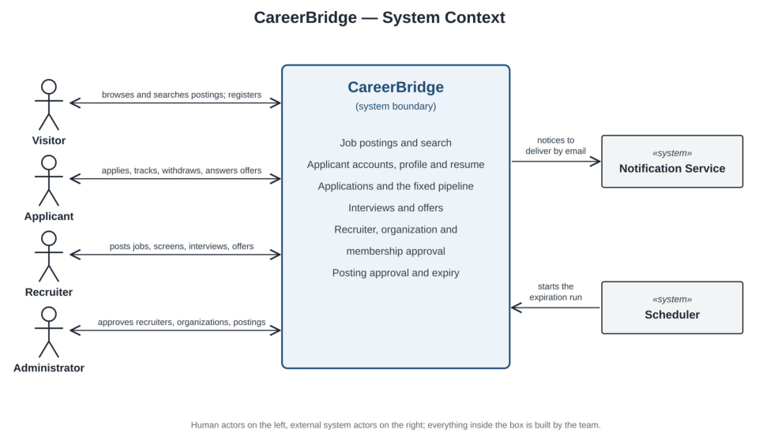

**Figure 1: System context: CareerBridge, its human actors and its two system actors**

### 2.2 Assumptions and Dependencies

The customer's Deliverable 0 answers (section 3.3) leave some behavior open. The team settled it with the working assumptions in Table 1, each tagged A-n; the use cases cite them where they apply, and the last column lists those use cases. The customer is asked to confirm them.

**Table 1: Working assumptions and the use cases that depend on them**

|**ID**|**Assumption**|**Used in**|
|---|---|---|
|A1|The Administrator approves job postings.|UC-11, UC-12|
|A2|Each posting has a number of openings (default 1); it is filled when accepted offers equal that number.|UC-07, UC-11, UC-15|
|A3|When a posting is filled, its remaining active applications are rejected with the reason "Posting closed." When a posting only expires, it stops accepting applications, but those already submitted continue through the pipeline.|UC-05, UC-07, UC-13, UC-15, Close Job Posting|
|A4|The Administrator approves a recruiter joining an additional organization.|UC-08 to UC-10|
|A5|An applicant cannot reapply to a posting they already applied to, including after withdrawing.|UC-04, UC-06|
|A6|Each submitted application keeps a copy of the resume as it was at submission, so later resume changes do not alter it (follows from BR-5 and BR-6).|UC-03, UC-04, UC-14|
|A7|An application is active while it is in Applied, Screening, Interview or Offer. Hired, Rejected, Withdrawn and Offer Declined are terminal. Only active applications count toward the limit in BR-4.|UC-04, UC-06, UC-07|
|A8|Stage changes are final. An application moves forward one stage at a time and is never moved back, and a rejection cannot be reversed.|UC-14|
|A9|A posting can be saved as a Draft before it is submitted. The Administrator can return a submitted posting for changes (Returned) or reject it (Rejected, final). Its application deadline must be 1 to 90 days away when it is submitted. A posting whose deadline passes before it is published is returned for a new deadline (UC-12) or marked Expired (UC-13).|Close Job Posting|
|A10|Every active recruiter of an organization can see and act on all of that organization's postings and the applications to them. "The posting's recruiters" means the active recruiters of the organization that owns it.|UC-04 to UC-07, UC-14, UC-15, Close Job Posting|
|A11|A rejection of an application in the Applied or Screening stage reaches the applicant by the end of the organization's business day on which it is recorded. An advance to Screening or Interview, and a rejection at the Interview or Offer stage, reach the applicant within 4 business days. All other notices, including offers and interview details, are sent within 1 minute. Business days are Monday to Friday in the organization's time zone.|UC-02, UC-04, UC-05, UC-07, UC-14, UC-15, Close Job Posting|
|A12|Interview outcomes are recorded for the organization only. Applicants learn the result through an offer (UC-15) or a rejection (UC-14, extension 5a).|UC-05, UC-14|
|A13|An application can have at most two interview rounds. A cancelled interview does not count as a round.|UC-14|
|A14|An offer's response deadline defaults to 7 days, and the start date must follow it. A recruiter may revise an unanswered offer, including its deadline, and the application stays in Offer. After its deadline an offer can no longer be accepted, and it stays in Offer until a recruiter rejects it (UC-14, extension 5a).|UC-07, UC-15|
|A15|New accounts verify their email address through a link valid for 24 hours. Passwords have at least 10 characters, including a letter and a number. Five failed log-ins within 15 minutes lock the account for 15 minutes.|UC-02, Log In|
|A16|A recruiter acts for one organization at a time and switches between Active memberships.|UC-14, Log In|
|A17|A recruiter request whose work-email domain differs from the organization's website domain is flagged for the Administrator's closer review.|UC-08|
|A18|Withdrawals and rejections record a reason chosen from a fixed list, plus an optional comment. The system itself uses the reason "Posting closed."|UC-05, UC-06, UC-14|

The system depends on the following:

- An external email service, the Notification Service, delivers every notice: verification links, stage changes, interview details, offers and approval decisions. If it is unavailable, CareerBridge keeps the decision recorded and holds the notice until the service accepts it.

- A scheduler starts the posting expiration run at least every 15 minutes (UC-13).

- The platform chosen by team poll in Deliverable 0: a backend written in JavaScript on Node.js. Users reach CareerBridge through current desktop and mobile web browsers.

- Deadlines and business days are interpreted in each organization's time zone (A11, UC-13).

## 3. Requirements

The requirements below come from the use cases in section 4.2. Each functional requirement cites the use-case steps or extensions it realizes, and section 3.4 traces every one to the SSD message and operation contract that carry it out. Business rules (BR-n) come from the customer's answers in section 3.3; assumptions (A-n) are listed in section 2.2.

### 3.1 Functional Requirements

#### UC-01 Browse Job Postings (Oleg Berdyshev)

- **FR-UC01.1:** The system shall let any visitor, without logging in, view the open job postings of all organizations, newest first. (BR-1, BR-3, BR-9, BR-10; UC-01 steps 1–2)

- **FR-UC01.2:** The system shall let a visitor search open postings by keyword, location, organization and employment type. (UC-01 steps 3–4)

- **FR-UC01.3:** The system shall show the full details of a selected open posting. (UC-01 steps 5–6)

#### UC-02 Register as Applicant (Oleg Berdyshev)

- **FR-UC02.1:** The system shall let a visitor create an Applicant account with full name, email address and password, without Administrator approval. (BR-14; UC-02 steps 1–5)

- **FR-UC02.2:** The system shall reject a registration with a missing field, a malformed or already registered email address, or a password shorter than 10 characters or lacking a letter or a number. (A15; UC-02 step 4, extensions 4a–4c)

- **FR-UC02.3:** The system shall email the new Applicant a verification link valid for 24 hours and activate the account only when the link is opened before it expires. (A15; UC-02 steps 5–8, extension 7a)

#### UC-03 Maintain Profile and Resume (Oleg Berdyshev)

- **FR-UC03.1:** The system shall let an applicant view their profile details and edit their full name, phone, location, headline, skills, education and work experience, and shall reject the changes if the full name is empty or the phone number is malformed. (UC-03 steps 1–4, extension 4a)

- **FR-UC03.2:** The system shall let an applicant upload one resume, a PDF or DOCX file of up to 5 MB, that replaces any previous resume, and shall reject any other file or a file flagged by the malware scan. (BR-6; UC-03 steps 5–7, extensions 6a, 6b)

- **FR-UC03.3:** The system shall keep the resume copy attached to each submitted application unchanged when the applicant replaces their resume. (BR-5, A6; UC-03 step 6, Success Guarantee)

#### UC-04 Apply for Job (Josh Job Joseph)

- **FR-UC04.1:** The system shall let a logged-in Applicant apply to an open posting and, before submission, show the posting title and organization, the Applicant's contact details, the resume on file and how many of the 5 active applications are in use. (BR-4; UC-04 steps 1–2)

- **FR-UC04.2:** The system shall require the Applicant to confirm the submission and to acknowledge that a submitted application cannot be edited; if the Applicant cancels, nothing shall be saved. (BR-5; UC-04 step 3, extension 3b)

- **FR-UC04.3:** Before creating an application, the system shall verify that the posting is still open, that the Applicant has fewer than 5 active applications and that the Applicant has not applied to the posting before, including through a withdrawn application. (BR-4, BR-10, A5; UC-04 step 4, extensions 4a–4c)

- **FR-UC04.4:** The system shall create the application in the Applied stage, keep a copy of the resume as it was at submission and record the submission time. (A6; UC-04 step 5)

- **FR-UC04.5:** After creating the application, the system shall ask the Notification Service to send the Applicant a confirmation, and shall confirm the submission with the updated count of active applications and a link to Track Application Status (UC-05). (UC-04 steps 6–7)

- **FR-UC04.6:** If the Applicant has no resume on file, the system shall explain that a resume is required and send the Applicant to Maintain Profile and Resume (UC-03), then resume the application. (BR-6; UC-04 extension 2a)

- **FR-UC04.7:** If the Applicant already has 5 active applications, the system shall block the application, list the active applications and explain that a slot frees up when one is withdrawn or reaches Hired, Rejected or Offer Declined. (BR-4, A7; UC-04 extensions 2b, 4b)

- **FR-UC04.8:** If the Notification Service is unavailable, the system shall keep the application saved, retry the confirmation and still confirm the submission on screen. (UC-04 extension 6a)

#### UC-14 Screen Applications (Josh Job Joseph)

- **FR-UC14.1:** The system shall present every posting of the organization the Recruiter is acting for, each with the number of applications at each stage. (A10; UC-14 steps 1–2)

- **FR-UC14.2:** The system shall present an application's resume copy, the applicant's profile details and the application's stage history, and nothing about the applicant's other applications. (A6, BR-15; UC14 steps 3–4)

- **FR-UC14.3:** The system shall let the Recruiter add an optional internal note and advance an application only to the next stage of the fixed pipeline, and shall record the new stage, the date and the Recruiter. (BR-8; UC-14 steps 5–6)

- **FR-UC14.4:** After an advance, the system shall ask the Notification Service to notify the applicant of the new stage within the time A11 allows. (BR-7, A11; UC-14 step 7)

- **FR-UC14.5:** The system shall refuse any move that skips or reverses a stage and explain that the pipeline is fixed and stage changes are final. (BR-8, A8; UC-14 extension 5b)

- **FR-UC14.6:** The system shall let the Recruiter reject an application at any active stage with a reason from the fixed list and an optional comment, warning first that a rejection at the Offer stage rescinds the offer. It shall record the stage, reason, date and Recruiter, and ask the Notification Service to send the applicant the reason within the time A11 allows for that stage. (BR-11, A8, A18; UC-14 extension 5a)

- **FR-UC14.7:** At the Interview stage, the system shall let the Recruiter record up to two interview rounds with their date and time, format, location or meeting link and interviewers, and later each round's outcome and notes. For a newly arranged interview it shall ask the Notification Service to send the applicant the details. (BR-12, A13; UC-14 extension 5c)

- **FR-UC14.8:** The system shall let the Recruiter advance several applications together and report any it could not move. (UC-14 extension 5d)

- **FR-UC14.9:** When a Recruiter asks for a posting or application of an organization they are not an Active member of, the system shall reveal nothing, report that it was not found and record the attempt. (BR-15; UC-14 extension *a)

- **FR-UC14.10:** If the application was withdrawn, rejected or moved by another recruiter since the Recruiter took it up, the system shall report the current stage and change nothing. (UC-14 extension 6a)

- **FR-UC14.11:** The system shall let a Recruiter who belongs to several organizations switch the organization they act for, and then present only that organization's postings. (BR-2, A16; UC-14 extension 2a)

#### UC-15 Extend Job Offer (Josh Job Joseph)

- **FR-UC15.1:** The system shall let a Recruiter extend an offer only on an application at the Interview stage, and shall present the offer terms to fill in, with the job title taken from the posting and the posting's openings, accepted offers and outstanding offers. (BR-8; UC-15 steps 1–2, extension 1a)

- **FR-UC15.2:** The system shall collect the start date, compensation, other terms and response deadline, with the deadline defaulting to 7 days, and shall accept an optional offer letter as a PDF of at most 5 MB. (A14; UC-15 step 3, Special Requirements)

- **FR-UC15.3:** The system shall show the offer as the applicant will see it and require the Recruiter to confirm it; if the Recruiter cancels, nothing shall change. (UC-15 step 4, extension 4a)

- **FR-UC15.4:** The system shall reject an offer with a missing or invalid field, a response deadline that is not in the future, or a start date that is not after the response deadline. (A14; UC-15 step 5, extension 5a)

- **FR-UC15.5:** When the offer is valid, the system shall move the application to the Offer stage and record the terms, the date and the Recruiter. (BR-8, BR-13; UC-15 step 6)

- **FR-UC15.6:** The system shall ask the Notification Service to send the applicant the offer with a link to Respond to Job Offer (UC-07), and confirm to the Recruiter that it was sent. (UC-15 steps 7–8)

- **FR-UC15.7:** The system shall let a Recruiter revise an unanswered offer's terms, response deadline or offer letter, keep the application in the Offer stage, record the revision with the date and the Recruiter, and tell the applicant what changed. (A14; UC-15 extension 1b)

- **FR-UC15.8:** The system shall warn the Recruiter when no interview with the outcome Passed is recorded, and when the posting's accepted plus outstanding offers already equal its openings, and shall let the Recruiter continue or cancel. (A2, A3; UC-15 extensions 2a, 2b)

- **FR-UC15.9:** If, since the Recruiter started, the application was withdrawn or rejected, the applicant answered the offer, or the posting was filled, the system shall report the current status and shall not make or revise the offer. (UC-15 extension 5b)

- **FR-UC15.10:** When a Recruiter asks for an application of an organization they are not an Active member of, the system shall reveal nothing, report that it was not found and record the attempt. (BR15; UC-15 extension *a)

#### UC-05 Track Application Status (Rabeya Nazara)

- **FR-UC05.1:** The system shall let a logged-in Applicant view all applications that belong to that Applicant, with active applications shown first. Each application shall show the posting title, organization, submission date, current stage, and date of the most recent stage change. (BR-7, BR-15; UC-05 steps 1–2)

- **FR-UC05.2:** The system shall let an Applicant select one of their applications and view its stage history, including each pipeline stage reached and the date on which the application entered that stage. (BR-7, BR-8; UC-05 steps 3–4)

- **FR-UC05.3:** The system shall display the date, time, format and location of any recorded interview for the selected application, and shall not display interview outcomes. (BR-12, A12; UC-05 step 4)

- **FR-UC05.4:** The system shall display the rejection date, stage at rejection, and recorded rejection reason when an application is in the Rejected stage. (BR-11; UC-05 extension 4a)

- **FR-UC05.5:** The system shall show only the actions that are valid for the application's current stage. For applications in Applied, Screening, or Interview, the system shall provide the Withdraw action through UC-06. For an application in Offer, the system shall provide the Accept and Decline actions through UC-07. (BR-5, BR-13; UC-05 step 5, extensions 5a–5b)

- **FR-UC05.6:** When an Applicant asks for an application that is not theirs, the system shall reveal nothing about it, report that it was not found and record the attempt. (BR-15; UC-05 extension *a)

- **FR-UC05.7:** The system shall let an Applicant filter the application list to show active or terminal applications. (UC-05 extension 2b)

- **FR-UC05.8:** The system shall show the Applicant's current number of active applications relative to the maximum of five allowed active applications. (BR-4; UC-05 step 2)

#### UC-06 Withdraw Application (Rabeya Nazara)

- **FR-UC06.1:** The system shall let an Applicant withdraw an application only while it is in the Applied, Screening, or Interview stage. An application in the Offer stage shall be handled through UC-07 instead. (BR-5, BR-8; UC-06 Preconditions)

- **FR-UC06.2:** Before recording a withdrawal, the system shall show the posting title, organization, current application stage, and a warning that the withdrawal is final and that the Applicant cannot reapply to the posting under the current assumption. (A5; UC-06 steps 1–2)

- **FR-UC06.3:** The system shall allow the Applicant to provide an optional withdrawal reason and shall require the Applicant to confirm the withdrawal before any application data is changed. (UC-06 step 3)

- **FR-UC06.4:** Before completing a withdrawal, the system shall verify that the application is still in an eligible active stage. If the application has already moved to Offer or a terminal stage, the system shall not withdraw it. (BR-8; UC-06 step 4, extensions 4a–4b)

- **FR-UC06.5:** After a successful withdrawal, the system shall change the application stage to Withdrawn and record the withdrawal date and any reason provided by the Applicant. (UC-06 step 5)

- **FR-UC06.6:** After a successful withdrawal, the application shall no longer count toward the Applicant's 5 active applications. (BR-4, A7; UC-06 Success Guarantee)

- **FR-UC06.7:** After a successful withdrawal, the system shall ask the Notification Service to notify the posting organization's recruiters and send a confirmation to the Applicant. (UC-06 step 6)

- **FR-UC06.8:** If the Notification Service is unavailable, the system shall keep the withdrawal recorded, queue the notifications, and retry delivery later. (UC-06 extension 6a)

- **FR-UC06.9:** A withdrawn application shall remain stored as a read-only record for audit purposes and shall not be deleted by the withdrawal operation. (UC-06 Special Requirements)

#### UC-07 Respond to Job Offer (Rabeya Nazara)

- **FR-UC07.1:** The system shall let an Applicant whose application is in the Offer stage view the offer details, including the organization, job title, start date, compensation, other offer terms, and response deadline. (BR-13; UC-07 steps 1–2)

- **FR-UC07.2:** The system shall allow the Applicant to either Accept or Decline an active offer. (BR13; UC-07 step 3, extension 3a)

- **FR-UC07.3:** The system shall require confirmation before recording either acceptance or decline of an offer, and no change shall be made if the Applicant leaves or does not confirm. (UC-07 steps 4–5; extensions 3a, 3b, 5a)

- **FR-UC07.4:** When an Applicant confirms acceptance, the system shall move the application to Hired and record the acceptance date. (BR-13; UC-07 step 6)

- **FR-UC07.5:** When an Applicant confirms a decline, the system shall move the application to Offer Declined and record the date and any reason given. The application shall then no longer count toward the Applicant's 5 active applications. (BR-4, BR-13, A7; UC-07 extension 3a, Success Guarantee)

- **FR-UC07.6:** Before recording an offer response, the system shall verify that the offer is still open. If the application has been rejected, the posting has closed, or the response deadline has passed, the system shall show the current stage and make no change. (UC-07 extension 6a)

- **FR-UC07.7:** When an acceptance makes the posting's accepted offers equal its openings, the system shall close the posting with the reason Filled, remove it from public listings, stop accepting applications, reject every remaining active application with the reason "Posting closed" and notify those applicants. (BR-10, BR-11, A2, A3; UC-07 extension 6c)

- **FR-UC07.8:** After an offer response is successfully recorded, the system shall ask the Notification Service to notify the posting organization's recruiters and send a confirmation to the Applicant. (UC07 steps 7–8)

- **FR-UC07.9:** If the Notification Service is unavailable, the system shall keep the Applicant's decision recorded, queue the notifications, and retry delivery later. (UC-07 extension 7a)

- **FR-UC07.10:** The system shall prevent the number of accepted offers for a posting from exceeding the posting's number of openings, including when multiple Applicants accept offers at nearly the same time. (A2; UC-07 Special Requirements)

- **FR-UC07.11:** If the recruiter revised the offer after the Applicant viewed it, the system shall present the revised terms and record no response until the Applicant responds to them. (A14; UC-07 extension 6b)

#### UC-08 Register Recruiter and Organization (Reagan Rubio)

- **FR-UC08.1:** The system shall check that all required registration fields are present and valid and that the password meets the policy before creating the recruiter account. (UC-08 step 4, extension 4a)

- **FR-UC08.2:** The system shall reject a registration whose email address is already registered, offer Log In instead and create no account. (UC-08 step 4, extension 4b)

- **FR-UC08.3:** The system shall determine whether an organization already exists by comparing its normalized legal name and website domain against registered organizations. (UC-08 step 4, extension 4c; Technology and Data Variations 4a)

- **FR-UC08.4:** When the visitor opens a valid verification link, the system shall mark the email verified, add the request to the Administrator's approval queue and ask the Notification Service to alert the Administrator. (UC-08 steps 6–7)

#### UC-09 Join Additional Organization (Reagan Rubio)

- **FR-UC09.1:** Before creating a membership request, the system shall verify that the recruiter is not already a member of the organization and has no pending request for it. (UC-09 step 6, extensions 6a– 6b)

- **FR-UC09.2:** The system shall prevent the recruiter from accessing the target organization's postings and applications until the membership request is approved. (BR-15; UC-09 Success Guarantee)

- **FR-UC09.3:** When a recruiter creates a new organization through UC-09, the system shall create the organization with a Pending Approval status. (UC-09 extension 3a)

#### UC-10 Approve Recruiter/Organization Request (Reagan Rubio)

- **FR-UC10.1:** The system shall allow only authenticated users with the **Administrator** role to access the recruiter/organization approval queue. (UC-10 Preconditions, Special Requirements)

- **FR-UC10.2:** When the Administrator approves a request, the system shall activate the recruiter account if new, the organization if new, and the membership, and record the decision. (UC-10 step 6)

- **FR-UC10.3:** The system shall ask the Notification Service to tell the requester the decision, with the reason when the request is denied. (UC-10 step 7, extension 5a)

#### UC-11 Create Job Posting (Zeba Tusnia Towshi)

- **FR-UC11.1:** The system shall allow an approved Recruiter to create a job posting only for an organization in which the Recruiter has an active membership. (BR-14; UC-11 Preconditions, extension 2a)

- **FR-UC11.2:** The system shall collect and validate the posting title, description, requirements, location, employment type, application deadline, and number of openings before submission. (UC-11 steps 3 and 5, extension 5a)

- **FR-UC11.3:** The system shall allow an optional salary range and shall require the number of openings to be at least one. (UC-11 steps 3 and 5)

- **FR-UC11.4:** The system shall require the application deadline to be between 1 and 90 days from submission. (UC-11 step 5, extension 5b)

- **FR-UC11.5:** The system shall save a submitted posting with Pending Approval status, link it to its organization and creating Recruiter, and add it to the Administrator's posting approval queue. (UC-11 step 6)

- **FR-UC11.6:** The system shall keep Draft and Pending Approval postings hidden from public listings. (BR-9; UC-11 Success Guarantee)

- **FR-UC11.7:** The system shall allow a Recruiter to save a posting as Draft without submitting it for approval. (UC-11 extension 3b)

- **FR-UC11.8:** The system shall show a Returned posting with the Administrator's comments and let a recruiter of the organization revise and resubmit it. (UC-11 extension 6a; UC-12 extension 5a)

#### UC-12 Approve Job Posting (Zeba Tusnia Towshi)

- **FR-UC12.1:** The system shall allow only authenticated Administrators to access the job-posting approval queue. (UC-12 Preconditions)

- **FR-UC12.2:** The system shall list Pending Approval postings oldest first and display the title, organization, submitting Recruiter, submission date, and application deadline. (UC-12 step 2)

- **FR-UC12.3:** The system shall provide a public-view preview of a selected posting and the owning organization's current account status. (UC-12 step 4)

- **FR-UC12.4:** When an Administrator approves a valid posting, the system shall set its status to Published, record the publication date and deciding Administrator, and add it to public listings. (UC12 step 6)

- **FR-UC12.5:** The system shall allow an Administrator to return a posting for changes only after comments are entered. (UC-12 extension 5a)

- **FR-UC12.6:** The system shall allow an Administrator to reject a posting with a reason and prevent that rejected posting from being resubmitted. (UC-12 extension 5b)

- **FR-UC12.7:** If the deadline has passed, the system shall block approval and return the posting to the recruiters for a new deadline. If the organization or submitting Recruiter is no longer active, it shall block publication, show the reason and keep the posting pending. (UC-12 extensions 6a, 6b)

- **FR-UC12.8:** The system shall notify the organization's recruiters after an approval, return, or rejection decision. (UC-12 step 7; extensions 5a, 5b)

#### UC-13 Expire Job Posting (Zeba Tusnia Towshi)

- **FR-UC13.1:** The system shall run the expiration process at least every 15 minutes. (UC-13 step 1, Special Requirements)

- **FR-UC13.2:** The system shall identify every Published job posting whose application deadline has passed. (UC-13 step 2)

- **FR-UC13.3:** The system shall close each overdue Published posting with reason Expired, remove it from public listings, and prevent new applications. (UC-13 step 3)

- **FR-UC13.4:** The system shall preserve the stages of applications submitted before the posting deadline. (A3; UC-13 Success Guarantee)

- **FR-UC13.5:** The system shall mark a Pending Approval or Returned posting whose deadline has passed as Expired, without publishing it, and notify its recruiters that a new deadline is needed. (UC13 extension 2b)

- **FR-UC13.6:** The system shall skip a posting that was already closed, including one closed because all openings were filled. (UC-13 extension 3a)

- **FR-UC13.7:** The system shall notify the owning organization's recruiters when a posting expires and include the number of still-active applications. (UC-13 step 4)

- **FR-UC13.8:** The system shall log each expiration run, including start time, postings closed, and errors. (UC-13 step 5)

### 3.2 Non-functional Requirements

#### UC-01 Browse Job Postings (Oleg Berdyshev)

- **NFR-UC01.1 (Performance):** Search results appear within 2 seconds for up to 10,000 open postings.

- **NFR-UC01.2 (Usability):** Pages work on current desktop and mobile browsers and meet WCAG 2.1 AA.

#### UC-02 Register as Applicant (Oleg Berdyshev)

- **NFR-UC02.1 (Security):** Passwords are stored only as salted hashes, and all traffic uses HTTPS.

- **NFR-UC02.2 (Performance):** The system hands the verification email to the Notification Service within 1 minute of registration. (A11)

- **NFR-UC02.3 (Usability):** Pages work on current desktop and mobile browsers and meet WCAG 2.1 AA.

#### UC-03 Maintain Profile and Resume (Oleg Berdyshev)

- **NFR-UC03.1 (Performance):** The system validates, scans and stores a 5 MB resume within 10 seconds after receiving it.

- **NFR-UC03.2 (Security/Privacy):** Resume files are encrypted at rest. Only the applicant and the Administrator can open the resume on file; a recruiter sees only the resume copy attached to an application to their organization's posting. (BR-15, A6)

#### UC-04 Apply for Job (Josh Job Joseph)

- **NFR-UC04.1 (Integrity):** An Applicant shall never have more than 5 active applications, even when several submissions from the same Applicant arrive at the same moment. (BR-4; UC-04 Special Requirements)

- **NFR-UC04.2 (Integrity):** If a failure interrupts a submission, either the application exists with its resume copy or nothing was created, in 100% of cases. (UC-04 extension *a)

- **NFR-UC04.3 (Performance):** The Applicant's confirmation shall be sent within 1 minute of submission. (A11; UC-04 Special Requirements)

- **NFR-UC04.4 (Privacy):** An application shall be visible only to the Applicant, the Administrator and the posting's recruiters. (BR-15, A10; UC-04 Success Guarantee)

- **NFR-UC04.5 (Reliability):** If the Notification Service is unavailable, no submitted application shall be lost, and every held notice is sent within 15 minutes after the service is available again.

#### UC-14 Screen Applications (Josh Job Joseph)

- **NFR-UC14.1 (Performance):** The applications to a posting with up to 1,000 applications shall be listed within 2 seconds. (UC-14 Special Requirements)

- **NFR-UC14.2 (Freshness):** A new stage shall be visible to the applicant in UC-05 within 1 minute of the change. (UC-14 Special Requirements)

- **NFR-UC14.3 (Privacy):** No applicant view and no other organization's view shall show an internal note or an interview outcome. (A12; UC-14 Special Requirements)

- **NFR-UC14.4 (Auditability):** 100% of stage changes, rejections and interview records shall be logged with the Recruiter and the date and time. (UC-14 Special Requirements)

- **NFR-UC14.5 (Reliability):** If the Notification Service is unavailable, no recorded stage change shall be lost, and every held notice shall still be sent within the time A11 allows for its stage. (UC-14 extension 7a)

#### UC-15 Extend Job Offer (Josh Job Joseph)

- **NFR-UC15.1 (Performance):** The offer shall be sent to the applicant within 1 minute of the Recruiter's confirmation. (A11; UC-15 Special Requirements)

- **NFR-UC15.2 (Privacy):** Offer terms shall be visible only to the applicant, the posting's recruiters and the Administrator. (BR-15, A10; UC-15 Special Requirements)

- **NFR-UC15.3 (Auditability):** 100% of offers and revisions shall be logged with the Recruiter and the date and time. (UC-15 Special Requirements)

- **NFR-UC15.4 (Reliability):** If the Notification Service is unavailable, no recorded offer or revision shall be lost, and every held notice is sent within 15 minutes after the service is available again.

#### UC-05 Track Application Status (Rabeya Nazara)

- **NFR-UC05.1 (Performance):** The application-status page shall load within 2 seconds for an Applicant with up to 200 applications.

- **NFR-UC05.2 (Security/Privacy):** An Applicant shall be able to access only applications that belong to that Applicant. Attempts to access another Applicant's application shall reveal no application data and shall be logged.

- **NFR-UC05.3 (Freshness):** A stage change made by a recruiter shall appear to the Applicant within 1 minute.

- **NFR-UC05.4 (Privacy):** No applicant view shall show a recruiter's internal notes or an interview outcome (A12).

#### UC-06 Withdraw Application (Rabeya Nazara)

- **NFR-UC06.1 (Integrity):** After any withdrawal attempt, including one interrupted by a failure, the application's stage and the Applicant's count of active applications shall agree in 100% of cases. (UC06 extension *a, Special Requirements)

- **NFR-UC06.2 (Performance):** A successful withdrawal shall become visible to the posting organization's recruiters within 1 minute.

- **NFR-UC06.3 (Reliability):** If the Notification Service is unavailable, no recorded withdrawal shall be lost, and every held notice is sent within 15 minutes after the service is available again.

#### UC-07 Respond to Job Offer (Rabeya Nazara)

- **NFR-UC07.1 (Integrity):** A posting shall never have more Hired applications than openings, even when two or more Applicants accept the last opening at the same moment. (A2; UC-07 Special Requirements)

- **NFR-UC07.2 (Performance):** A filled posting shall leave public listings within 1 minute of the acceptance that filled it. (UC-07 Special Requirements)

- **NFR-UC07.3 (Reliability):** If the Notification Service is unavailable, no recorded offer response shall be lost, and every held notice is sent within 15 minutes after the service is available again.

#### UC-08 Register Recruiter and Organization (Reagan Rubio)

- **NFR-UC08.1 (Performance):** A verified registration request shall appear in the Administrator's approval queue within 1 minute of email verification. (UC-08 Special Requirements)

#### UC-09 Join Additional Organization (Reagan Rubio)

- **NFR-UC09.1 (Security):** A recruiter shall only be able to access data belonging to organizations for which the recruiter has an approved membership.

- **NFR-UC09.2 (Integrity):** At most one pending membership request shall exist per recruiter and organization, even when two identical requests are submitted at the same moment.

#### UC-10 Approve Recruiter/Organization Request (Reagan Rubio)

- **NFR-UC10.1 (Auditability):** 100% of approval decisions shall be logged with the deciding Administrator, the date and time, the decision and any reason. (UC-10 Special Requirements)

- **NFR-UC10.2 (Integrity):** After any approval, including one interrupted by a failure, the recruiter account, any new organization and the membership shall be either all Active or all unchanged.

#### UC-11 Create Job Posting (Zeba Tusnia Towshi)

- **NFR-UC11.1 (Security):** Draft and pending postings shall be visible only to approved recruiters of the owning organization and Administrators.

- **NFR-UC11.2 (Reliability):** After a session timeout, a recruiter who logs in again within 24 hours shall recover all posting-form input entered up to 30 seconds before the timeout. (UC-11 Special Requirements)

#### UC-12 Approve Job Posting (Zeba Tusnia Towshi)

- **NFR-UC12.1 (Security):** Only users with the Administrator role shall be authorized to approve, return, or reject job postings.

- **NFR-UC12.2 (Auditability):** Every posting decision shall record the deciding Administrator, date/time, decision, and any comments or reason.

- **NFR-UC12.3 (Reliability):** If the Notification Service is unavailable, no recorded posting decision shall be lost, and every held notice is sent within 15 minutes after the service is available again.

#### UC-13 Expire Job Posting (Zeba Tusnia Towshi)

- **NFR-UC13.1 (Reliability/Idempotency):** Running the expiration job more than once shall not close an already closed posting again.

- **NFR-UC13.2 (Performance):** A run that closes up to 1,000 overdue postings shall finish within 1 minute.

- **NFR-UC13.3 (Reliability):** Failure to close one posting shall not stop the remaining postings from being processed; the failed posting shall be retried on the next run.

- **NFR-UC13.4 (Reliability):** If the Notification Service is unavailable, no recorded posting closure shall be lost, and every held notice is sent within 15 minutes after the service is available again.

- **NFR-UC13.5 (Correctness):** A posting shall stop accepting applications at 23:59 on its deadline date in the organization's time zone, and shall leave public listings no more than 15 minutes later (one run interval).

### 3.3 Requirements Clarifications

Table 2 lists the 14 clarification questions submitted in Deliverable 0, the customer's answers, the business rule each answer became and the use cases that enforce it. The customer has not changed any answer since Deliverable 0.

**Table 2: Deliverable 0 clarification questions, answers and resulting business rules**

|**Q**|**Question**|**Customer answer**|**Business rule**|**Enforced in**|
|---|---|---|---|---|
|1|Is the system for a single organization's internal recruiting, or a multi-company job board where many organizations post jobs?|Multi-organization, similar to LinkedIn.|BR-1: Many organizations post jobs; applicants browse and apply across organizations.|UC-01|
|2|Can one recruiter belong to multiple organizations?|Yes.|BR-2: A recruiter may belong to more than one organization.|UC-09, UC-11, UC-14|
|3|Should the public (not-logged-in visitors) be able to browse job postings, or is everything behind a login?|Some pages are public.|BR-3: Some pages are public: visitors can browse open postings without logging in.|UC-01, UC-12|
|4|Can an applicant apply to multiple jobs at once? Is there a limit on|Yes, 5 active applications.|BR-4: An applicant may have at most 5 active applications at a time.|UC-04 to UC- 07, UC-13,|
||active applications?|||UC-14, Close Job Posting|
|5|Can an applicant withdraw or edit an application after submitting it?|They can withdraw but not edit it.|BR-5: An applicant may withdraw a submitted application but may not edit it.|UC-03 to UC- 06|
|6|One resume per applicant, or multiple resumes or cover letters tailored per application?|One resume.|BR-6: Each applicant has exactly one resume on file; no cover letters or per-job resumes.|UC-03, UC-04|
|7|What should an applicant see about their application status: every internal stage, or only coarse outcomes?|All stages.|BR-7: Applicants see every pipeline stage of their own applications.|UC-05, UC-14|
|8|What are the stages of the recruiting pipeline? Is the pipeline fixed or configurable per job?|Fixed pipeline.|BR-8: The recruiting pipeline is fixed for all postings (see diagram below).|UC-05, UC-06, UC-14, UC-15|
|9|Do job postings need an approval step before going live, and do they expire (deadline, auto-close when filled)?|Yes, and they do expire.|BR-9: A job posting must be approved before it is published. BR-10: A posting closes automatically when its deadline passes or when it is filled (A2 defines filled).|UC-01, UC-04, UC-05, UC-07, UC-11 to UC- 13, Close Job Posting|
|10|Should rejected applicants be notified automatically? Are rejection reasons recorded and/or shared?|Yes and yes.|BR-11: Rejected applicants are notified automatically, and the recorded rejection reason is shared with them.|UC-05, UC-07, UC-14, Close Job Posting|
|11|Should interview coordination happen inside the system, or is it enough to record that an interview was scheduled and its outcome?|It is enough to record that an interview was scheduled.|BR-12: The system records that an interview was scheduled and its outcome; it does not coordinate times.|UC-05, UC-14|
|12|Is an offer extended and accepted or declined through the system, and should a job posting close automatically once it is filled?|Yes; the posting should close automatically to save memory and time for other applications.|BR-10: A posting closes automatically when its deadline passes or when it is filled (A2 defines filled). BR-13: Offers are extended, accepted and declined inside the system.|UC-01, UC-04, UC-05, UC-07, UC-13, UC-15, Close Job Posting|
|13|Who creates and approves new recruiter and organization accounts? Is applicant self-registration open?|Applicants can self- register. Recruiter and organization accounts require Administrator approval.|BR-14: Applicants self-register; recruiter and organization accounts require Administrator approval.|UC-02, UC-08, UC-10, UC-11, UC-14, UC-15, Log In|
|14|Are there privacy expectations (company A cannot see applications to company B; recruiters cannot see an applicant's other applications)?|Yes. Recruiters only access applications to jobs within their own organization and cannot view an applicant's applications to other organizations.|BR-15: Recruiters see only applications to their own organizations' postings, never an applicant's applications elsewhere.|UC-01, UC-03 to UC-05, UC- 09 to UC-11, UC-14, UC-15, Log In|

Writing the use cases raised further questions for the customer. Table 3 lists them with the use case that raised each one and the answer the team works with until the customer replies.

**Table 3: Open questions raised by the use cases, with the team's working answers**

|**Use case**|**Question for the customer**|**Team's working answer**|
|---|---|---|
|UC-04|Confirm that an applicant cannot reapply to a posting after withdrawing.|As stated in A5 (section 2.2).|
|UC-04|Should recruiters also get a notice for each new application, or only see new applications among their postings?|This model only lists them (UC-14).|
|UC-04|Confirm that an application at the Offer stage counts toward the limit until the offer is accepted, declined or expires.|As stated in A7 (section 2.2).|
|UC-14|Confirm that every active recruiter of an organization sees all of its postings and applications.|As stated in A10 (section 2.2).|
|UC-14|Confirm the notice times: a rejection before the Interview stage by the end of the business day; an advance, or a rejection at the Interview or Offer stage, within 4 business days.|As stated in A11 (section 2.2).|
|UC-14|Confirm that an application can never be moved back a stage and that a rejection is final.|As stated in A8 (section 2.2).|
|UC-14|Confirm that interview outcomes stay hidden from applicants and that an application has at most two interview rounds.|As stated in A12, A13 (section 2.2).|
|UC-15|Is 7 days a sensible default response deadline?|As stated in A14 (section 2.2).|
|UC-15|Should an interview with the outcome Passed be required before an offer, rather than only warned about?|This model only warns.|
|UC-15|A14: may a revision shorten the response deadline, or only extend it?|This model allows any future deadline.|
|UC-05|BR-7 says applicants see all stages. Confirm that this means stage names and dates only, not recruiter notes or recruiter names; this model shows names and dates only.|Not covered by the current use cases; left for the customer to decide.|
|UC-05|Should rejection reasons come from a fixed list with an optional comment, to keep them professional, or be free text?|This model uses a fixed list (A18).|
|UC-05|Confirm that applications to a filled posting are rejected with the reason "Posting closed."|As stated in A3 (section 2.2).|
|UC-06|Confirm that an applicant cannot reapply after withdrawing.|As stated in A5 (section 2.2).|
|UC-06|Is the withdrawal reason shared with the recruiter, or kept for platform statistics only?|This model shares it.|
|UC-06|Should an applicant be able to withdraw at the Offer stage?|This model routes that case to Decline in UC-07.|
|UC-07|Once hired, should the applicant's other active applications be withdrawn automatically?|This model leaves them to the applicant.|
|UC-07|Confirm the number-of-openings rule and the automatic rejection with the reason "Posting closed."|As stated in A2 and A3 (section 2.2).|
|UC-07|Confirm that an offer past its response deadline can no longer be accepted and stays in Offer until a recruiter rejects it.|As stated in A14 (section 2.2).|
|UC-08|What evidence should the Administrator require to approve a request (matching email domain, business registration number)?|Not covered by the current use cases; left for the customer to decide.|
|UC-08|When a new recruiter asks to join an existing organization, should an approved recruiter of that organization approve instead of the Administrator?|As stated in A4 (section 2.2).|
|UC-08|Should a pending recruiter be able to draft postings before approval?|This model says no.|
|UC-09|Should the Administrator approve membership requests, or an|As stated in A4 (section 2.2).|
||existing recruiter of the target organization?||
|UC-09|Is there a limit on how many organizations one recruiter can join?|Not covered by the current use cases; left for the customer to decide.|
|UC-09|Leaving an organization, or being removed from one, is not covered by any current use case.|Not covered by the current use cases; left for the customer to decide.|
|UC-10|What verification criteria must be met before approval? This ties to UC-08.|Not covered by the current use cases; left for the customer to decide.|
|UC-10|Confirm that the Administrator, not the organization, approves membership requests.|As stated in A4 (section 2.2).|
|UC-10|Suspending or revoking an approved recruiter or organization is not covered by any current use case.|Not covered by the current use cases; left for the customer to decide.|
|UC-11|Confirm that the Administrator, not a reviewer inside the organization, approves postings.|As stated in A1 (section 2.2).|
|UC-11|Can a published posting be edited, and does an edit need re- approval? Can the deadline be extended?|Not covered by the current use cases; left for the customer to decide.|
|UC-11|Is the 90-day maximum deadline acceptable, and is salary range required?|Not covered by the current use cases; left for the customer to decide.|
|UC-11|Can every recruiter of an organization manage all of its postings, or only their own?|Not covered by the current use cases; left for the customer to decide.|
|UC-12|Confirm that the Administrator approves postings.|As stated in A1 (section 2.2).|
|UC-12|Who writes the posting guidelines, and what do they prohibit?|Not covered by the current use cases; left for the customer to decide.|
|UC-12|Should organizations with a good track record be allowed to publish without review?|Not covered by the current use cases; left for the customer to decide.|
|UC-13|Confirm that applications submitted before the deadline continue after the posting expires.|As stated in A3 (section 2.2).|
|UC-13|Can a recruiter reopen an expired posting with a new deadline, and would that need re-approval?|Not covered by the current use cases; left for the customer to decide.|
|UC-13|Applications never processed after expiry keep occupying applicants' slots (BR-4). Should they be rejected automatically after some period?|Not covered by the current use cases; left for the customer to decide.|

### 3.4 Traceability Matrix

Table 4 traces each functional requirement to the use-case steps it cites, the SSD message that carries it out and that message's operation contract (section 4.3). Query messages change nothing, so they have no contract. "None" marks an extension that has no system operation in its SSD, and so no contract.

**Table 4: Functional requirements to use-case steps, SSD messages and operation contracts**

|**FR**|**Use-case steps**|**SSD message**|**Operation contract**|
|---|---|---|---|
|FR-UC01.1|UC-01 steps 1–2|searchPostings(criteria)|CO-01.1|
|FR-UC01.2|UC-01 steps 3–4|searchPostings(criteria)|CO-01.1|
|FR-UC01.3|UC-01 steps 5–6|viewPosting(postingId)|CO-01.2|
|FR-UC02.1|UC-02 steps 1–5|register(fullName, email, password)|CO-02.1|
|FR-UC02.2|UC-02 step 4, extensions 4a–4c|register(fullName, email, password)|CO-02.1|
|FR-UC02.3|UC-02 steps 5–8, extension 7a|register(fullName, email, password), verifyEmail(token)|CO-02.1, CO-02.2|
|FR-UC03.1|UC-03 steps 1–4, extension 4a|viewProfile(), updateProfile(details)|CO-03.1, CO-03.2|
|FR-UC03.2|UC-03 steps 5–7, extensions 6a, 6b|uploadResume(file)|CO-03.3|
|FR-UC03.3|UC-03 step 6, Success Guarantee|uploadResume(file)|CO-03.3|
|FR-UC04.1|UC-04 steps 1–2|startApplication(postingId)|query (no contract)|
|FR-UC04.2|UC-04 step 3, extension 3b|submitApplication(postingId)|CO-04.1|
|FR-UC04.3|UC-04 step 4, extensions 4a–4c|submitApplication(postingId)|CO-04.1|
|FR-UC04.4|UC-04 step 5|submitApplication(postingId)|CO-04.1|
|FR-UC04.5|UC-04 steps 6–7|submitApplication(postingId)|CO-04.1|
|FR-UC04.6|UC-04 extension 2a|startApplication(postingId)|query (no contract)|
|FR-UC04.7|UC-04 extensions 2b, 4b|startApplication(postingId), submitApplication(postingId)|query (no contract), CO-04.1|
|FR-UC04.8|UC-04 extension 6a|submitApplication(postingId)|CO-04.1|
|FR-UC05.1|UC-05 steps 1–2|viewApplications()|CO-05.1|
|FR-UC05.2|UC-05 steps 3–4|viewApplication(applicationId)|CO-05.2|
|FR-UC05.3|UC-05 step 4|viewApplication(applicationId)|CO-05.2|
|FR-UC05.4|UC-05 extension 4a|viewApplication(applicationId)|CO-05.2|
|FR-UC05.5|UC-05 step 5, extensions 5a–5b|viewApplication(applicationId)|CO-05.2|
|FR-UC05.6|UC-05 extension *a|viewApplication(applicationId)|CO-05.2|
|FR-UC05.7|UC-05 extension 2b|viewApplications()|CO-05.1|
|FR-UC05.8|UC-05 step 2|viewApplications()|CO-05.1|
|FR-UC06.1|UC-06 Preconditions|requestWithdrawal(applicationId), withdrawApplication(applicationId, reason)|CO-06.1, CO-06.2|
|FR-UC06.2|UC-06 steps 1–2|requestWithdrawal(applicationId)|CO-06.1|
|FR-UC06.3|UC-06 step 3|withdrawApplication(applicationId, reason)|CO-06.2|
|FR-UC06.4|UC-06 step 4, extensions 4a–4b|withdrawApplication(applicationId, reason)|CO-06.2|
|FR-UC06.5|UC-06 step 5|withdrawApplication(applicationId, reason)|CO-06.2|
|FR-UC06.6|UC-06 Success Guarantee|withdrawApplication(applicationId, reason)|CO-06.2|
|FR-UC06.7|UC-06 step 6|withdrawApplication(applicationId, reason)|CO-06.2|
|FR-UC06.8|UC-06 extension 6a|withdrawApplication(applicationId, reason)|CO-06.2|
|FR-UC06.9|UC-06 Special Requirements|withdrawApplication(applicationId, reason)|CO-06.2|
|FR-UC07.1|UC-07 steps 1–2|viewOffer(applicationId)|CO-07.1|
|FR-UC07.2|UC-07 step 3, extension 3a|acceptOffer(applicationId), declineOffer(applicationId, reason)|CO-07.2, CO-07.3|
|FR-UC07.3|UC-07 steps 4–5; UC-07 extensions 3a, 3b, 5a|acceptOffer(applicationId), declineOffer(applicationId, reason)|CO-07.2, CO-07.3|
|FR-UC07.4|UC-07 step 6|acceptOffer(applicationId)|CO-07.2|
|FR-UC07.5|UC-07 extension 3a, Success Guarantee|declineOffer(applicationId, reason)|CO-07.3|
|FR-UC07.6|UC-07 extension 6a|acceptOffer(applicationId), declineOffer(applicationId, reason)|CO-07.2, CO-07.3|
|FR-UC07.7|UC-07 extension 6c|acceptOffer(applicationId)|CO-07.2|
|FR-UC07.8|UC-07 steps 7–8|acceptOffer(applicationId), declineOffer(applicationId, reason)|CO-07.2, CO-07.3|
|FR-UC07.9|UC-07 extension 7a|acceptOffer(applicationId), declineOffer(applicationId, reason)|CO-07.2, CO-07.3|
|FR-UC07.10|UC-07 Special Requirements|acceptOffer(applicationId)|CO-07.2|
|FR-UC07.11|UC-07 extension 6b|acceptOffer(applicationId)|CO-07.2|
|FR-UC08.1|UC-08 step 4, extension 4a|submitRecruiterRegistration(recruiterData, organizationData)|CO-08.1|
|FR-UC08.2|UC-08 step 4, extension 4b|submitRecruiterRegistration(recruiterData, organizationData)|CO-08.1|
|FR-UC08.3|UC-08 step 4, extension 4c|submitRecruiterRegistration(recruiterData, organizationData)|CO-08.1|
|FR-UC08.4|UC-08 steps 6–7|verifyRecruiterEmail(token)|CO-08.2|
|FR-UC09.1|UC-09 step 6, extensions 6a–6b|submitMembershipRequest(organizationId, role, justification)|CO-09.1|
|FR-UC09.2|UC-09 Success Guarantee|submitMembershipRequest(organizationId, role, justification)|CO-09.1|
|FR-UC09.3|UC-09 extension 3a|none for UC-09 ext. 3a|none for UC-09 ext. 3a|
|FR-UC10.1|UC-10 Preconditions, Special Requirements|openApprovalQueue()|query (no contract)|
|FR-UC10.2|UC-10 step 6|approveRequest(requestId)|CO-10.1|
|FR-UC10.3|UC-10 step 7, extension 5a|approveRequest(requestId); none for UC-10 ext. 5a|CO-10.1; none for UC-10 ext. 5a|
|FR-UC11.1|UC-11 Preconditions, extension 2a|selectCreatePosting(), submitJobPosting(organizationId, postingData)|query (no contract), CO-11.1|
|FR-UC11.2|UC-11 steps 3 and 5, extension 5a|submitJobPosting(organizationId, postingData)|CO-11.1|
|FR-UC11.3|UC-11 steps 3 and 5|submitJobPosting(organizationId, postingData)|CO-11.1|
|FR-UC11.4|UC-11 step 5, extension 5b|submitJobPosting(organizationId, postingData)|CO-11.1|
|FR-UC11.5|UC-11 step 6|submitJobPosting(organizationId, postingData)|CO-11.1|
|FR-UC11.6|UC-11 Success Guarantee|submitJobPosting(organizationId, postingData)|CO-11.1|
|FR-UC11.7|UC-11 extension 3b|none for UC-11 ext. 3b|none for UC-11 ext. 3b|
|FR-UC11.8|UC-11 extension 6a; UC-12 extension 5a|submitJobPosting(organizationId, postingData); none for UC-12 ext. 5a|CO-11.1; none for UC-12 ext. 5a|
|FR-UC12.1|UC-12 Preconditions|openPostingApprovalQueue()|query (no contract)|
|FR-UC12.2|UC-12 step 2|openPostingApprovalQueue()|query (no contract)|
|FR-UC12.3|UC-12 step 4|selectPosting(postingId)|query (no contract)|
|FR-UC12.4|UC-12 step 6|approveJobPosting(postingId)|CO-12.1|
|FR-UC12.5|UC-12 extension 5a|none for UC-12 ext. 5a|none for UC-12 ext. 5a|
|FR-UC12.6|UC-12 extension 5b|none for UC-12 ext. 5b|none for UC-12 ext. 5b|
|FR-UC12.7|UC-12 extensions 6a, 6b|approveJobPosting(postingId)|CO-12.1|
|FR-UC12.8|UC-12 step 7; UC-12 extensions 5a, 5b|approveJobPosting(postingId); none for UC-12 ext. 5a, 5b|CO-12.1; none for UC-12 ext. 5a, 5b|
|FR-UC13.1|UC-13 step 1, Special Requirements|runExpirationJob()|CO-13.1|
|FR-UC13.2|UC-13 step 2|runExpirationJob()|CO-13.1|
|FR-UC13.3|UC-13 step 3|runExpirationJob()|CO-13.1|
|FR-UC13.4|UC-13 Success Guarantee|runExpirationJob()|CO-13.1|
|FR-UC13.5|UC-13 extension 2b|runExpirationJob()|CO-13.1|
|FR-UC13.6|UC-13 extension 3a|runExpirationJob()|CO-13.1|
|FR-UC13.7|UC-13 step 4|runExpirationJob()|CO-13.1|
|FR-UC13.8|UC-13 step 5|runExpirationJob()|CO-13.1|
|FR-UC14.1|UC-14 steps 1–2|listPostings()|query (no contract)|
|FR-UC14.2|UC-14 steps 3–4|reviewApplication(applicationId)|CO-14.1|
|FR-UC14.3|UC-14 steps 5–6|advanceApplication(applicationId, note)|CO-14.2|
|FR-UC14.4|UC-14 step 7|advanceApplication(applicationId, note)|CO-14.2|
|FR-UC14.5|UC-14 extension 5b|advanceApplication(applicationId, note)|CO-14.2|
|FR-UC14.6|UC-14 extension 5a|rejectApplication(applicationId, reason, comment)|CO-14.3|
|FR-UC14.7|UC-14 extension 5c|recordInterview(applicationId, interviewDetails)|CO-14.4|
|FR-UC14.8|UC-14 extension 5d|advanceApplication(applicationId, note)|CO-14.2|
|FR-UC14.9|UC-14 extension *a|reviewApplication(applicationId)|CO-14.1|
|FR-UC14.10|UC-14 extension 6a|advanceApplication(applicationId, note), rejectApplication(applicationId, reason, comment)|CO-14.2, CO-14.3|
|FR-UC14.11|UC-14 extension 2a|listPostings()|query (no contract)|
|FR-UC15.1|UC-15 steps 1–2, extension 1a|startOffer(applicationId)|query (no contract)|
|FR-UC15.2|UC-15 step 3, Special Requirements|extendOffer(applicationId, offerTerms)|CO-15.1|
|FR-UC15.3|UC-15 step 4, extension 4a|extendOffer(applicationId, offerTerms)|CO-15.1|
|FR-UC15.4|UC-15 step 5, extension 5a|extendOffer(applicationId, offerTerms)|CO-15.1|
|FR-UC15.5|UC-15 step 6|extendOffer(applicationId, offerTerms)|CO-15.1|
|FR-UC15.6|UC-15 steps 7–8|extendOffer(applicationId, offerTerms)|CO-15.1|
|FR-UC15.7|UC-15 extension 1b|reviseOffer(applicationId, offerTerms)|CO-15.2|
|FR-UC15.8|UC-15 extensions 2a, 2b|startOffer(applicationId)|query (no contract)|
|FR-UC15.9|UC-15 extension 5b|extendOffer(applicationId, offerTerms), reviseOffer(applicationId, offerTerms)|CO-15.1, CO-15.2|
|FR-UC15.10|UC-15 extension *a|startOffer(applicationId)|query (no contract)|

## 4. Use Case Model

This section describes CareerBridge's behavior from each actor's point of view: the use-case diagram (4.1), the fifteen fully-dressed use cases (4.2), the system sequence diagram and operation contracts of each use case (4.3), and the first user-interface drafts (4.4). The use cases follow Larman's fully-dressed format (Applying UML and Patterns, ch. 6), with the rows of the course template. Every customer rule is written into a precondition, a step, an extension or a special requirement and tagged with its business-rule ID (BR-n, Table 2); every team decision is tagged with its assumption ID (A-n, Table 1).

### 4.1 Use Case Diagram

Figure 2 shows the use-case diagram. The rectangle is the CareerBridge system boundary: everything inside it is what the team builds. The human actors stand on the left; the Notification Service and the Scheduler, both system actors, stand on the right, outside the boundary. Solid lines are associations, dashed arrows are «include» and «extend», and hollow-headed arrows are generalizations: Applicant, Recruiter and Administrator are specializations of Visitor, so each can also browse job postings, while the two registration use cases apply only to a person who is not logged in. White ovals are the two subfunctions described at the end of section 4.2.

**Figure 2: CareerBridge use-case diagram**

When one use case hands the actor to another (for example, Screen Applications hands over to Extend Job Offer), the text names the target use case. These hand-offs are navigation, not «include» or «extend» relationships, so they are not drawn. Table 5 lists the use cases with their authors.

**Table 5: Use-case index**

|**ID**|**Use case**|**Primary actor**|**Author**|
|---|---|---|---|
|UC-01|Browse Job Postings|Visitor|Oleg Berdyshev|
|UC-02|Register as Applicant|Visitor|Oleg Berdyshev|
|UC-03|Maintain Profile and Resume|Applicant|Oleg Berdyshev|
|UC-04|Apply for Job|Applicant|Josh Job Joseph|
|UC-05|Track Application Status|Applicant|Rabeya Nazara|
|UC-06|Withdraw Application|Applicant|Rabeya Nazara|
|UC-07|Respond to Job Offer|Applicant|Rabeya Nazara|

|**ID** ~~a~~ |**Use case**|**Primary actor**|**Author**|
|---|---|---|---|
|UC-08 ~~a~~ ~~a~~|Register Recruiter and Organization|Visitor|Reagan Rubio|
|UC-09  ~~a~~|Join Additional Organization|Recruiter|Reagan Rubio|
|UC-10 ~~a~~|Approve Recruiter/Organization Request |Administrator |Reagan Rubio |
|UC-11 |Create Job Posting ~~P~~|Recruiter ~~T~~|Zeba Tusnia Towshi |
|UC-12  ~~a~~|Approve Job Posting |Administrator |Zeba Tusnia Towshi |
|UC-13  ~~a~~|Expire Job Posting|Scheduler|Zeba Tusnia Towshi|
|UC-14 ~~a~~|Screen Applications |Recruiter |Josh Job Joseph |
|UC-15 |Extend Job Offer |Recruiter |Josh Job Joseph |
|— |Log In (subfunction) ~~p~~|Applicant, Recruiter, Administrator |— ~~p~~|
|— |Close Job Posting (subfunction) |— (used by UC-07 and UC-13) |— |

#### Application pipeline (BR-8)

An application is **active** while it is in Applied, Screening, Interview or Offer (A7). Hired, Rejected, Withdrawn and Offer Declined are terminal; an application that reaches one of them no longer counts toward the limit of 5 (BR-4). Every move follows an arrow in Figure 3, one stage at a time, and no move is ever undone (A8). At the Offer stage the applicant declines through UC-07 rather than withdrawing. After its response deadline an offer can no longer be accepted; it stays in Offer until a recruiter rejects it (A14).

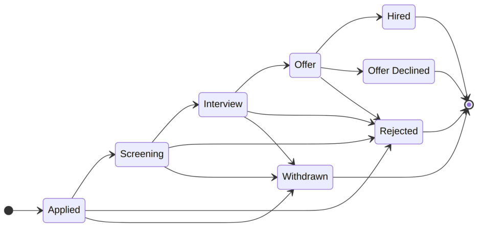

**Figure 3: Application pipeline (BR-8)**

#### Job posting lifecycle (BR-9, BR-10, A9)

Recruiters save and submit postings in UC-11, and the Administrator approves, returns or rejects them in UC-12 (Figure 4). A posting accepts applications and appears in public listings only while it is **Published** ; a Rejected posting cannot be resubmitted. A Closed posting records why it closed: Filled, when its accepted offers equal its openings (UC-07, A2), or Expired, when its application deadline passes after publication (UC-13). A posting whose deadline passes before it is published is returned for a new deadline if the Administrator tries to approve it (UC-12, extension 6a), or marked Expired by the next expiration run (UC-13, extension 2b).

**Figure 4: Job posting lifecycle (BR-9, BR-10, A9)**

### 4.2 Fully-Dressed Use Cases

Each use case below follows the template's table: name, author, actor, preconditions, postconditions, main success scenario, extensions and special requirements, with the stakeholders' interests and the frequency of occurrence added from Larman's format. The Actor row names the primary actor first and then the supporting actors. The use cases are grouped by author, three per team member; the questions each one raised for the customer are listed in Table 3.

#### Use cases authored by Oleg Berdyshev

**Table 6: UC-01 Browse Job Postings**

|**Use Case Name**|UC-01: Browse Job Postings|
|---|---|
|**Author**|Oleg Berdyshev|
|**Actor**|Primary: Visitor (also Applicant, Recruiter and Administrator, through generalization). Supporting: None.|
|**Stakeholders and Interests**| **Visitor:** wants to find relevant open jobs across all organizations quickly, without creating an account (BR-1, BR-3).  **Applicant:** wants the same, plus a direct route to apply and a clear sign of postings they have already applied to.  **Recruiter / Organization:** wants its published postings seen by as many qualified people as possible, and never wants drafts or unapproved postings shown.  **Administrator:** wants only approved, open postings made public (BR-9, BR-10), and no applicant or application data exposed on public pages (BR-15).|
|**Preconditions**|None. The job board is a public page (BR-3).|
|**Postconditions**|The visitor has viewed a list of open postings matching their criteria and, optionally, the full details of one posting. No data has changed. Only published postings that are before their deadline and not filled were shown (BR-9, BR-10).|
|**Main Success Scenario**|1. Visitor opens the CareerBridge job board. 2. System shows open postings from all organizations, newest first. Each entry shows title, organization, location, employment type and application deadline. 3. Visitor enters search criteria: keywords, location, organization and/or employment type. 4. System shows the open postings that match the criteria. 5. Visitor selects a posting. 6. System shows the posting's full details: description, requirements, organization, location, employment type, deadline and number of openings, and offers to apply. Visitor repeats steps 3–6 until done.|
|**Extensions**|**\*a.** At any time, the system fails: 1. System shows an error message and keeps the visitor's search criteria. 2. Visitor retries; the use case resumes at the failed step. **2a.** No postings are open: 1. System shows "No open positions right now." The use case ends. **4a.** No postings match the criteria: 1. System shows "No matching postings" and suggests removing filters. 2. Visitor revises the criteria; the use case resumes at step 3. **5a.** The selected posting closed after the list was shown (deadline passed or filled, BR-10): 1. System shows "This posting is no longer accepting applications" and returns to the refreshed list at step 4. **6a.** Visitor asks to apply while not logged in: 1. System asks the visitor to log in or register (UC-02). 2. After the visitor logs in as an Applicant, the Apply for Job use case (UC-04) begins for this posting. **6b.** A logged-in Applicant already applied to this posting: 1. System shows the application's current stage instead of offering to apply, with a link to Track Application Status (UC-05). **6c.** A logged-in Recruiter or Administrator asks to apply: 1. System explains that only Applicant accounts can apply. The use case ends.|
|**Special Requirements**| Pages in this use case require no login (BR-3) and must show no applicant or application data.  Search results appear within 2 seconds for up to 10,000 open postings (team target).  Pages work on current desktop and mobile browsers and meet WCAG 2.1 AA.|
|**Frequency of Occurrence**|Continuous. This is the most frequent use case in the system.|

**Table 7: UC-02 Register as Applicant**

|**Use Case Name**|UC-02: Register as Applicant|
|---|---|
|**Author**|Oleg Berdyshev|
|**Actor**|Primary: Visitor. Supporting: Notification Service.|
|**Stakeholders and Interests**| **Visitor:** wants to create an account quickly so they can apply, without waiting for anyone's approval (BR-14).  **Administrator:** wants one account per email address, valid contact details and securely stored credentials, without reviewing every applicant.  **Recruiter / Organization:** wants applicant contact details to be real, so offers and notices reach the right person.|
|**Preconditions**|The visitor is not logged in.|
|**Postconditions**|An active Applicant account exists with a unique, verified email address and a securely hashed password. An empty applicant profile with no resume has been created. The new Applicant is logged in.|
|**Main Success Scenario**|1. Visitor asks to register as an applicant. 2. System asks for full name, email address and password. 3. Visitor enters full name, email address and password. 4. System validates the data: required fields are present, the email is well formed and not already registered, and the password meets the password policy. 5. System creates the Applicant account in Pending Verification state and asks the Notification Service to send a verification email with a link valid for 24 hours. 6. Notification Service delivers the verification email. 7. Visitor opens the verification link. 8. System activates the account, logs the Applicant in and invites them to add a resume (UC-03).|
|**Extensions**|**\*a.** At any time, the system fails: 1. System shows an error message. No partial account is saved unless step 5 completed. **3a.** Visitor wants a recruiter account instead: 1. System directs the visitor to Register Recruiter and Organization (UC-08). This use case ends. **4a.** A required field is missing or malformed: 1. System reports each invalid field and the reason. 2. Visitor corrects the data; the use case resumes at step 4. **4b.** The email address is already registered: 1. System reports that an account already exists for that email and suggests logging in. No new account is created. The use case ends. **4c.** The password does not meet the policy: 1. System shows the policy (at least 10 characters, including a letter and a number). 2. Visitor enters a new password; the use case resumes at step 4. **7a.** The verification link has expired: 1. System issues a new verification link valid for 24 hours and asks the Notification Service to send it; the use case resumes at step 6.|

|**Special Requirements**| Passwords are stored only as salted hashes, and all traffic uses HTTPS.|
|---|---|
|| The system hands the verification email to the Notification Service within 1 minute of registration.  Pages work on current desktop and mobile browsers and meet WCAG 2.1 AA.|
|**Frequency of Occurrence**|Often. Every new applicant does this once.|

**Table 8: UC-03 Maintain Profile and Resume**

|**Use Case Name**|UC-03: Maintain Profile and Resume|
|---|---|
|**Author**|Oleg Berdyshev|
|**Actor**|Primary: Applicant. Supporting: None.|
|**Stakeholders and Interests**| **Applicant:** wants profile details and their resume to stay current and easy to replace.  **Recruiter / Organization:** wants an accurate resume for each application it reviews, and wants that resume to stay the same after submission (BR-5).  **Administrator:** wants uploaded files to be safe (correct type, limited size, no malware) and resumes visible only to people entitled to see them (BR-15).|
|**Preconditions**|The Applicant is logged in (Log In).|
|**Postconditions**|The applicant's profile details are saved. The applicant has at most one resume on file (BR-6); an uploaded resume has replaced any previous one. Resume copies attached to already-submitted applications are unchanged (BR-5, A6).|
|**Main Success Scenario**|1. Applicant asks to view their profile. 2. System shows the current profile (name, email, phone, location, headline, skills, education and work experience) and the resume on file, if any. 3. Applicant edits profile details. 4. System validates and saves the details and confirms the save. 5. Applicant uploads a resume file. 6. System checks the file type and size, scans the file for malware, and stores it as the applicant's only resume. 7. System shows the resume's file name and upload date.|
|**Extensions**|**\*a.** At any time, the system fails: 1. System shows an error message. Profile data saved before the failure is kept, and the previous resume stays on file. **4a.** A field is invalid (for example, name left empty or phone number malformed): 1. System reports the field and the reason. 2. Applicant corrects it; the use case resumes at step 4. **6a.** The file is not a PDF or DOCX, or is larger than 5 MB: 1. System rejects the file, states the accepted types and size limit, and keeps the current resume. Applicant selects another file; the use case resumes at step 5. **6b.** The malware scan flags the file: 1. System rejects the file and keeps the current resume. Applicant selects another file; the use case resumes at step 5.|
|**Special Requirements**| The system validates, scans and stores a 5 MB resume within 10 seconds after receiving it.  Resume files are encrypted at rest. Only the applicant and the Administrator can open the resume on file; a recruiter sees only the resume copy attached to an application to their organization's posting (BR-15, A6).|
|**Frequency of Occurrence**|Occasional. Usually once after registration, then a few times a year.|

#### Use cases authored by Josh Job Joseph

**Table 9: UC-04 Apply for Job**

|**Use Case Name**|UC-04: Apply for Job|
|---|---|
|**Author**|Josh Job Joseph|
|**Actor**|Primary: Applicant. Supporting: Notification Service.|
|**Stakeholders and Interests**| **Applicant:** wants to apply quickly using the resume on file, get a confirmation, and know how many application slots remain (BR-4).  **Recruiter / Organization:** wants complete applications only for open postings, with no duplicates, and visible only to the posting's recruiters (BR-15, A10).  **Administrator:** wants the 5-application limit enforced consistently, even when submissions arrive at the same moment.  **Other applicants:** benefit from the limit, which keeps applicant pools focused.|
|**Preconditions**| The Applicant is logged in (Log In).  The Applicant has chosen an open posting (UC-01).|
|**Postconditions**|A new application exists in the Applied stage, linked to the Applicant and the posting, with a copy of the resume as it was at submission (A6). The Applicant has at most 5 active applications (BR-4, A7). A confirmation has been sent to the Applicant. The application is visible only to the Applicant, the Administrator and the posting's recruiters (BR-15, A10).|
|**Main Success Scenario**|1. Applicant asks to apply to the chosen posting. 2. System presents an application summary: posting title and organization, the applicant's contact details, the resume on file and how many of the 5 active applications the applicant is using (for example, "3 of 5 active"). 3. Applicant confirms the submission, acknowledging that a submitted application cannot be edited (BR-5). 4. System verifies that the posting is still open, that the applicant still has fewer than 5 active applications (BR-4) and that the applicant has not applied to this posting before (A5). 5. System creates the application in the Applied stage, keeps a copy of the resume and records the submission time. 6. System asks the Notification Service to send the Applicant a confirmation. 7. System confirms the submission with the updated count (for example, "4 of 5 active") and a link to Track Application Status (UC-05).|
|**Extensions**|**\*a.** At any time, the system fails before step 5 completes: 1. No application is created, and the applicant's active applications are unchanged. System asks the applicant to try again. **2a.** Applicant has no resume on file (BR-6): 1. System explains that a resume is required and hands the applicant to Maintain Profile and Resume (UC-03). 2. After the upload, the use case resumes at step 2. **2b.** Applicant already has 5 active applications (BR-4): 1. System blocks the application and lists the applicant's active applications. 2. System explains that a slot frees up when an application is withdrawn (UC-06) or reaches Hired, Rejected or Offer Declined (A7). The use case ends. **3a.** Applicant wants to update the resume first: 1. Applicant goes to Maintain Profile and Resume (UC-03); the use case then resumes at step 2. **3b.** Applicant cancels: 1. Nothing is saved. The use case ends. **4a.** The posting closed after step 1 (deadline passed or filled, BR-10): 1. System reports that the posting no longer accepts applications. No application is created. **4b.** The applicant reached 5 active applications after step 2, for example through another submission made at the same time (BR-4): 1. The use case continues as in 2b. **4c.** Applicant has already applied to this posting, including a withdrawn application (A5): 1. System reports the existing application's stage and does not create a new one. **6a.** The Notification Service is unavailable: 1. The application stays saved. System queues the confirmation and retries; the confirmation is also given at step 7.|
|**Special Requirements**| The limit of 5 active applications holds even when several submissions from the same applicant arrive at the same moment (BR-4).  The confirmation email arrives within 1 minute under normal load (A11).  If the Notification Service is unavailable, held notices are sent within 15 minutes after it is available again.|
|**Frequency of Occurrence**|High. Several times per applicant, with peaks right after postings are published.|

**Table 10: UC-14 Screen Applications**

|**Use Case Name**|UC-14: Screen Applications|
|---|---|
|**Author**|Josh Job Joseph|
|**Actor**|Primary: Recruiter. Supporting: Notification Service.|
|**Stakeholders and Interests**| **Recruiter:** wants to review the applications to their organization's postings and move qualified candidates forward one stage at a time (BR-8).  **Applicant:** wants the application reviewed and wants to learn of each stage change within a known time (BR-7, A11).  **Organization:** wants every posting to follow the same fixed pipeline (BR-8) and its applications hidden from other organizations (BR-15).  **Administrator:** wants each stage change attributable to a specific recruiter for audit.|
|**Preconditions**|The Recruiter is logged in and is an Active member of the organization they are acting for (BR- 14, A16).|
|**Postconditions**|Each application the recruiter advanced has moved exactly one stage forward: Applied to Screening, or Screening to Interview (BR-8, A8). Each change is recorded with its date and the recruiter, and the applicant's notice has been sent or scheduled within the time A11 allows (BR-7). Each application the recruiter rejected is Rejected with its reason recorded, and its notice has been sent or scheduled (BR-11, A11). Each interview recorded holds its details and any outcome (BR- 12). The recruiter has seen nothing from other organizations and nothing about the applicant's applications to them (BR-15).|
|**Main Success Scenario**|1. Recruiter asks to review the applications to one of their organization's postings. 2. System presents all postings of the organization the recruiter is acting for (A10), each with the number of applications at each stage. 3. Recruiter takes up one application to review. 4. System presents the resume copy submitted with the application (A6), the applicant's profile details and this application's stage history. Nothing about the applicant's other applications is shown (BR-15). 5. Recruiter optionally adds an internal note and advances the application to the next stage. 6. System confirms that the move is to the next stage of the fixed pipeline (BR-8) and records the new stage, the date and the recruiter. 7. System asks the Notification Service to notify the applicant of the new stage within the time A11 allows (BR-7). Recruiter repeats steps 3–7 until done.|
|**Extensions**|**\*a.** Recruiter asks for a posting or application of an organization they are not an Active member of (BR-15): 1. System reveals nothing, reports that it was not found and records the attempt. **2a.** Recruiter belongs to more than one organization (BR-2, A16): 1. Recruiter switches the organization they are acting for; System presents only that organization's postings. **3a.** The posting has no applications: 1. System reports that there are none. The use case ends. **5a.** Recruiter decides to reject the application, at any active stage (BR-11): 1. Recruiter chooses a reason (A18), optionally adds a comment for the applicant, and confirms. At the Offer stage, System first warns that rejecting rescinds the offer. 2. System moves the application to Rejected, which frees the applicant's slot (BR-4), and records the stage, reason, date and recruiter. It asks the Notification Service to send the applicant the reason within the time A11 allows for that stage. The rejection is final (A8). 3. The use case resumes at step 3. **5b.** Recruiter tries to skip or reverse a stage, for example Applied straight to Interview, or Interview back to Screening (BR-8, A8): 1. System allows only the next stage and explains that the pipeline is fixed and stage changes are final. **5c.** The application is at the Interview stage: 1. Recruiter records an interview already arranged with the applicant (date and time, format, location or meeting link, interviewers) or, once it has taken place, its outcome (Passed, Not passed or No-show) and notes (BR-12). An application has at most two interview rounds (A13). 2. System saves the record and, for a newly arranged interview, asks the Notification Service to send the applicant the details (A11). Outcomes and notes are never shown to the applicant (A12). 3. Recruiter may extend an offer (UC-15) or reject the application (5a) instead of an advance. **5d.** Recruiter chooses several applications to advance together: 1. System applies steps 6–7 to each and reports any it could not move. **6a.** Since step 3, the application was withdrawn, rejected or moved by another recruiter: 1. System reports the current stage. Nothing changes. **7a.** The Notification Service is unavailable: 1. The stage change stays recorded. System queues the notice and retries within the time A11 allows.|
|**Special Requirements**| Notices of an advance reach the applicant within 4 business days (A11); the new stage is visible to the applicant in UC-05 within 1 minute.  Internal notes and interview outcomes are never shown to applicants (UC-05, A12) or to other organizations.  Every stage change, rejection and interview record is written to the audit log.  The applications to a posting with up to 1,000 applications are listed within 2 seconds. **Technology and data variations:**  4a. The resume copy is available as a PDF or DOCX, in the format the applicant uploaded (UC-03).|
|**Frequency of Occurrence**|Very high. Recruiters screen applications daily.|

**Table 11: UC-15 Extend Job Offer**

|**Use Case Name**|UC-15: Extend Job Offer|
|---|---|
|**Author**|Josh Job Joseph|
|**Actor**|Primary: Recruiter. Supporting: Notification Service.|
|**Stakeholders and Interests**| **Recruiter:** wants to send an offer with its terms, revise it while it is unanswered, and track the response in one place (BR-13, A14).  **Applicant:** wants the offer terms in writing, delivered promptly, with a known response deadline.  **Organization:** wants no more acceptances than it has openings (A2), and offer terms visible only to the candidate, the posting's recruiters and the Administrator (BR-15, A10).  **Administrator:** wants each offer and each revision attributable to a recruiter for audit.|
|**Preconditions**|The Recruiter is logged in and is an Active member of at least one organization (BR-14).|
|**Postconditions**|The application is in the Offer stage with its terms recorded: job title, start date, compensation, other terms, response deadline and an optional offer letter. The offer, or its revision, is recorded with the date and the recruiter. The applicant has been sent the offer within 1 minute (A11) and can respond through UC-07 until the response deadline (A14).|

|**Main Success Scenario**|1. Recruiter asks to extend an offer on an application at the Interview stage (from UC-14). 2. System presents the offer terms to fill in, with the job title taken from the posting and the posting's openings, accepted offers and outstanding offers. 3. Recruiter enters the start date, compensation, other terms and response deadline (7 days by default, A14), and optionally attaches an offer letter. 4. Recruiter reviews the offer as the applicant will see it and confirms. 5. System validates the offer: required fields are present, the response deadline is in the future, the start date is after the response deadline (A14), and Interview to Offer is an allowed move (BR- 8). 6. System moves the application to the Offer stage and records the terms, the date and the recruiter. 7. System asks the Notification Service to send the applicant the offer, with a link to Respond to Job Offer (UC-07). 8. System confirms that the offer was sent.|
|---|---|
|**Extensions**|**\*a.** Recruiter asks for an application of an organization they are not an Active member of (BR- 15): 1. System reveals nothing, reports that it was not found and records the attempt. **1a.** The application is neither at the Interview stage nor holding an unanswered offer (BR-8): 1. System explains that offers can be made only at the Interview stage and offers Screen Applications (UC-14). **1b.** The application already holds an unanswered offer, and the recruiter revises it (A14): 1. System presents the current terms for editing. 2. Recruiter changes the terms, the response deadline or the offer letter; the use case continues at step 4. 3. At step 6, System keeps the application in Offer, records the revised terms and the revision with the date and the recruiter. At step 7, the notice tells the applicant what changed. **2a.** No interview with the outcome Passed is recorded (UC-14, extension 5c): 1. System warns the recruiter, who may continue or cancel. **2b.** Accepted plus outstanding offers already equal the number of openings (A2): 1. System warns that if the posting fills, the remaining offers will be rejected automatically with the reason "Posting closed" (A3). 2. Recruiter continues or cancels. **4a.** Recruiter cancels: 1. Nothing changes. The use case ends. **5a.** A field is missing or invalid: 1. System identifies the problem; the recruiter corrects it and the use case resumes at step 4. **5b.** Since step 1, the application was withdrawn or rejected, the applicant answered the offer, or the posting was filled: 1. System reports the current status. No offer is made or revised. **7a.** The Notification Service is unavailable: 1. The offer stays recorded. System queues the notice and retries; the applicant can also see the offer in UC-05.|
|**Special Requirements**| Any active recruiter of the organization that owns the posting can extend offers on its applications (A10).  Offer terms are visible only to the applicant, the posting's recruiters and the Administrator (BR-15, A10).  The offer reaches the applicant within 1 minute under normal load (A11).  The offer letter is a PDF of at most 5 MB.  Every offer and revision is written to the audit log.  If the Notification Service is unavailable, held notices are sent within 15 minutes after it is available again. **Technology and data variations:**  3a. Compensation is given as an amount, a currency and a period (hourly, monthly or yearly).|
|**Frequency of Occurrence**|Low. Roughly once per opening, plus any offers that are declined or revised.|

#### Use cases authored by Rabeya Nazara

**Table 12: UC-05 Track Application Status**

|**Use Case Name**|UC-05: Track Application Status|
|---|---|
|**Author**|Rabeya Nazara|
|**Actor**|Primary: Applicant. Supporting: None.|
|**Stakeholders and Interests**| **Applicant:** wants to see every pipeline stage of each application (BR-7), know why an application was rejected (BR-11) and reach the next action, such as withdrawing or responding to an offer.  **Recruiter / Organization:** wants applicants kept informed, which cuts status inquiries, while its internal notes and interview outcomes stay private (A12).  **Other applicants and organizations:** want no application visible to anyone other than its owner, the posting's recruiters and the Administrator (BR-15, A10).|
|**Preconditions**|The Applicant is logged in (Log In).|
|**Postconditions**|The Applicant has seen the current stage and stage history of their own applications, and only their own. No data has changed.|
|**Main Success Scenario**|1. Applicant asks to see their applications. 2. System presents all of the applicant's applications, active ones first, with how many of the 5 active applications are in use. Each entry gives posting title, organization, submission date, current stage and date of the last change. 3. Applicant asks for the history of one application. 4. System presents the application's stage history: each stage reached (Applied, Screening, Interview, Offer, Hired) with the date it was entered, and the date, time, format and location of any recorded interview (BR-12). Interview outcomes are not shown (A12). 5. System presents the actions allowed at the current stage. Applicant repeats steps 3–5 until done.|
|**Extensions**|**\*a.** Applicant asks for an application that is not theirs (BR-15): 1. System reveals nothing about the application, reports that it was not found and records the attempt. **2a.** Applicant has no applications: 1. System says so and links to Browse Job Postings (UC-01). The use case ends. **2b.** Applicant filters the list to active or terminal applications: 1. System lists only the matching applications; the use case continues at step 3. **4a.** The application was rejected by a recruiter (BR-11): 1. System presents the rejection date, the stage at which it was rejected and the recorded reason. **4b.** The posting was filled while the application was active (BR-10, A3): 1. System presents the application as Rejected with the reason "Posting closed." **4c.** The application was withdrawn: 1. System presents the withdrawal date. No further actions are offered. **5a.** The application is in Applied, Screening or Interview: 1. System offers Withdraw (UC-06). Editing is never offered (BR-5). **5b.** The application is at the Offer stage (BR-13): 1. System presents the offer's current terms and response deadline, with Accept and Decline (UC-07).|
|**Special Requirements**| A stage change made by a recruiter is visible here within 1 minute; the notices about it follow the timing in A11.  The list appears within 2 seconds for an applicant with up to 200 applications.  Recruiters' internal notes and interview outcomes are never shown to applicants (A12). **Technology and data variations:**  1a. Applicant may reach step 4 directly from a link in a notification email.|
|**Frequency of Occurrence**|Very high. Several times a week for each applicant with active applications.|

**Table 13: UC-06 Withdraw Application**

|**Use Case Name**|UC-06: Withdraw Application|
|---|---|
|**Author**|Rabeya Nazara|
|**Actor**|Primary: Applicant. Supporting: Notification Service.|
|**Stakeholders and Interests**| **Applicant:** wants to withdraw an application quickly, free an application slot (BR-4) and understand beforehand that withdrawal is final (A5).  **Recruiter / Organization:** wants to know promptly so it stops spending review time on the candidate, and wants the withdrawn application kept on record.  **Administrator:** wants the 5-application limit to stay accurate and an audit trail of every withdrawal.|
|**Preconditions**| The Applicant is logged in (Log In).  The application belongs to the Applicant and is in the Applied, Screening or Interview stage. At the Offer stage the applicant declines through UC-07 instead.|
|**Postconditions**|The application is in the Withdrawn stage, with the withdrawal date and any reason given (A18). It no longer counts toward the applicant's 5 active applications (BR-4, A7). The posting's recruiters have been notified, and the application stays in their records as read-only. The Applicant cannot apply to this posting again (A5).|
|**Main Success Scenario**|1. Applicant asks to withdraw one of their active applications (from UC-05). 2. System presents the posting title, organization and current stage. It explains that withdrawal cannot be undone and that the applicant cannot reapply to this posting (A5). 3. Applicant optionally gives a reason and confirms the withdrawal. 4. System verifies that the application is still in Applied, Screening or Interview. 5. System moves the application to Withdrawn and records the date and reason. 6. System asks the Notification Service to notify the posting's recruiters (A10) and to send the Applicant a confirmation. 7. System confirms the withdrawal with the updated count (for example, "2 of 5 active").|
|**Extensions**|**\*a.** At any time, the system fails before step 5 completes: 1. The application is unchanged and still counts as active. System asks the applicant to try again. **1a.** Applicant wants to change a submitted application instead of withdrawing it (BR-5): 1. System explains that submitted applications cannot be edited, only withdrawn. 2. Applicant either continues at step 2 or leaves, and the use case ends. **3a.** Applicant cancels: 1. Nothing changes. The use case ends. **4a.** The application moved to the Offer stage after step 1: 1. System explains that the applicant must decline the offer instead and links to Respond to Job Offer (UC-07). Nothing changes. **4b.** The application reached a terminal stage after step 1 (rejected, including because the posting closed, or withdrawn in another session): 1. System reports the current stage. Nothing changes. **6a.** The Notification Service is unavailable: 1. The withdrawal stays recorded. System queues the notices and retries.|
|**Special Requirements**| A withdrawal is recorded completely or not at all, so the application's stage and the applicant's count of active applications always agree.  Recruiters see the Withdrawn stage within 1 minute.  Withdrawn applications are kept for audit and are never deleted by this use case.  If the Notification Service is unavailable, held notices are sent within 15 minutes after it is available again. **Technology and data variations:**  3a. Reasons come from a short list (accepted another offer, no longer interested, other) with an optional comment (A18).|

|**Frequency of Occurrence**|Occasional. Most often when an applicant is at the limit of 5 active applications and wants to apply elsewhere.|
|---|---|

**Table 14: UC-07 Respond to Job Offer**

|**Use Case Name**|UC-07: Respond to Job Offer|
|---|---|
|**Author**|Rabeya Nazara|
|**Actor**|Primary: Applicant. Supporting: Notification Service.|
|**Stakeholders and Interests**| **Applicant:** wants to see the full, current offer terms and accept or decline clearly, knowing the decision is final (BR-13).  **Recruiter / Organization:** wants a prompt, recorded answer, and wants the posting closed as soon as it is filled so no more applications arrive (BR-10).  **Other applicants to the posting:** want to learn promptly that the position is filled, which also frees their application slots (A3, BR-4).  **Administrator:** wants no posting to end up with more hires than openings (A2).|
|**Preconditions**| The Applicant is logged in (Log In).  The application belongs to the Applicant and is in the Offer stage (UC-15).|
|**Postconditions**| **If accepted:** the application is in the Hired stage with the acceptance date, and it no longer counts toward the applicant's 5 active applications (A7). If the posting now has as many accepted offers as openings, it has been closed through Close Job Posting (A2). The posting's recruiters have been notified.  **If declined:** the application is in the Offer Declined stage and no longer counts toward the limit (BR-4, A7). The posting's recruiters have been notified, and the posting stays open.|
|**Main Success Scenario**|1. Applicant asks to respond to an offer, from UC-05 or from the offer notification. 2. System presents the offer: posting and organization, job title, start date, compensation, other terms and the response deadline. 3. Applicant accepts the offer. 4. System asks the Applicant to confirm that acceptance is final. 5. Applicant confirms. 6. System moves the application to Hired and records the acceptance date. 7. System asks the Notification Service to notify the posting's recruiters (A10) and to send the Applicant a confirmation. 8. System confirms the acceptance.|
|**Extensions**|Extension point:_Posting Filled_, extension 6c, after step 6. The Close Job Posting subfunction extends this use case when the acceptance fills the last opening (BR-10, A2). **\*a.** At any time, the system fails before step 6 completes: 1. The application stays in the Offer stage with no change. System asks the applicant to try again. **3a.** Applicant declines (BR-13): 1. System asks for an optional reason and confirmation that declining is final. 2. Applicant confirms. 3. System moves the application to Offer Declined and records the date and reason. 4. The use case continues at step 7. The posting stays open. **3b.** Applicant leaves without responding: 1. Nothing changes. After the response deadline the offer can no longer be accepted (A14). **5a.** Applicant does not confirm: 1. The use case resumes at step 2. **6a.** Since step 1, the offer stopped being open: the recruiter rescinded it (UC-14, extension 5a), the posting closed, or the response deadline passed (A14): 1. System reports the current stage. Nothing changes. **6b.** The recruiter revised the offer after step 2 (UC-15, A14): 1. System presents the revised terms; the use case resumes at step 2. **6c.** _Posting Filled:_the posting now has as many accepted offers as openings (BR-10, A2): 1. Close Job Posting runs with the reason Filled: the posting becomes Closed and leaves public listings. Everyremainingactive application to it is rejected with the reason "Posting closed" (A3), and those applicants are notified (BR-11, A11). 2. The use case continues at step 7. **7a.** The Notification Service is unavailable: 1. The decision stays recorded. System queues the notices and retries.|
|**Special Requirements**| A posting never records more hires than openings, even when two applicants accept at the same moment.  A filled posting leaves public listings within 1 minute of the acceptance that filled it.  If the Notification Service is unavailable, held notices are sent within 15 minutes after it is available again. **Technology and data variations:**  2a. Offer terms are shown as the recruiter entered them in UC-15; an offer letter may be attached as a PDF.|
|**Frequency of Occurrence**|Low. Once per offer extended.|

#### Use cases authored by Reagan Rubio

**Table 15: UC-08 Register Recruiter and Organization**

|**Use Case Name**|UC-08: Register Recruiter and Organization|
|---|---|
|**Author**|Reagan Rubio|
|**Actor**|Primary: Visitor. Supporting: Notification Service.|
|**Stakeholders and Interests**| **Prospective recruiter:** wants to set up a recruiter account, and their organization if it is new, in one pass and to hear back quickly.  **Organization:** wants only people it has authorized to post jobs or see applications in its name.  **Administrator:** wants enough information to confirm that the person and organization are genuine before granting access (BR-14), and wants no duplicate organizations.  **Applicants:** want every posting to come from a legitimate employer, not a scam.|
|**Preconditions**|The visitor is not logged in.|
|**Postconditions**|A recruiter account with a verified work email exists in the Pending Approval state. Either a new organization in Pending Approval, or a pending membership in an existing organization, is linked to it. The request is in the Administrator's approval queue (UC-10). The recruiter cannot use recruiter functions until approved (BR-14).|
|**Main Success Scenario**|1. Visitor chooses to register as a recruiter. 2. System shows the recruiter registration form. 3. Visitor enters personal details (full name, work email, phone, job title, password) and organization details (legal name, website, industry, headquarters location, size and a short description). 4. System validates the data: required fields are present, the email is not already registered, the password meets the policy and the organization is not already registered. 5. System creates the recruiter account and the organization, both in Pending Approval, asks the Notification Service to send a verification email and tells the visitor to open the link in it. 6. Visitor opens the verification link. 7. System marks the email verified, adds the request to the Administrator's approval queue and asks the Notification Service to alert the Administrator. 8. System tells the visitor that the request is under review and that the decision will arrive by email.|
|**Extensions**|**\*a.** Before approval, the pending recruiter logs in and tries to use recruiter functions: 1. System shows the request's status and allows no recruiter actions (BR-14). **4a.** A required field is missing or invalid, or the password fails the policy: 1. System highlights each problem; the visitor corrects it and the use case resumes at step 4. **4b.** The email address is already registered: 1. System offers Log In instead. If the account belongs to an approved recruiter, System points to Join Additional Organization (UC-09). No new account is created. **4c.** The organization is already registered: 1. System offers to request membership in the existing organization instead. 2. Visitor accepts; the use case continues at step 5, creating only the recruiter account with a pending membership (A4). **4d.** The work email's domain does not match the organization's website domain (A17): 1. System accepts the request but flags it for closer review by the Administrator. **6a.** The verification link has expired: 1. System offers a new link; the use case resumes at step 5. **7a.** The Notification Service is unavailable: 1. The request still enters the queue. System queues the emails and retries.|

|**Special Requirements**| Password storage and transport follow the same rules as UC-02.  The request appears in the Administrator's queue within 1 minute of email verification. **Technology and data variations:**|
|---|---|
|| 3a. Organization logo upload is optional (PNG or JPG, up to 1 MB).  4a. Duplicate organizations are detected by matching the website domain and normalized legal name.|
|**Frequency of Occurrence**|Occasional. A few requests per week.|

**Table 16: UC-09 Join Additional Organization**

|**Use Case Name**|UC-09: Join Additional Organization|
|---|---|
|**Author**|Reagan Rubio|
|**Actor**|Primary: Recruiter. Supporting: Notification Service.|
|**Stakeholders and Interests**| **Recruiter:** wants to recruit for another organization, such as a client or a sister company, with the same login (BR-2).  **Target organization:** wants only authorized people to act for it, and wants to know who has joined.  **Administrator:** wants to confirm the recruiter's affiliation before granting access (A4).  **Applicants:** want recruiters to see only applications to organizations they actually belong to (BR-15).|
|**Preconditions**|The Recruiter is logged in, the account is approved, and the recruiter belongs to at least one organization.|
|**Postconditions**|A pending membership request links the Recruiter to the target organization and is in the Administrator's approval queue (UC-10). The Recruiter has no access to that organization's postings or applications until the request is approved (BR-15).|
|**Main Success Scenario**|1. Recruiter chooses Join Organization. 2. System shows a search of registered organizations. 3. Recruiter searches for and selects the target organization. 4. System shows the organization's summary and the recruiter's current memberships. 5. Recruiter enters their role at the target organization and a short justification, then submits. 6. System verifies that the recruiter is not already a member and has no pending request for this organization. 7. System creates the pending membership request, adds it to the Administrator's approval queue, and asks the Notification Service to alert the Administrator and confirm to the Recruiter. 8. System lists the organization as Pending in the recruiter's memberships.|
|**Extensions**|**\*a.** Recruiter cancels a pending request before a decision: 1. System removes the request from the queue and from the recruiter's memberships. **3a.** The organization is not registered: 1. Recruiter enters the new organization's details, as in UC-08 step 3. 2. System creates the organization in Pending Approval; the use case continues at step 7 as a new-organization request. **6a.** Recruiter is already a member of the organization: 1. System says so. The use case ends. **6b.** A request for this organization is already pending: 1. System shows that request's status. No new request is created. **7a.** The Notification Service is unavailable: 1. The request still enters the queue. System queues the emails and retries.|

|**Special Requirements**| Every recruiter screen works in one organization at a time. The recruiter switches between approved organizations, and each view shows only that organization's postings and applications (BR-15).|
|---|---|
|| A recruiter's access to one organization never reveals data from another organization they belong to. **Technology and data variations:**  3a. Organization search matches on name and website domain.|
|**Frequency of Occurrence**|Rare. A few times per recruiter over the life of the account.|

**Table 17: UC-10 Approve Recruiter/Organization Request**

|**Use Case Name**|UC-10: Approve Recruiter/Organization Request|
|---|---|
|**Author**|Reagan Rubio|
|**Actor**|Primary: Administrator. Supporting: Notification Service.|
|**Stakeholders and Interests**| **Administrator:** wants a clear queue with enough information to decide each request quickly and defensibly.  **Requesting recruiter:** wants a fast decision, and a reason if denied.  **Organization:** wants no one acting in its name without authorization.  **Applicants:** want only genuine employers able to post jobs and read their applications (BR- 14, BR-15).|
|**Preconditions**|The Administrator is logged in with the Administrator role (Log In).|
|**Postconditions**|Each decided request is recorded as Approved or Denied, with the date, the deciding Administrator and, if denied, the reason. If approved, the recruiter account, the organization if new, and the membership are Active. The requester has been notified, and the decision is in the audit log.|
|**Main Success Scenario**|1. Administrator opens the approval queue. 2. System lists pending requests, oldest first. Each shows the request type (a new recruiter with a new organization from UC-08, a new recruiter joining an existing organization from UC-08 extension 4c, or an existing recruiter joining another organization from UC-09), requester, organization, submission date and any review flag, such as the email-domain mismatch from UC-08 extension 4d. 3. Administrator selects a request. 4. System shows the details: requester's name, work email, job title and existing memberships; the organization's details; and the requester's justification. 5. Administrator checks the information and approves the request. 6. System activates the recruiter account if new, the organization if new, and the membership, then records the decision. 7. System asks the Notification Service to tell the requester the request was approved. 8. System returns to the queue without the decided request. Administrator repeats steps 3–8 until done.|
|**Extensions**|**2a.** The queue is empty: 1. System shows "No pending requests." The use case ends. **5a.** Administrator denies the request: 1. System requires a reason. 2. Administrator enters the reason. 3. System marks the request Denied. An account or organization created only for this request stays inactive. 4. System asks the Notification Service to send the requester the decision and reason; the use case continues at step 8. **5b.** Administrator needs more information: 1. Administrator writes a question; System asks the Notification Service to email it to the requester. 2. The request stays pending, marked "Information requested." The use case continues at step 8. **5c.** The requested new organization duplicates one already registered: 1. Administrator approves the membership in the existing organization instead; System discards the duplicate organization record. 2. The use case continues at step 7. **6a.** The request was cancelled by the requester, or decided by another Administrator, after step 3: 1. System shows the request's current status. Nothing changes. **7a.** The Notification Service is unavailable: 1. The decision stays recorded. System queues the email and retries.|
|**Special Requirements**| Only accounts with the Administrator role can open the approval queue.  Every decision is logged with who decided, when, the decision and any reason.  Target: requests are decided within 2 business days. **Technology and data variations:**  5a. The Administrator may open the organization's website from the request to check it.|
|**Frequency of Occurrence**|Several times a week, rising as more organizations join.|

#### Use cases authored by Zeba Tusnia Towshi

**Table 18: UC-11 Create Job Posting**

|**Use Case Name**|UC-11: Create Job Posting|
|---|---|
|**Author**|Zeba Tusnia Towshi|
|**Actor**|Primary: Recruiter. Supporting: None.|
|**Stakeholders and Interests**| **Recruiter:** wants to draft a posting for one of their organizations, save it and submit it for approval with little effort (BR-2).  **Organization:** wants postings in its name created only by its own approved recruiters, with accurate details (BR-15).  **Administrator:** wants complete, lawful postings to review before anything goes public (BR- 9, A1).  **Applicants:** want clear information: role, location, type, requirements and deadline.|
|**Preconditions**|The Recruiter is logged in, the account is approved, and the recruiter is an active member of at least one organization (BR-14).|
|**Postconditions**|A posting exists, linked to the chosen organization and the creating recruiter, in the Pending Approval state. It has a title, description, requirements, location, employment type, application deadline and number of openings (A2). It is in the Administrator's posting approval queue (UC- 12) and is not publicly visible (BR-9).|
|**Main Success Scenario**|1. Recruiter chooses Create Posting. 2. System shows the posting form for the recruiter's current organization. 3. Recruiter enters the title, description, requirements, location (on-site, hybrid or remote), employment type, optional salary range, application deadline and number of openings (default 1). 4. Recruiter submits the posting for approval. 5. System validates the posting: required fields are present, the deadline is between 1 and 90 days away, and openings are at least 1. 6. System saves the posting as Pending Approval and adds it to the Administrator's posting approval queue (UC-12). 7. System shows the posting as Pending Approval in the organization's postings list.|
|**Extensions**|**\*a.** The recruiter's membership in the organization is revoked before step 6: 1. System refuses to save the posting and explains why. **2a.** Recruiter belongs to more than one organization (BR-2): 1. System asks which organization the posting is for, listing only approved memberships. 2. Recruiter selects one; the use case continues at step 3. **3a.** Recruiter starts from an earlier posting of the same organization: 1. System copies that posting's fields into the form, except the deadline. **3b.** Recruiter saves a draft instead of submitting: 1. System saves the posting as Draft, visible only to that organization's recruiters, and does not queue it. 2. Later, a recruiter reopens the draft and the use case resumes at step 3. **5a.** A required field is missing or invalid: 1. System highlights each problem; the recruiter corrects it and the use case resumes at step 4. **5b.** The deadline is in the past, less than 1 day away or more than 90 days away: 1. System states the allowed range; the recruiter corrects it and the use case resumes at step 4. **6a.** The posting was returned by the Administrator with comments (UC-12, extension 5a): 1. Recruiter opens the returned posting; System shows the Administrator's comments. 2. Recruiter revises it; the use case resumes at step 4.|

|**Special Requirements**| Drafts and pending postings are visible only to recruiters of the owning organization and to the Administrator (BR-15).|
|---|---|
|| The form keeps unsaved input if the session times out: a recruiter who logs in again within 24 hours recovers everything entered up to 30 seconds before the timeout. **Technology and data variations:**  3a. The description supports basic formatting (headings, bullets, bold) and is limited to 10,000 characters.  3b. Location is stored as city, region and country, plus a remote flag.|
|**Frequency of Occurrence**|Moderate. Several times a week for each active organization.|

**Table 19: UC-12 Approve Job Posting**

|**Use Case Name**|UC-12: Approve Job Posting|
|---|---|
|**Author**|Zeba Tusnia Towshi|
|**Actor**|Primary: Administrator. Supporting: Notification Service.|
|**Stakeholders and Interests**| **Administrator:** wants to see each posting exactly as the public will, and to decide quickly against clear guidelines (BR-9).  **Recruiter / Organization:** wants a fast decision, and specific comments when changes are needed.  **Applicants:** want only legitimate, non-discriminatory postings published.|
|**Preconditions**|The Administrator is logged in with the Administrator role (Log In).|
|**Postconditions**|Each decided posting is either Published, appearing in public listings and accepting applications until its deadline (BR-3, BR-9), or Returned with comments. The decision is logged with the date and the deciding Administrator, and the organization's recruiters have been notified.|
|**Main Success Scenario**|1. Administrator opens the posting approval queue. 2. System lists pending postings, oldest first, with title, organization, submitting recruiter, submission date and application deadline. 3. Administrator selects a posting. 4. System shows the posting exactly as it will appear publicly, together with the organization's account status. 5. Administrator reviews the posting against the posting guidelines and approves it. 6. System sets the posting to Published, records the publication date and adds it to public listings (UC-01). 7. System asks the Notification Service to tell the organization's recruiters that the posting is live. 8. System returns to the queue without the decided posting. Administrator repeats steps 3-8 until done.|
|**Extensions**|**2a.** The queue is empty: 1. System shows "No postings awaiting approval." The use case ends. **5a.** Administrator returns the posting for changes: 1. System requires comments; the Administrator enters them. 2. System sets the posting to Returned and asks the Notification Service to send the comments to the organization's recruiters, who revise it in UC-11. 3. The use case continues at step 8. **5b.** The posting is fraudulent or breaks the guidelines: 1. Administrator rejects it and enters a reason. 2. System sets the posting to Rejected, which cannot be resubmitted, and notifies the recruiters; the use case continues at step 8. **6a.** The deadline passed while the posting was waiting: 1. System blocks approval and returns the posting to the recruiters, asking for a new deadline. **6b.** The organization or the submitting recruiter is no longer active: 1. System blocks publication and shows the reason. The posting stays pending. **6c.** Another Administrator decided the posting after step 3: 1. System shows the current status. Nothing changes. **7a.** The Notification Service is unavailable: 1. The posting stays published. System queues the notice and retries.|
|**Special Requirements**| Only accounts with the Administrator role can approve, return or reject postings.  Every decision is logged with who decided, when, the decision and any comments.  Target: postings are decided within 1 business day.  If the Notification Service is unavailable, held notices are sent within 15 minutes after it is available again. **Technology and data variations:**  4a. The preview uses the same page template as UC-01, step 6.|
|**Frequency of Occurrence**|High. Several times a day.|

**Table 20: UC-13 Expire Job Posting**

|**Use Case Name**|UC-13: Expire Job Posting|
|---|---|
|**Author**|Zeba Tusnia Towshi|
|**Actor**|Primary: Scheduler (system actor). Supporting: Notification Service.|
|**Stakeholders and Interests**| **Organization / Recruiter:** wants the posting to stop taking applications exactly at its deadline, while it keeps processing applications already received.  **Applicants:** want no chance to apply to a posting whose deadline has passed; applicants who already applied want their applications to continue (A3).  **Administrator:** wants no stale postings in public listings, and less wasted storage and effort (D0 Q12).|
|**Preconditions**|The Scheduler is running.|
|**Postconditions**|Every posting whose deadline has passed is Closed with reason Expired, is out of public listings and accepts no new applications (BR-10). Applications already submitted keep their stages (A3). The organizations' recruiters have been notified, and the run is logged.|
|**Main Success Scenario**|Includes  Close Job Posting, at step 3, with reason Expired. 1. Scheduler starts the expiration job at its regular interval (every 15 minutes). 2. System finds every Published posting whose application deadline has passed. 3. For each posting, System runs Close Job Posting with reason Expired: the posting becomes Closed, leaves public listings and stops accepting applications. 4. System asks the Notification Service to tell each organization's recruiters which postings closed and how many applications on each are still active. 5. System logs the run: start time, postings closed and any errors.|
|**Extensions**|**1a.** Earlier runs were missed, for example during downtime: 1. This run processes every overdue posting. The recorded closing time is the actual time, and the deadline is kept. 2. No late applications get in, because UC-04 step 4 checks the deadline itself. **2a.** No postings are overdue: 1. System logs the run. The use case ends. **2b.** A posting still in Pending Approval or Returned has passed its deadline: 1. System marks it Expired without publishing it and notifies its recruiters that a new deadline is needed. **3a.** A posting was filled and closed through UC-07 after step 2: 1. System skips it. **3b.** Closing one posting fails: 1. System logs the error, continues with the other postings and retries the failed one on the next run. **4a.** The Notification Service is unavailable: 1. Closures stay recorded. System queues the notices and retries.|

|**Special Requirements**| The job runs at least every 15 minutes and is safe to run twice: a posting that is already closed is never closed again.|
|---|---|
|| A run that closes up to 1,000 overdue postings finishes within 1 minute.  If the Notification Service is unavailable, held notices are sent within 15 minutes after it is available again. **Technology and data variations:**  1a. The Scheduler is a timed job inside the backend, such as a cron job.  2a. A deadline means 23:59 on that date in the organization's time zone, stored in UTC.|
|**Frequency of Occurrence**|Every 15 minutes, 96 runs a day. Most runs close a few postings or none.|

#### Subfunctions

Log In and Close Job Posting appear on the diagram with white fill. They are subfunctions (below sea level in Cockburn's terms), so they are written in brief form rather than fully dressed and have no author of their own.

#### Log In

**Level:** Subfunction. **Actors:** Applicant, Recruiter, Administrator; Notification Service (supporting).

The user enters their email address and password. The system checks the credentials and the account's state, then starts a session with the account's role. The role decides what the user can reach: a recruiter in Pending Approval sees only the request's status (BR-14), and a recruiter's session covers only organizations with Active memberships, one at a time (BR-15, A16). After 5 failed attempts in 15 minutes, the account is locked for 15 minutes (A15). A forgotten password is reset through a link that the Notification Service emails, which is why the diagram links Log In to that actor. The fully-dressed use cases list "logged in (Log In)" as a precondition instead of repeating these steps.

#### Close Job Posting

**Level:** Subfunction. **Used by:** UC-13 Expire Job Posting («include», reason Expired) and UC-07 Respond to Job Offer («extend» at the _Posting Filled_ extension point, reason Filled). **Supporting Actor:** Notification Service.

1. System sets the posting to Closed and records the reason and time (A9).

2. System removes the posting from public listings and the approval queue, and stops accepting applications (BR-10).

3. If the reason is Filled, System rejects every remaining active application to the posting with the reason "Posting closed" (A3), which frees the applicants' slots (BR-4), and sends each applicant the rejection notice within the time A11 allows for its stage (BR-11). If the reason is Expired, submitted applications stay in their stages.

4. System notifies the posting's recruiters that the posting closed (A10).

Closing a posting that is already closed does nothing, so an expiration check and an acceptance can never close the same posting twice.

### 4.3 System Sequence Diagrams and Operation Contracts

For each use case, the system sequence diagram (SSD) shows the main success scenario with CareerBridge as a black box, and the operation contracts define each system operation. Contract postconditions are written only as instances created or deleted, associations formed or broken and attributes modified, using the classes and attribute names of the domain model in section 5 (attribute names in italics). Messages that only return information are queries and have no contract.

#### UC-01 Browse Job Postings (author: Oleg Berdyshev)

Figure 5 shows SSD-01, the system sequence diagram for the main success scenario of UC-01.

**Figure 5: SSD-01: UC-01 Browse Job Postings**

1. Visitor to System: searchPostings(criteria); System returns the open postings, newest first (steps 1–2, criteria empty).

2. Visitor to System: searchPostings(criteria); System returns the matching open postings (steps 3–4).

3. Visitor to System: viewPosting(postingId); System returns the posting details (steps 5–6).

#### CO-01.1: searchPostings

**Operation:** searchPostings(criteria); criteria may be empty (steps 1–2)

**Cross-references:** UC-01 steps 1–4; FR-UC01.1, FR-UC01.2

**Preconditions:** None

**Postconditions:** None. This is a query operation.

**Output:** The open Job Postings that match the criteria, newest first.

#### CO-01.2: viewPosting

**Operation:** viewPosting(postingId)

**Cross-references:** UC-01 steps 5–6, extension 5a; FR-UC01.3

**Preconditions:** The Job Posting exists and was published (BR-9).

**Postconditions:** None. This is a query operation.

**Output:** The posting's full details, or a notice that it no longer accepts applications if it has closed.

#### UC-02 Register as Applicant (author: Oleg Berdyshev)

Figure 6 shows SSD-02, the system sequence diagram for the main success scenario of UC-02.

**Figure 6: SSD-02: UC-02 Register as Applicant**

1. Visitor to System: register(fullName, email, password); System asks the Notification Service to send the verification email and returns "verification email sent" (steps 3–6).

2. Visitor to System: verifyEmail(token); System returns "account activated, Applicant logged in" (steps 7–8).

#### CO-02.1: register

**Operation:** register(fullName, email, password)

**Cross-references:** UC-02 steps 3–5, extensions 4a–4c; FR-UC02.1, FR-UC02.2, FR-UC02.3

**Preconditions:** The visitor is not logged in.

**Postconditions:**

- An Applicant instance was created with _First Name_ and _Last Name_ from fullName and _email_ from email, and its _account Status_ became Pending Verification.

- A Notification instance was created with _type_ Email verification and _status_ Pending, and associated with the Applicant.

**Output:** System hands the new Notification to the Notification Service.

#### CO-02.2: verifyEmail

**Operation:** verifyEmail(token)

**Cross-references:** UC-02 steps 7–8, extension 7a; FR-UC02.3

**Preconditions:** The token belongs to the verification email sent to an Applicant whose _account Status_ is Pending Verification.

**Postconditions:**

- If the link had expired (extension 7a): a Notification instance was created with _type_ Email verification and _status_ Pending, and associated with the Applicant.

- Otherwise: the Applicant's _account Status_ became Active.

**Output:** System hands any new Notification to the Notification Service.

#### UC-03 Maintain Profile and Resume (author: Oleg Berdyshev)

Figure 7 shows SSD-03, the system sequence diagram for the main success scenario of UC-03.

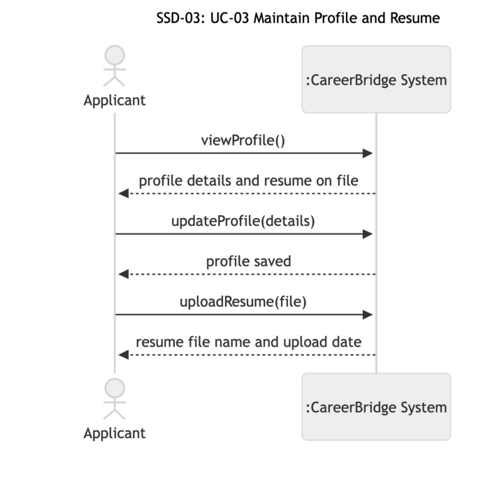

**Figure 7: SSD-03: UC-03 Maintain Profile and Resume**

1. Applicant to System: viewProfile(); System returns the profile details and the resume on file (steps 1– 2).

2. Applicant to System: updateProfile(details); System returns "profile saved" (steps 3–4).

3. Applicant to System: uploadResume(file); System returns the resume file name and upload date (steps 5–7).

#### CO-03.1: viewProfile

**Operation:** viewProfile()

**Cross-references:** UC-03 steps 1–2; FR-UC03.1

**Preconditions:** The Applicant is logged in.

**Postconditions:** None. This is a query operation.

**Output:** The Applicant's _First Name_ , _Last Name_ , _email_ and _phone #_ , the other profile details, and the _file Name_ and _upload Date_ of the Resume on file, if any.

#### CO-03.2: updateProfile

**Operation:** updateProfile(details)

**Cross-references:** UC-03 steps 3–4, extension 4a; FR-UC03.1

**Preconditions:** The Applicant is logged in.

**Postconditions:** The Applicant's _First Name_ , _Last Name_ and _phone #_ became the valid values in details.

#### CO-03.3: uploadResume

**Operation:** uploadResume(file)

**Cross-references:** UC-03 steps 5–7, extensions 6a, 6b; FR-UC03.2, FR-UC03.3

**Preconditions:** The Applicant is logged in.

**Postconditions:** A Resume was created for the accepted file, with its _file Name_ and _upload Date_ , and associated with the Applicant. Any previous Resume was dissociated from the Applicant (BR-6).

#### UC-04 Apply for Job (author: Josh Job Joseph)

Figure 8 shows SSD-04, the system sequence diagram for the main success scenario of UC-04.

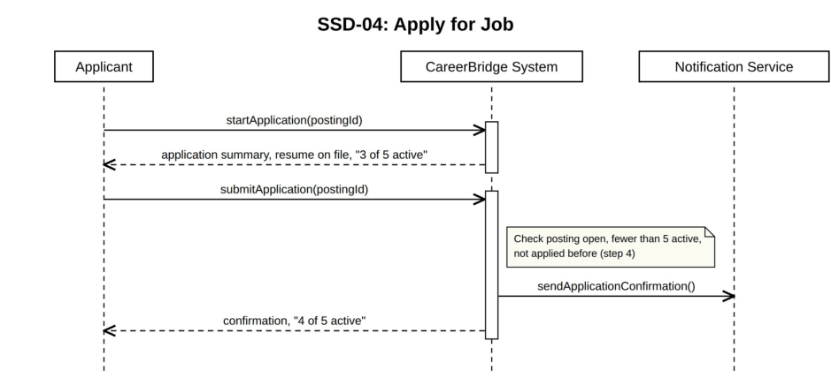

**Figure 8: SSD-04: UC-04 Apply for Job**

startApplication(postingId) only presents the application summary and changes nothing, so it has no contract.

#### CO-04.1: submitApplication

**Operation:** submitApplication(postingId)

**Cross-references:** UC-04 steps 3–7; extensions *a, 3b, 4a–4c, 6a; FR-UC04.2 through FR-UC04.5, FRUC04.7, FR-UC04.8

**Preconditions:**

- The Applicant is logged in.

- The Applicant has chosen an open posting (UC-01).

**Postconditions:**

- An Application instance was created and associated with the Job Posting and with the Applicant's Resume.

- The Application's _applicationStatus_ became Applied and its _dateApplied_ became the current date.

- The Application's _resumeSnapshot_ became a copy of the Resume as it is at submission (A6).

- The Application's _statusHistory_ gained the entry Applied with the current date.

- A Notification instance was created with _type_ Application confirmation and _status_ Pending, and associated with the Applicant.

**Output:** System hands the new Notification to the Notification Service.

**Exceptions:**

- The posting closed after step 1 (extension 4a): no postcondition holds.

- The Applicant already has 5 active applications (extension 4b): no postcondition holds; the active applications are listed.

- The Applicant already applied to this posting (extension 4c): no postcondition holds; the existing application's stage is shown.

- The Notification Service is unavailable (extension 6a): the postconditions still hold, and each Notification keeps _status_ Pending until the service accepts it.

#### UC-14 Screen Applications (author: Josh Job Joseph)

Figure 9 shows SSD-14, the system sequence diagram for the main success scenario of UC-14.

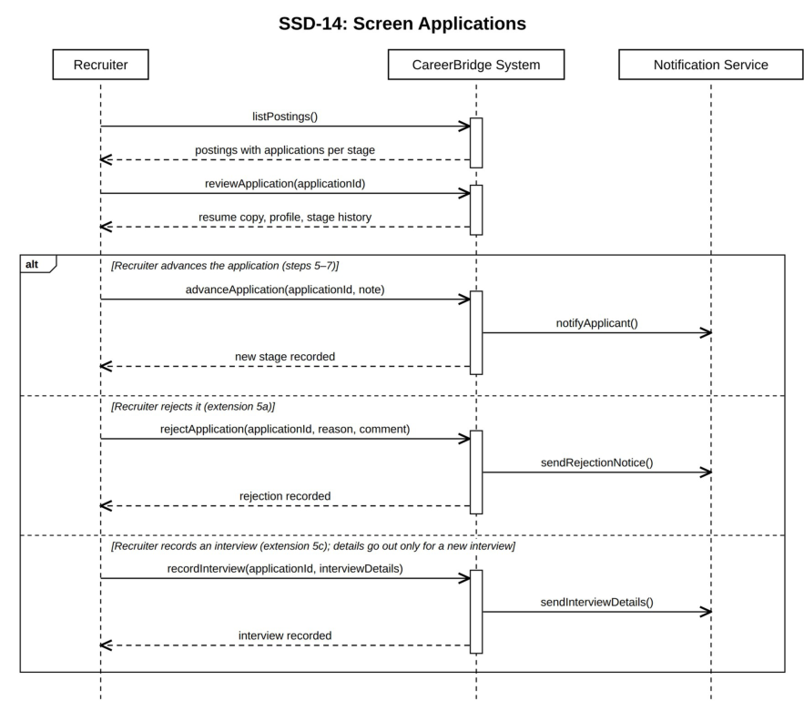

**Figure 9: SSD-14: UC-14 Screen Applications**

listPostings() is a query that changes nothing, so it has no contract. At step 3 the Recruiter takes up the application from the chosen posting's list.

#### CO-14.1: reviewApplication

**Operation:** reviewApplication(applicationId)

**Cross-references:** UC-14 steps 3–4; extension *a; FR-UC14.2, FR-UC14.9

**Preconditions:** The Recruiter is logged in and is an Active member of the organization they are acting for (BR-14, A16).

**Postconditions:** None. This is a query operation.

**Output:** The Application's _resumeSnapshot_ , the applicant's User details and the Application's _statusHistory_ . If the application belongs to another organization, nothing is returned except "not found".

#### CO-14.2: advanceApplication

**Operation:** advanceApplication(applicationId, note)

**Cross-references:** UC-14 steps 5–7; extensions 5b, 5d, 6a, 7a; FR-UC14.3, FR-UC14.4, FR-UC14.5, FR-UC14.8, FR-UC14.10

**Preconditions:** The Recruiter is logged in and is an Active member of the organization they are acting for (BR-14, A16).

**Postconditions:**

- The Application's _applicationStatus_ became the next stage of the pipeline: Screening if it was Applied, or Interview if it was Screening (BR-8).

- The Application's _statusHistory_ gained an entry with the new stage, the current date, the Recruiter and the internal note, if one was given.

- A Notification instance was created with _type_ Stage change and _status_ Pending, and associated with the Applicant who owns the Application's Resume.

**Output:** System hands the new Notification to the Notification Service.

**Exceptions:**

- The move would skip or reverse a stage (extension 5b), or the application is at the Interview stage, where the next step is an offer (UC-15) or a rejection (extension 5c): no postcondition holds.

- The application was withdrawn, rejected or moved since step 3 (extension 6a): no postcondition holds; the current stage is shown.

- Several applications are advanced together (extension 5d): the postconditions hold for each application that could be moved, and the others are reported.

- The Notification Service is unavailable (extension 7a): the postconditions still hold, and each Notification keeps _status_ Pending until the service accepts it.

#### CO-14.3: rejectApplication

**Operation:** rejectApplication(applicationId, reason, comment)

**Cross-references:** UC-14 extension 5a; extensions 6a, 7a; FR-UC14.6, FR-UC14.10

**Preconditions:** The Recruiter is logged in and is an Active member of the organization they are acting for (BR-14, A16).

**Postconditions:**

- The Application's _applicationStatus_ became Rejected and its _rejectionReason_ became reason.

- The Application's _statusHistory_ gained an entry with the stage at rejection, the current date, the Recruiter and the comment, if one was given.

- If the Application was at the Offer stage: the Offer's _status_ became Rescinded.

- A Notification instance was created with _type_ Rejection and _status_ Pending, and associated with the Applicant who owns the Application's Resume.

**Output:** System hands the new Notification to the Notification Service.

**Exceptions:**

- The application was withdrawn, rejected or moved since step 3 (extension 6a): no postcondition holds; the current stage is shown.

- The Notification Service is unavailable (extension 7a): the postconditions still hold, and each Notification keeps _status_ Pending until the service accepts it.

#### CO-14.4: recordInterview

**Operation:** recordInterview(applicationId, interviewDetails)

**Cross-references:** UC-14 extension 5c; extension 7a; FR-UC14.7

**Preconditions:** The Recruiter is logged in and is an Active member of the organization they are acting for (BR-14, A16).

**Postconditions:**

- For a newly arranged interview: an Interview instance was created and associated with the Application, and its _scheduledTime_ became the date and time in interviewDetails.

- For an interview that has taken place: the Interview's _outcome_ became Passed, Not passed or Noshow, and its _notes_ became the notes given (BR-12).

- For a newly arranged interview: a Notification instance was created with _type_ Interview details and _status_ Pending, and associated with the Applicant who owns the Application's Resume. Outcomes and notes are never sent (A12).

**Output:** For a newly arranged interview, System hands the new Notification to the Notification Service.

**Exceptions:**

- The application is not at the Interview stage, or already has two Interviews and a third is being arranged (A13): no postcondition holds.

- The Notification Service is unavailable (extension 7a): the postconditions still hold, and each Notification keeps _status_ Pending until the service accepts it.

#### UC-15 Extend Job Offer (author: Josh Job Joseph)

Figure 10 shows SSD-15, the system sequence diagram for the main success scenario of UC-15.

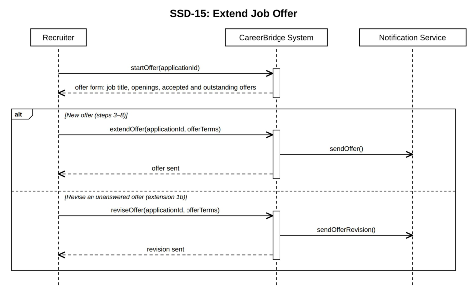

**Figure 10: SSD-15: UC-15 Extend Job Offer**

startOffer(applicationId) only presents the offer form, or the current terms of an unanswered offer, and changes nothing, so it has no contract.

#### CO-15.1: extendOffer

**Operation:** extendOffer(applicationId, offerTerms)

**Cross-references:** UC-15 steps 4–8; extensions 1a, 5a, 5b, 7a; FR-UC15.3 through FR-UC15.6, FRUC15.9

**Preconditions:** The Recruiter is logged in and is an Active member of at least one organization (BR-14).

**Postconditions:**

- An Offer instance was created and associated with the Application; its _dateExtended_ became the current date, its _salary_ became the compensation in offerTerms, its _expirationDate_ became the response deadline, and its _status_ became Extended.

- The Application's _applicationStatus_ became Offer, and its _statusHistory_ gained the entry Offer with the current date and the Recruiter.

- A Notification instance was created with _type_ Offer and _status_ Pending, and associated with the Applicant who owns the Application's Resume.

**Output:** System hands the new Notification to the Notification Service.

**Exceptions:**

- The application is not at the Interview stage (extension 1a), or a field is missing or invalid (extension 5a): no postcondition holds.

- Since step 1, the application was withdrawn or rejected, or the posting was filled (extension 5b): no postcondition holds; the current status is shown.

- The Notification Service is unavailable (extension 7a): the postconditions still hold, and each Notification keeps _status_ Pending until the service accepts it.

#### CO-15.2: reviseOffer

**Operation:** reviseOffer(applicationId, offerTerms)

**Cross-references:** UC-15 extension 1b; extensions 5a, 5b, 7a; FR-UC15.7, FR-UC15.9

**Preconditions:** The Recruiter is logged in and is an Active member of at least one organization (BR-14).

**Postconditions:**

- The Offer's _salary_ and _expirationDate_ became the values in offerTerms.

- The Application's _statusHistory_ gained an entry recording the revision, with the current date and the Recruiter.

- A Notification instance was created with _type_ Offer revised and _status_ Pending, and associated with the Applicant who owns the Application's Resume.

**Output:** System hands the new Notification to the Notification Service.

**Exceptions:**

- A field is missing or invalid (extension 5a): no postcondition holds.

- Since step 1, the application was withdrawn or rejected, the applicant answered the offer, or the posting was filled (extension 5b): no postcondition holds; the current status is shown.

- The Notification Service is unavailable (extension 7a): the postconditions still hold, and each Notification keeps _status_ Pending until the service accepts it.

#### UC-05 Track Application Status (author: Rabeya Nazara)

Figure 11 shows SSD-05, the system sequence diagram for the main success scenario of UC-05.

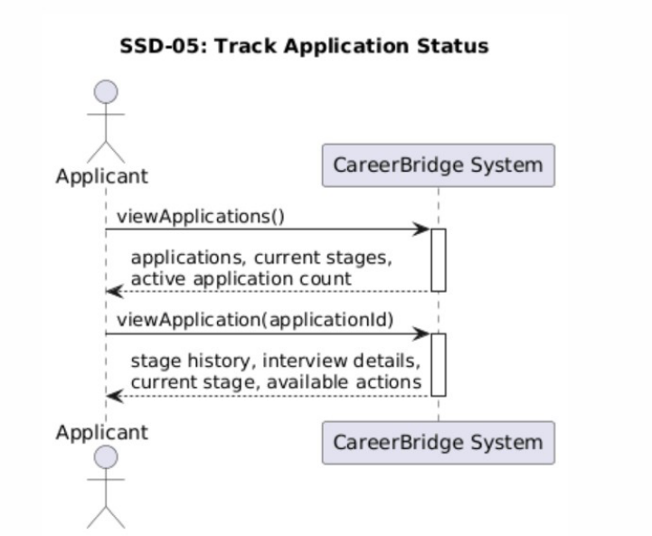

**Figure 11: SSD-05: UC-05 Track Application Status**

1. Applicant to System: viewApplications(); System returns the Applicant's applications, current stages, and active application count.

2. Applicant to System: viewApplication(applicationId); System returns the selected application's stage history, interview details, current stage, and available actions.

#### CO-05.1: viewApplications

**Operation:** viewApplications()

**Cross-references:** UC-05 steps 1–2; FR-UC05.1, FR-UC05.7, FR-UC05.8

**Preconditions:** The Applicant is logged in.

**Postconditions:** None. This is a query operation.

**Output:** The Applicant's applications are returned with active applications shown first. Each application includes the posting title, organization, submission date, current stage, and date of the most recent stage change. The Applicant's current active-application count is also returned.

#### CO-05.2: viewApplication

**Operation:** viewApplication(applicationId)

**Cross-references:** UC-05 steps 3–5; extensions *a, 4a–4c, 5a–5b; FR-UC05.2 through FR-UC05.6

**Preconditions:** The Applicant is logged in.

**Postconditions:** None. This is a query operation.

**Output:** If the application belongs to the logged-in Applicant, the system returns the Application's _applicationStatus_ and _statusHistory_ , its Interviews' _scheduledTime_ , its _rejectionReason_ when it is Rejected, and the actions currently available to the Applicant.

If the application does not belong to the logged-in Applicant, no application information is returned.

#### UC-06 Withdraw Application (author: Rabeya Nazara)

Figure 12 shows SSD-06, the system sequence diagram for the main success scenario of UC-06.

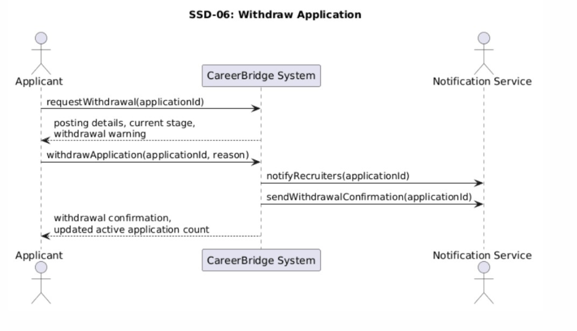

**Figure 12: SSD-06: UC-06 Withdraw Application**

1. Applicant to System: requestWithdrawal(applicationId); System returns the posting details, current stage, and withdrawal warning.

2. Applicant to System: withdrawApplication(applicationId, reason); System asks the Notification Service to notify the posting organization's recruiters and send the Applicant a confirmation, then System returns the withdrawal confirmation and updated active application count.

#### CO-06.1: requestWithdrawal

**Operation:** requestWithdrawal(applicationId)

**Cross-references:** UC-06 steps 1–2; FR-UC06.1, FR-UC06.2

**Preconditions:**

- The Applicant is logged in.

- The application belongs to the Applicant.

- The application is in the Applied, Screening, or Interview stage.

**Postconditions:** None. This is a query operation.

**Output:** The posting title, organization, current application stage, and a warning that withdrawal is final are returned. Under assumption A5, the system also states that the Applicant cannot reapply to the same posting after withdrawal.

#### CO-06.2: withdrawApplication

**Operation:** withdrawApplication(applicationId, reason)

**Cross-references:** UC-06 steps 3–7; extensions 3a, 4a, 4b, 6a; FR-UC06.3 through FR-UC06.9

**Preconditions:**

- The Applicant is logged in.

- The application belongs to the Applicant.

- The application is in the Applied, Screening, or Interview stage.

**Postconditions:**

- The Application's _applicationStatus_ became Withdrawn and its _withdrawnAt_ became the current date.

- The Application's _statusHistory_ gained the entry Withdrawn with the current date and the reason, if one was given.

- A Notification instance was created for each recruiter who is an Active member of the posting's Organization, with _type_ Withdrawal and _status_ Pending, and associated with that Recruiter.

- A Notification instance was created with _type_ Withdrawal confirmation and _status_ Pending, and associated with the Applicant.

**Output:** System hands the new Notifications to the Notification Service.

**Exceptions:**

- The application is no longer in an eligible stage (extensions 4a–4b): no postcondition holds.

- The Notification Service is unavailable (extension 6a): the postconditions still hold, and each Notification keeps _status_ Pending until the service accepts it.

#### UC-07 Respond to Job Offer (author: Rabeya Nazara)

Figure 13 shows SSD-07, the system sequence diagram for the main success scenario of UC-07.

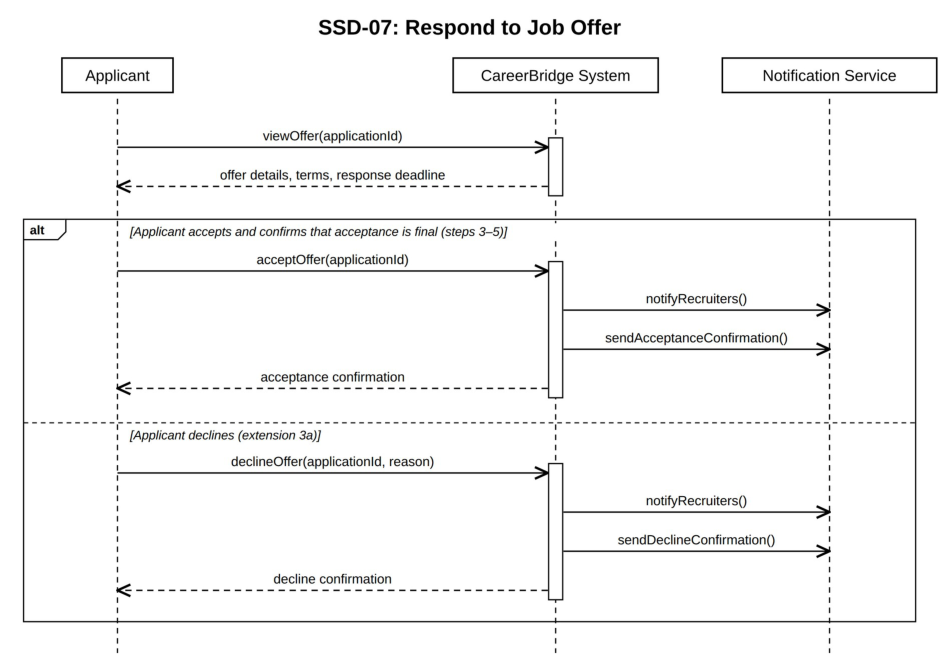

**Figure 13: SSD-07: UC-07 Respond to Job Offer**

1. Applicant to System (steps 1–2): viewOffer(applicationId); System returns the offer details, terms, and response deadline.

2. Applicant to System (steps 3–5, sent after the Applicant confirms that acceptance is final): acceptOffer(applicationId); System asks the Notification Service to notify the posting's recruiters and to send the Applicant a confirmation (step 7), then returns the acceptance confirmation (step 8).

3. Alternative (extension 3a): Applicant to System: declineOffer(applicationId, reason); System asks the Notification Service to notify the posting's recruiters and to send the Applicant a confirmation, then returns the decline confirmation.

#### CO-07.1: viewOffer

**Operation:** viewOffer(applicationId)

**Cross-references:** UC-07 steps 1–2; FR-UC07.1

**Preconditions:**

- The Applicant is logged in.

- The application belongs to the Applicant.

- The application is in the Offer stage.

**Postconditions:** None. This is a query operation.

**Output:** The system returns the offer details, including the organization, job title, start date, compensation, other offer terms, and response deadline.

#### CO-07.2: acceptOffer

**Operation:** acceptOffer(applicationId)

**Cross-references:** UC-07 steps 3–8; extensions 5a, 6a, 6b, 6c, 7a; FR-UC07.2, FR-UC07.3, FR-UC07.4, FR-UC07.6 through FR-UC07.11

**Preconditions:**

- The Applicant is logged in.

- The application belongs to the Applicant.

- The application is in the Offer stage.

**Postconditions:**

- The Application's _applicationStatus_ became Hired, and its _statusHistory_ gained the entry Hired with the current date.

- The Offer's _status_ became Accepted and its _responseDate_ became the current date.

- If the Job Posting now has as many Hired applications as its _numberOfOpenings_ (extension 6c, Close Job Posting): the Job Posting's _postStatus_ became Closed (Filled), and for each other active Application to it, _applicationStatus_ became Rejected, _rejectionReason_ became "Posting closed" (A3) and _statusHistory_ gained the entry Rejected with the current date.

- A Notification instance was created for each recruiter who is an Active member of the posting's Organization, with _type_ Offer accepted and _status_ Pending, and associated with that Recruiter.

- A Notification instance was created with _type_ Acceptance confirmation and _status_ Pending, and associated with the Applicant.

- If the posting closed: a Notification instance was created for the applicant of each Application rejected with it, with _type_ Rejection and _status_ Pending.

**Output:** System hands the new Notifications to the Notification Service.

**Exceptions:**

- The offer is no longer open (extension 6a) or was revised (extension 6b): no postcondition holds.

- The Notification Service is unavailable (extension 7a): the postconditions still hold, and each Notification keeps _status_ Pending until the service accepts it.

#### CO-07.3: declineOffer

**Operation:** declineOffer(applicationId, reason)

**Cross-references:** UC-07 extension 3a; FR-UC07.2, FR-UC07.3, FR-UC07.5, FR-UC07.8, FR-UC07.9

**Preconditions:**

- The Applicant is logged in.

- The application belongs to the Applicant.

- The application is in the Offer stage.

**Postconditions:**

- The Application's _applicationStatus_ became Offer Declined, and its _statusHistory_ gained the entry Offer Declined with the current date and the reason, if one was given.

- The Offer's _status_ became Declined and its _responseDate_ became the current date.

- A Notification instance was created for each recruiter who is an Active member of the posting's Organization, with _type_ Offer declined and _status_ Pending, and associated with that Recruiter.

- A Notification instance was created with _type_ Decline confirmation and _status_ Pending, and associated with the Applicant.

**Output:** System hands the new Notifications to the Notification Service.

**Exceptions:**

- The offer is no longer open (extension 6a): no postcondition holds.

- The Notification Service is unavailable (extension 7a): the postconditions still hold, and each Notification keeps _status_ Pending until the service accepts it.

#### UC-08 Register Recruiter and Organization (author: Reagan Rubio)

Figure 14 shows SSD-08, the system sequence diagram for the main success scenario of UC-08.

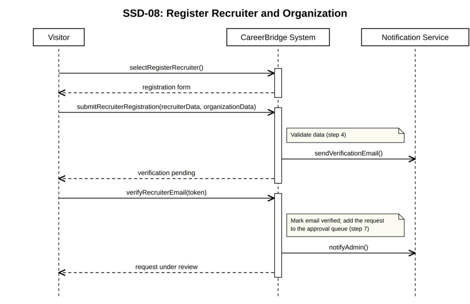

**Figure 14: SSD-08: UC-08 Register Recruiter and Organization**

selectRegisterRecruiter() only opens the registration form and changes nothing, so it has no contract.

#### CO-08.1: submitRecruiterRegistration

**Operation:** submitRecruiterRegistration(recruiterData, organizationData)

**Cross-references:** UC-08 steps 3–5; extensions 4a–4c; FR-UC08.1, FR-UC08.2, FR-UC08.3

**Preconditions:** The visitor is not logged in.

**Postconditions:**

- A Recruiter instance was created with _First Name_ , _Last Name_ , _email_ and _phone #_ from recruiterData, and its _account Status_ became Pending Approval.

- For a new organization: an Organization instance was created with _name_ , _website_ and _description_ from organizationData, and its _organization Status_ became Pending Approval.

- An Organization Membership instance was created and associated with the Recruiter and with the new Organization, or with the existing Organization when the visitor chose to join it (extension 4c); its _status_ became Awaiting Verification and its _requested at_ became the current date.

- A Notification instance was created with _type_ Email verification and _status_ Pending, and associated with the Recruiter.

**Output:** System hands the new Notification to the Notification Service.

**Exceptions:**

- Invalid registration data (extension 4a): no postcondition holds; validation errors are returned.

- Existing email (extension 4b): no postcondition holds.

- Existing organization (extension 4c): no Organization instance is created; the Organization Membership is associated with the existing Organization.

#### CO-08.2: verifyRecruiterEmail

**Operation:** verifyRecruiterEmail(token)

**Cross-references:** UC-08 steps 6–8; extensions 6a, 7a; FR-UC08.4

**Preconditions:** The token belongs to the verification email sent to a Recruiter whose Organization Membership has _status_ Awaiting Verification.

**Postconditions:**

- The Organization Membership's _status_ became Pending, which puts the request in the Administrator's approval queue.

- A Notification instance was created with _type_ New recruiter request and _status_ Pending, and associated with the Administrator.

**Output:** System hands the new Notification to the Notification Service.

**Exceptions:**

- The verification link has expired (extension 6a): no postcondition holds; the visitor can ask for a new link.

- The Notification Service is unavailable (extension 7a): the postconditions still hold, and each Notification keeps _status_ Pending until the service accepts it.

#### UC-09 Join Additional Organization (author: Reagan Rubio)

Figure 15 shows SSD-09, the system sequence diagram for the main success scenario of UC-09.

**Figure 15: SSD-09: UC-09 Join Additional Organization**

selectJoinOrganization(), searchOrganizations(query) and selectOrganization(organizationId) are queries that change nothing, so they have no contract.

#### CO-09.1: submitMembershipRequest

**Operation:** submitMembershipRequest(organizationId, role, justification)

**Cross-references:** UC-09 steps 5–8; extensions 6a, 6b, 7a; FR-UC09.1, FR-UC09.2

**Preconditions:**

- The recruiter is authenticated.

- The recruiter's account has been approved.

- The recruiter has at least one approved organization membership.

- The target organization exists.

**Postconditions:**

- An Organization Membership instance was created and associated with the Recruiter and the target Organization; its _status_ became Pending and its _requested at_ became the current date.

- A Notification instance was created with _type_ Membership request and _status_ Pending, and associated with the Administrator.

- A Notification instance was created with _type_ Request confirmation and _status_ Pending, and associated with the Recruiter.

**Output:** System hands the new Notifications to the Notification Service.

**Exceptions:**

- The recruiter already belongs to the organization (extension 6a): no postcondition holds; the system says so.

- A request for this organization is already pending (extension 6b): no postcondition holds; the existing request's status is shown.

- The Notification Service is unavailable (extension 7a): the postconditions still hold, and each Notification keeps _status_ Pending until the service accepts it.

#### UC-10 Approve Recruiter/Organization Request (author: Reagan Rubio)

Figure 16 shows SSD-10, the system sequence diagram for the main success scenario of UC-10.

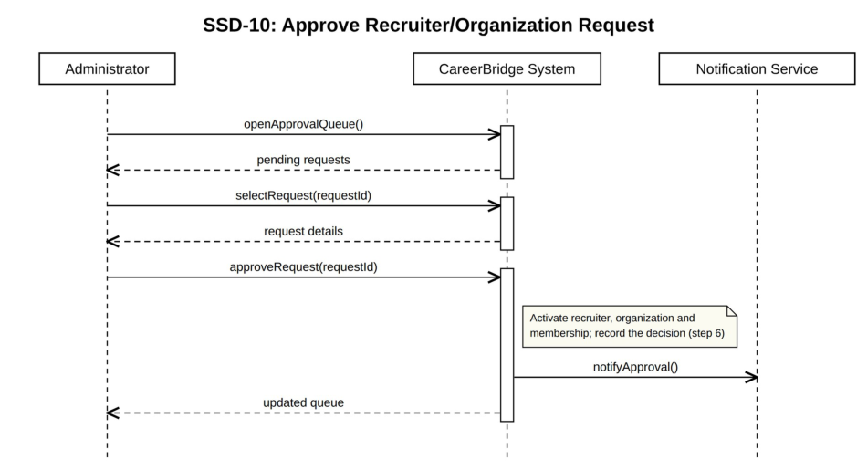

**Figure 16: SSD-10: UC-10 Approve Recruiter/Organization Request**

openApprovalQueue() and selectRequest(requestId) are queries that change nothing, so they have no contract.

#### CO-10.1: approveRequest

**Operation:** approveRequest(requestId)

**Cross-references:** UC-10 steps 5–8; extensions 5c, 6a, 7a; FR-UC10.2, FR-UC10.3

**Preconditions:**

- The Administrator is authenticated.

- The authenticated user has the Administrator role.

- The Organization Membership identified by requestId exists.

- Its _status_ is Pending or Information Requested.

**Postconditions:**

- The Organization Membership's _status_ became Active and its _approved at_ became the current date.

- If the Recruiter's _account Status_ was Pending Approval (a new recruiter from UC-08, including extension 4c), it became Active.

- If the Organization's _organization Status_ was Pending Approval (a new organization), it became Active.

- A Notification instance was created with _type_ Request approved and _status_ Pending, and associated with the Recruiter.

**Output:** System hands the new Notification to the Notification Service.

**Exceptions:**

- The new organization duplicates a registered one (extension 5c): the duplicate Organization instance was deleted, and the Organization Membership was associated with the existing Organization instead.

- The request was cancelled, or already decided by another Administrator (extension 6a): no postcondition holds; the current status is shown.

- The Notification Service is unavailable (extension 7a): the postconditions still hold, and each Notification keeps _status_ Pending until the service accepts it.

#### UC-11 Create Job Posting (author: Zeba Tusnia Towshi)

Figure 17 shows SSD-11, the system sequence diagram for the main success scenario of UC-11.

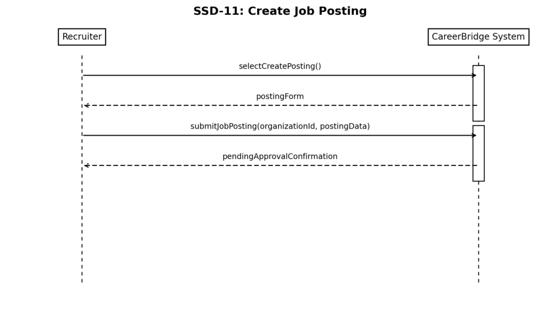

**Figure 17: SSD-11: UC-11 Create Job Posting**

selectCreatePosting() only opens the posting form and changes nothing, so it has no contract.

#### CO-11.1: submitJobPosting

**Operation:** submitJobPosting(organizationId, postingData)

**Cross-references:** UC-11 steps 4–7; extensions *a, 5a, 5b; FR-UC11.2 through FR-UC11.5

**Preconditions:**

- The Recruiter is authenticated and approved.

- The Recruiter is an active member of at least one organization (BR-14).

**Postconditions:**

- A Job Posting instance was created and associated with the selected Organization and the creating Recruiter.

- Its _title_ , _description_ , _jobRequirements_ , _location_ , _employmentType_ , _salaryRange_ , _applicationDeadline_ and _numberOfOpenings_ became the values in postingData.

- Its _postStatus_ became Pending Approval and its _approvalStatus_ became Pending.

**Exceptions:**

- Invalid posting data (extensions 5a, 5b): no postcondition holds; validation errors are returned.

- The Recruiter no longer has an active membership in the selected organization (extension *a): no postcondition holds.

#### UC-12 Approve Job Posting (author: Zeba Tusnia Towshi)

Figure 18 shows SSD-12, the system sequence diagram for the main success scenario of UC-12.

**Figure 18: SSD-12: UC-12 Approve Job Posting**

openPostingApprovalQueue() and selectPosting(postingId) are queries that change nothing, so they have no contract.

#### CO-12.1: approveJobPosting

**Operation:** approveJobPosting(postingId)

**Cross-references:** UC-12 steps 5–8; extensions 6a, 6b, 6c, 7a; FR-UC12.4, FR-UC12.7, FR-UC12.8

**Preconditions:**

- The Administrator is authenticated.

- The authenticated user has the Administrator role.

- The specified posting exists and is in Pending Approval.

**Postconditions:**

- The Job Posting's _postStatus_ became Published and its _date posted_ became the current date.

- Its _approvalStatus_ became Approved, _approvedBy_ became the deciding Administrator, and _approvedAt_ became the current date and time.

- A Notification instance was created for each recruiter who is an Active member of the posting's Organization, with _type_ Posting published and _status_ Pending, and associated with that Recruiter.

**Output:** System hands the new Notifications to the Notification Service.

**Exceptions:**

- The deadline has passed (extension 6a): instead of the postconditions above, the Job Posting's _postStatus_ and _approvalStatus_ became Returned, with a request for a new deadline.

- The organization or the submitting Recruiter is inactive (extension 6b): no postcondition holds; the posting stays pending.

- Another Administrator already decided the posting (extension 6c): no postcondition holds; the current status is shown.

- The Notification Service is unavailable (extension 7a): the postconditions still hold, and each Notification keeps _status_ Pending until the service accepts it.

#### UC-13 Expire Job Posting (author: Zeba Tusnia Towshi)

Figure 19 shows SSD-13, the system sequence diagram for the main success scenario of UC-13.

**Figure 19: SSD-13: UC-13 Expire Job Posting**

#### CO-13.1: runExpirationJob

**Operation:** runExpirationJob()

**Cross-references:** UC-13 steps 1–5; extensions 1a, 2a, 2b, 3a, 3b, 4a; FR-UC13.2 through FR-UC13.7

**Preconditions:** The Scheduler is running.

**Postconditions:**

- For each Published Job Posting whose _applicationDeadline_ has passed: _postStatus_ became Closed (Expired).

- For each Pending Approval or Returned Job Posting whose _applicationDeadline_ has passed (extension 2b): _postStatus_ became Expired.

- A Notification instance was created for each recruiter who is an Active member of each affected posting's Organization, with _type_ Posting expired and _status_ Pending, and associated with that Recruiter.

**Output:** System hands the new Notifications to the Notification Service.

**Exceptions:**

- No postings are overdue (extension 2a): no postcondition holds.

- A posting was already closed, for example filled through UC-07 (extension 3a): that posting is left out of the postconditions.

- One posting fails to close (extension 3b): the other postings are still processed, and the failed posting is retried on the next run.

- The Notification Service is unavailable (extension 4a): the postconditions still hold, and each Notification keeps _status_ Pending until the service accepts it.

### 4.4 UI Initial Drafts

Low-fidelity wireframes (desktop, 1280 pixels wide) for the main screens of each actor, one per figure. Each description names the use cases the screen serves.

#### Applicant Home Page

Figure 20. The applicant's workspace. Its icons open Maintain Profile and Resume (UC-03), Apply for Job (UC-04), Track Application Status (UC-05), Withdraw Application (UC-06) and Respond to Job Offer (UC-07) in the central canvas.

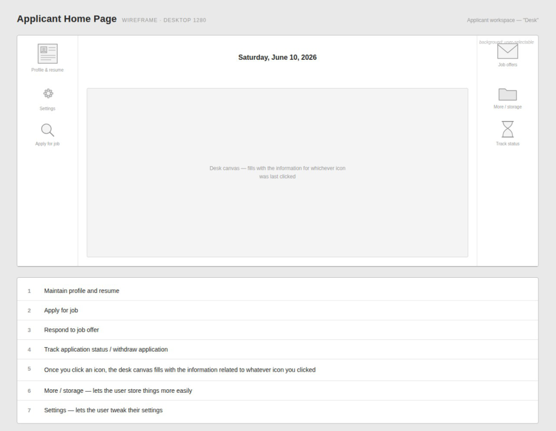

**Figure 20: Applicant Home Page wireframe**

#### Job Application Page

Figure 21. The screen for Apply for Job (UC-04): the applicant's resume on file, the chosen posting's description and other open postings (UC-01), with Cancel and Submit application.

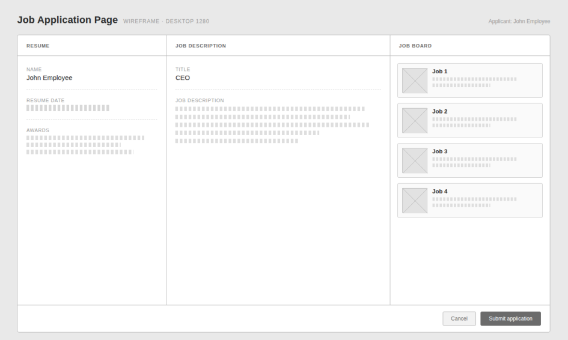

**Figure 21: Job Application Page wireframe**

#### Recruiter Home Page

Figure 22. The recruiter's workspace, with entry points for Join Additional Organization (UC-09), Create Job Posting (UC-11), Screen Applications, including rejections and interview records (UC-14), and Extend Job Offer (UC-15).

**Figure 22: Recruiter Home Page wireframe**

#### Applicant Page (recruiter view)

Figure 23. The screen for Screen Applications (UC-14): the applicant pool for the selected posting, a preview of the chosen application with the job description, and the organization's postings.

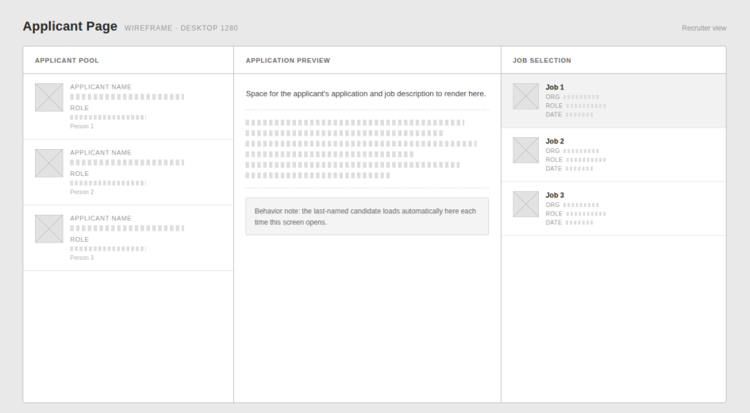

**Figure 23: Applicant Page (recruiter view) wireframe**

#### Admin

Figure 24. The Administrator's workspace, with its two approval actions: Approve Job Posting (UC-12) and Approve Recruiter/Organization Request (UC-10).

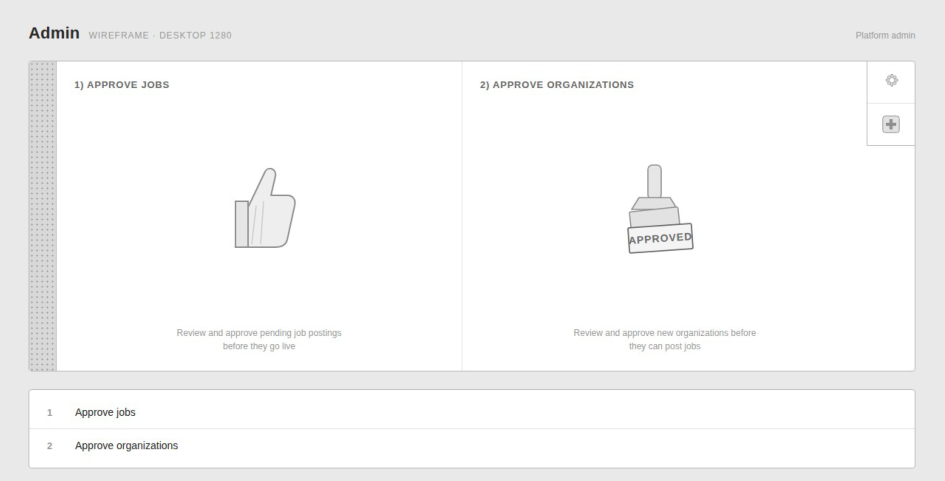

**Figure 24: Admin wireframe**

## 5. Domain Model (Analysis)

Figure 25 shows CareerBridge's conceptual classes, their attributes and the associations between them, with multiplicities. It models what exists in the job-board domain: users in their three roles, organizations and memberships, job postings, applications with their resume copy and history, interviews, offers and notifications. The operation contracts in section 4.3 are written with these class and attribute names.

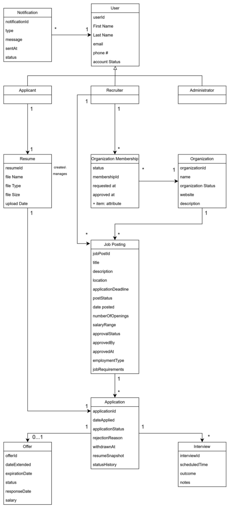

**Figure 25: CareerBridge domain model**

## 6. Sequence Diagrams (Design)

Delivered in Iteration 2: design-level sequence diagrams for each member's three use cases.

## 7. Design Class Diagram (DCD)

Delivered in Iteration 2, consistent with the design sequence diagrams.

## 8. Implementation Overview

Delivered in Iteration 3, with the architecture and key design decisions of the implemented system.

## 9. Testing

Delivered in Iteration 3, with the unit-testing summary and the test case table.

## 10. Team Contribution

Every member owns three use cases end to end, from analysis in this iteration through design, implementation and unit testing, and holds one project role (Deliverable 0). Table 21 lists each member's role, use cases and Iteration 1 work.

**Table 21: Team roles, use cases and contribution**

|**Member**|**Role**|**Use cases** **(author)**|**Iteration 1 work**|**Contribution**|
|---|---|---|---|---|
|Zeba Tusnia Towshi|Project Manager|UC-11, UC-12, UC-13|Planning and the Jira board; UC-11 to UC-13 with their requirements, SSDs and operation contracts|20%|
|Rabeya Nazara|Requirements Engineer|UC-05, UC-06, UC-07|Requirements and clarification questions; UC-05 to UC-07 with their requirements, SSDs and operation contracts|20%|
|Josh Job Joseph|Design Engineer|UC-04, UC-14, UC-15|Use-case and context diagrams, document integration; UC-04, UC-14 and UC-15 with their requirements, SSDs and operation contracts|20%|
|Reagan Rubio|Quality Assurance Engineer|UC-08, UC-09, UC-10|Consistency reviews; UC-08 to UC-10 with their requirements, SSDs and operation contracts|20%|
|Oleg Berdyshev|Project Librarian|UC-01, UC-02, UC-03|GitHub repository and document versions; UC-01 to UC-03 with their requirements, SSDs and operation contracts|20%|

## 11. Setup / Installation Guide

Delivered in Iteration 3, once the system can be installed and run.

## 12. User Manual

Delivered in Iteration 3, with the key features and typical workflows of the finished system.
