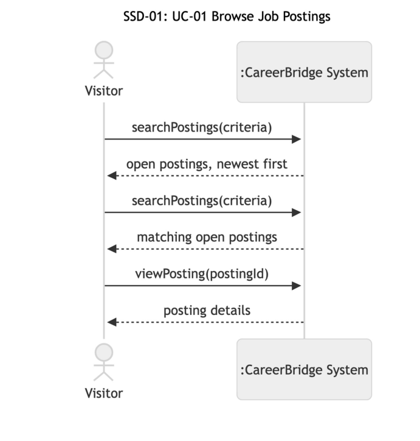
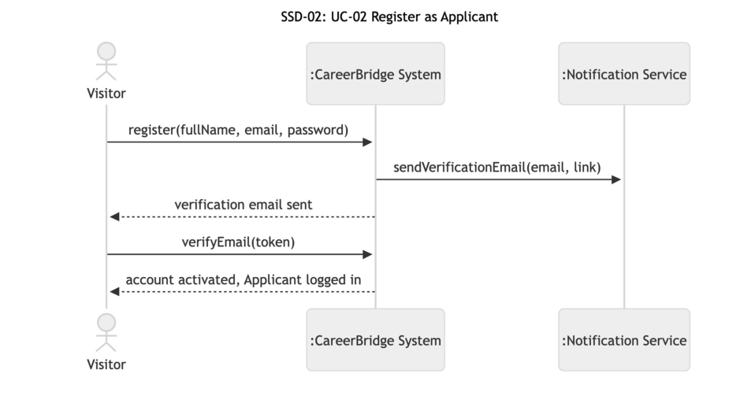
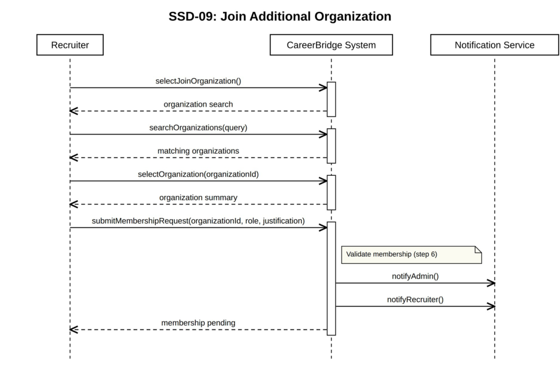
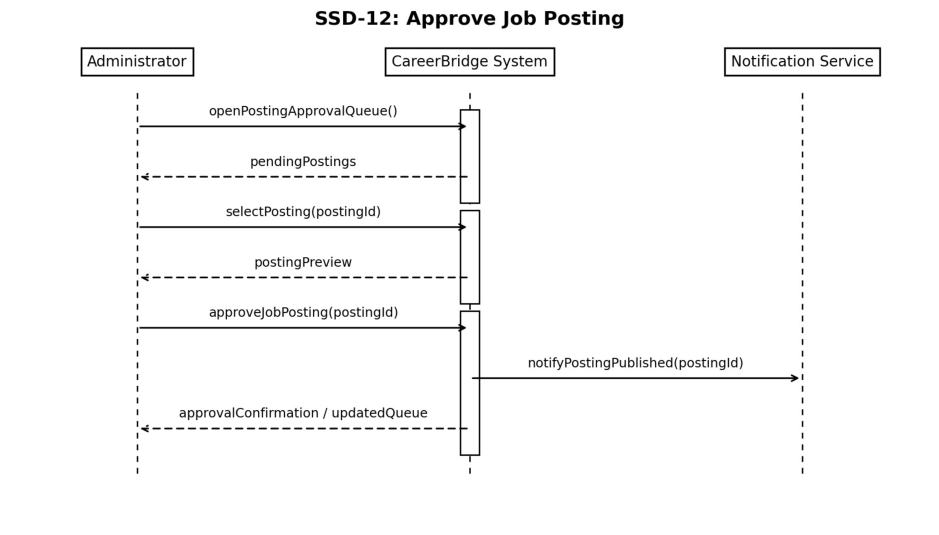
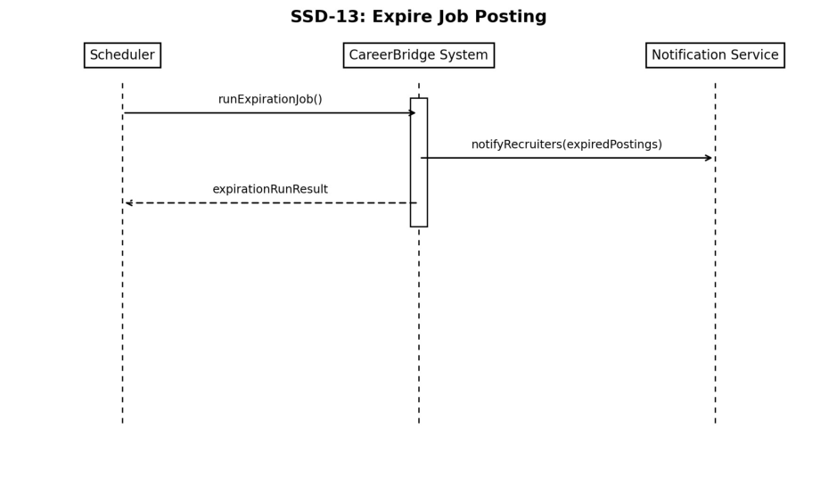

# CareerBridge — System sequence diagrams and operation contracts

> Part of the CareerBridge specification — see the [index](README.md). Section numbers are those of the project documentation, so references such as "section 4.3" work across files.

### 4.3 System Sequence Diagrams and Operation Contracts

For each use case, the system sequence diagram (SSD) shows the main success scenario with CareerBridge as a black box, and the operation contracts define each system operation. Contract postconditions are written only as instances created or deleted, associations formed or broken and attributes modified, using the classes and attribute names of the domain model in section 5 (attribute names in italics). Messages that only return information are queries and have no contract.

#### UC-01 Browse Job Postings

Figure 5 shows SSD-01, the system sequence diagram for the main success scenario of UC-01.

**Figure 5: SSD-01: UC-01 Browse Job Postings**

1. Visitor to System: searchPostings(criteria); System returns the open postings, newest first (steps 1–2, criteria empty).

2. Visitor to System: searchPostings(criteria); System returns the matching open postings (steps 3–4).

3. Visitor to System: viewPosting(postingId); System returns the posting details (steps 5–6).

#### CO-01.1: searchPostings

**Operation:** searchPostings(criteria); criteria may be empty (steps 1–2)

**Cross-references:** UC-01 steps 1–4; FR-UC01.1, FR-UC01.2

**Preconditions:** None

**Postconditions:** None. This is a query operation.

**Output:** The open Job Postings that match the criteria, newest first.

#### CO-01.2: viewPosting

**Operation:** viewPosting(postingId)

**Cross-references:** UC-01 steps 5–6, extension 5a; FR-UC01.3

**Preconditions:** The Job Posting exists and was published (BR-9).

**Postconditions:** None. This is a query operation.

**Output:** The posting's full details, or a notice that it no longer accepts applications if it has closed.

#### UC-02 Register as Applicant

Figure 6 shows SSD-02, the system sequence diagram for the main success scenario of UC-02.

**Figure 6: SSD-02: UC-02 Register as Applicant**

1. Visitor to System: register(fullName, email, password); System asks the Notification Service to send the verification email and returns "verification email sent" (steps 3–6).

2. Visitor to System: verifyEmail(token); System returns "account activated, Applicant logged in" (steps 7–8).

#### CO-02.1: register

**Operation:** register(fullName, email, password)

**Cross-references:** UC-02 steps 3–5, extensions 4a–4c; FR-UC02.1, FR-UC02.2, FR-UC02.3

**Preconditions:** The visitor is not logged in.

**Postconditions:**

- An Applicant instance was created with _First Name_ and _Last Name_ from fullName and _email_ from email, and its _account Status_ became Pending Verification.

- A Notification instance was created with _type_ Email verification and _status_ Pending, and associated with the Applicant.

**Output:** System hands the new Notification to the Notification Service.

#### CO-02.2: verifyEmail

**Operation:** verifyEmail(token)

**Cross-references:** UC-02 steps 7–8, extension 7a; FR-UC02.3

**Preconditions:** The token belongs to the verification email sent to an Applicant whose _account Status_ is Pending Verification.

**Postconditions:**

- If the link had expired (extension 7a): a Notification instance was created with _type_ Email verification and _status_ Pending, and associated with the Applicant.

- Otherwise: the Applicant's _account Status_ became Active.

**Output:** System hands any new Notification to the Notification Service.

#### UC-03 Maintain Profile and Resume

Figure 7 shows SSD-03, the system sequence diagram for the main success scenario of UC-03.

**Figure 7: SSD-03: UC-03 Maintain Profile and Resume**

1. Applicant to System: viewProfile(); System returns the profile details and the resume on file (steps 1– 2).

2. Applicant to System: updateProfile(details); System returns "profile saved" (steps 3–4).

3. Applicant to System: uploadResume(file); System returns the resume file name and upload date (steps 5–7).

#### CO-03.1: viewProfile

**Operation:** viewProfile()

**Cross-references:** UC-03 steps 1–2; FR-UC03.1

**Preconditions:** The Applicant is logged in.

**Postconditions:** None. This is a query operation.

**Output:** The Applicant's _First Name_ , _Last Name_ , _email_ and _phone #_ , the other profile details, and the _file Name_ and _upload Date_ of the Resume on file, if any.

#### CO-03.2: updateProfile

**Operation:** updateProfile(details)

**Cross-references:** UC-03 steps 3–4, extension 4a; FR-UC03.1

**Preconditions:** The Applicant is logged in.

**Postconditions:** The Applicant's _First Name_ , _Last Name_ and _phone #_ became the valid values in details.

#### CO-03.3: uploadResume

**Operation:** uploadResume(file)

**Cross-references:** UC-03 steps 5–7, extensions 6a, 6b; FR-UC03.2, FR-UC03.3

**Preconditions:** The Applicant is logged in.

**Postconditions:** A Resume was created for the accepted file, with its _file Name_ and _upload Date_ , and associated with the Applicant. Any previous Resume was dissociated from the Applicant (BR-6).

#### UC-04 Apply for Job

Figure 8 shows SSD-04, the system sequence diagram for the main success scenario of UC-04.

**Figure 8: SSD-04: UC-04 Apply for Job**

startApplication(postingId) only presents the application summary and changes nothing, so it has no contract.

#### CO-04.1: submitApplication

**Operation:** submitApplication(postingId)

**Cross-references:** UC-04 steps 3–7; extensions *a, 3b, 4a–4c, 6a; FR-UC04.2 through FR-UC04.5, FRUC04.7, FR-UC04.8

**Preconditions:**

- The Applicant is logged in.

- The Applicant has chosen an open posting (UC-01).

**Postconditions:**

- An Application instance was created and associated with the Job Posting and with the Applicant's Resume.

- The Application's _applicationStatus_ became Applied and its _dateApplied_ became the current date.

- The Application's _resumeSnapshot_ became a copy of the Resume as it is at submission (A6).

- The Application's _statusHistory_ gained the entry Applied with the current date.

- A Notification instance was created with _type_ Application confirmation and _status_ Pending, and associated with the Applicant.

**Output:** System hands the new Notification to the Notification Service.

**Exceptions:**

- The posting closed after step 1 (extension 4a): no postcondition holds.

- The Applicant already has 5 active applications (extension 4b): no postcondition holds; the active applications are listed.

- The Applicant already applied to this posting (extension 4c): no postcondition holds; the existing application's stage is shown.

- The Notification Service is unavailable (extension 6a): the postconditions still hold, and each Notification keeps _status_ Pending until the service accepts it.

#### UC-14 Screen Applications

Figure 9 shows SSD-14, the system sequence diagram for the main success scenario of UC-14.

**Figure 9: SSD-14: UC-14 Screen Applications**

listPostings() is a query that changes nothing, so it has no contract. At step 3 the Recruiter takes up the application from the chosen posting's list.

#### CO-14.1: reviewApplication

**Operation:** reviewApplication(applicationId)

**Cross-references:** UC-14 steps 3–4; extension *a; FR-UC14.2, FR-UC14.9

**Preconditions:** The Recruiter is logged in and is an Active member of the organization they are acting for (BR-14, A16).

**Postconditions:** None. This is a query operation.

**Output:** The Application's _resumeSnapshot_ , the applicant's User details and the Application's _statusHistory_ . If the application belongs to another organization, nothing is returned except "not found".

#### CO-14.2: advanceApplication

**Operation:** advanceApplication(applicationId, note)

**Cross-references:** UC-14 steps 5–7; extensions 5b, 5d, 6a, 7a; FR-UC14.3, FR-UC14.4, FR-UC14.5, FR-UC14.8, FR-UC14.10

**Preconditions:** The Recruiter is logged in and is an Active member of the organization they are acting for (BR-14, A16).

**Postconditions:**

- The Application's _applicationStatus_ became the next stage of the pipeline: Screening if it was Applied, or Interview if it was Screening (BR-8).

- The Application's _statusHistory_ gained an entry with the new stage, the current date, the Recruiter and the internal note, if one was given.

- A Notification instance was created with _type_ Stage change and _status_ Pending, and associated with the Applicant who owns the Application's Resume.

**Output:** System hands the new Notification to the Notification Service.

**Exceptions:**

- The move would skip or reverse a stage (extension 5b), or the application is at the Interview stage, where the next step is an offer (UC-15) or a rejection (extension 5c): no postcondition holds.

- The application was withdrawn, rejected or moved since step 3 (extension 6a): no postcondition holds; the current stage is shown.

- Several applications are advanced together (extension 5d): the postconditions hold for each application that could be moved, and the others are reported.

- The Notification Service is unavailable (extension 7a): the postconditions still hold, and each Notification keeps _status_ Pending until the service accepts it.

#### CO-14.3: rejectApplication

**Operation:** rejectApplication(applicationId, reason, comment)

**Cross-references:** UC-14 extension 5a; extensions 6a, 7a; FR-UC14.6, FR-UC14.10

**Preconditions:** The Recruiter is logged in and is an Active member of the organization they are acting for (BR-14, A16).

**Postconditions:**

- The Application's _applicationStatus_ became Rejected and its _rejectionReason_ became reason.

- The Application's _statusHistory_ gained an entry with the stage at rejection, the current date, the Recruiter and the comment, if one was given.

- If the Application was at the Offer stage: the Offer's _status_ became Rescinded.

- A Notification instance was created with _type_ Rejection and _status_ Pending, and associated with the Applicant who owns the Application's Resume.

**Output:** System hands the new Notification to the Notification Service.

**Exceptions:**

- The application was withdrawn, rejected or moved since step 3 (extension 6a): no postcondition holds; the current stage is shown.

- The Notification Service is unavailable (extension 7a): the postconditions still hold, and each Notification keeps _status_ Pending until the service accepts it.

#### CO-14.4: recordInterview

**Operation:** recordInterview(applicationId, interviewDetails)

**Cross-references:** UC-14 extension 5c; extension 7a; FR-UC14.7

**Preconditions:** The Recruiter is logged in and is an Active member of the organization they are acting for (BR-14, A16).

**Postconditions:**

- For a newly arranged interview: an Interview instance was created and associated with the Application, and its _scheduledTime_ became the date and time in interviewDetails.

- For an interview that has taken place: the Interview's _outcome_ became Passed, Not passed or Noshow, and its _notes_ became the notes given (BR-12).

- For a newly arranged interview: a Notification instance was created with _type_ Interview details and _status_ Pending, and associated with the Applicant who owns the Application's Resume. Outcomes and notes are never sent (A12).

**Output:** For a newly arranged interview, System hands the new Notification to the Notification Service.

**Exceptions:**

- The application is not at the Interview stage, or already has two Interviews and a third is being arranged (A13): no postcondition holds.

- The Notification Service is unavailable (extension 7a): the postconditions still hold, and each Notification keeps _status_ Pending until the service accepts it.

#### UC-15 Extend Job Offer

Figure 10 shows SSD-15, the system sequence diagram for the main success scenario of UC-15.

**Figure 10: SSD-15: UC-15 Extend Job Offer**

startOffer(applicationId) only presents the offer form, or the current terms of an unanswered offer, and changes nothing, so it has no contract.

#### CO-15.1: extendOffer

**Operation:** extendOffer(applicationId, offerTerms)

**Cross-references:** UC-15 steps 4–8; extensions 1a, 5a, 5b, 7a; FR-UC15.3 through FR-UC15.6, FRUC15.9

**Preconditions:** The Recruiter is logged in and is an Active member of at least one organization (BR-14).

**Postconditions:**

- An Offer instance was created and associated with the Application; its _dateExtended_ became the current date, its _salary_ became the compensation in offerTerms, its _expirationDate_ became the response deadline, and its _status_ became Extended.

- The Application's _applicationStatus_ became Offer, and its _statusHistory_ gained the entry Offer with the current date and the Recruiter.

- A Notification instance was created with _type_ Offer and _status_ Pending, and associated with the Applicant who owns the Application's Resume.

**Output:** System hands the new Notification to the Notification Service.

**Exceptions:**

- The application is not at the Interview stage (extension 1a), or a field is missing or invalid (extension 5a): no postcondition holds.

- Since step 1, the application was withdrawn or rejected, or the posting was filled (extension 5b): no postcondition holds; the current status is shown.

- The Notification Service is unavailable (extension 7a): the postconditions still hold, and each Notification keeps _status_ Pending until the service accepts it.

#### CO-15.2: reviseOffer

**Operation:** reviseOffer(applicationId, offerTerms)

**Cross-references:** UC-15 extension 1b; extensions 5a, 5b, 7a; FR-UC15.7, FR-UC15.9

**Preconditions:** The Recruiter is logged in and is an Active member of at least one organization (BR-14).

**Postconditions:**

- The Offer's _salary_ and _expirationDate_ became the values in offerTerms.

- The Application's _statusHistory_ gained an entry recording the revision, with the current date and the Recruiter.

- A Notification instance was created with _type_ Offer revised and _status_ Pending, and associated with the Applicant who owns the Application's Resume.

**Output:** System hands the new Notification to the Notification Service.

**Exceptions:**

- A field is missing or invalid (extension 5a): no postcondition holds.

- Since step 1, the application was withdrawn or rejected, the applicant answered the offer, or the posting was filled (extension 5b): no postcondition holds; the current status is shown.

- The Notification Service is unavailable (extension 7a): the postconditions still hold, and each Notification keeps _status_ Pending until the service accepts it.

#### UC-05 Track Application Status

Figure 11 shows SSD-05, the system sequence diagram for the main success scenario of UC-05.

**Figure 11: SSD-05: UC-05 Track Application Status**

1. Applicant to System: viewApplications(); System returns the Applicant's applications, current stages, and active application count.

2. Applicant to System: viewApplication(applicationId); System returns the selected application's stage history, interview details, current stage, and available actions.

#### CO-05.1: viewApplications

**Operation:** viewApplications()

**Cross-references:** UC-05 steps 1–2; FR-UC05.1, FR-UC05.7, FR-UC05.8

**Preconditions:** The Applicant is logged in.

**Postconditions:** None. This is a query operation.

**Output:** The Applicant's applications are returned with active applications shown first. Each application includes the posting title, organization, submission date, current stage, and date of the most recent stage change. The Applicant's current active-application count is also returned.

#### CO-05.2: viewApplication

**Operation:** viewApplication(applicationId)

**Cross-references:** UC-05 steps 3–5; extensions *a, 4a–4c, 5a–5b; FR-UC05.2 through FR-UC05.6

**Preconditions:** The Applicant is logged in.

**Postconditions:** None. This is a query operation.

**Output:** If the application belongs to the logged-in Applicant, the system returns the Application's _applicationStatus_ and _statusHistory_ , its Interviews' _scheduledTime_ , its _rejectionReason_ when it is Rejected, and the actions currently available to the Applicant.

If the application does not belong to the logged-in Applicant, no application information is returned.

#### UC-06 Withdraw Application

Figure 12 shows SSD-06, the system sequence diagram for the main success scenario of UC-06.

**Figure 12: SSD-06: UC-06 Withdraw Application**

1. Applicant to System: requestWithdrawal(applicationId); System returns the posting details, current stage, and withdrawal warning.

2. Applicant to System: withdrawApplication(applicationId, reason); System asks the Notification Service to notify the posting organization's recruiters and send the Applicant a confirmation, then System returns the withdrawal confirmation and updated active application count.

#### CO-06.1: requestWithdrawal

**Operation:** requestWithdrawal(applicationId)

**Cross-references:** UC-06 steps 1–2; FR-UC06.1, FR-UC06.2

**Preconditions:**

- The Applicant is logged in.

- The application belongs to the Applicant.

- The application is in the Applied, Screening, or Interview stage.

**Postconditions:** None. This is a query operation.

**Output:** The posting title, organization, current application stage, and a warning that withdrawal is final are returned. Under assumption A5, the system also states that the Applicant cannot reapply to the same posting after withdrawal.

#### CO-06.2: withdrawApplication

**Operation:** withdrawApplication(applicationId, reason)

**Cross-references:** UC-06 steps 3–7; extensions 3a, 4a, 4b, 6a; FR-UC06.3 through FR-UC06.9

**Preconditions:**

- The Applicant is logged in.

- The application belongs to the Applicant.

- The application is in the Applied, Screening, or Interview stage.

**Postconditions:**

- The Application's _applicationStatus_ became Withdrawn and its _withdrawnAt_ became the current date.

- The Application's _statusHistory_ gained the entry Withdrawn with the current date and the reason, if one was given.

- A Notification instance was created for each recruiter who is an Active member of the posting's Organization, with _type_ Withdrawal and _status_ Pending, and associated with that Recruiter.

- A Notification instance was created with _type_ Withdrawal confirmation and _status_ Pending, and associated with the Applicant.

**Output:** System hands the new Notifications to the Notification Service.

**Exceptions:**

- The application is no longer in an eligible stage (extensions 4a–4b): no postcondition holds.

- The Notification Service is unavailable (extension 6a): the postconditions still hold, and each Notification keeps _status_ Pending until the service accepts it.

#### UC-07 Respond to Job Offer

Figure 13 shows SSD-07, the system sequence diagram for the main success scenario of UC-07.

**Figure 13: SSD-07: UC-07 Respond to Job Offer**

1. Applicant to System (steps 1–2): viewOffer(applicationId); System returns the offer details, terms, and response deadline.

2. Applicant to System (steps 3–5, sent after the Applicant confirms that acceptance is final): acceptOffer(applicationId); System asks the Notification Service to notify the posting's recruiters and to send the Applicant a confirmation (step 7), then returns the acceptance confirmation (step 8).

3. Alternative (extension 3a): Applicant to System: declineOffer(applicationId, reason); System asks the Notification Service to notify the posting's recruiters and to send the Applicant a confirmation, then returns the decline confirmation.

#### CO-07.1: viewOffer

**Operation:** viewOffer(applicationId)

**Cross-references:** UC-07 steps 1–2; FR-UC07.1

**Preconditions:**

- The Applicant is logged in.

- The application belongs to the Applicant.

- The application is in the Offer stage.

**Postconditions:** None. This is a query operation.

**Output:** The system returns the offer details, including the organization, job title, start date, compensation, other offer terms, and response deadline.

#### CO-07.2: acceptOffer

**Operation:** acceptOffer(applicationId)

**Cross-references:** UC-07 steps 3–8; extensions 5a, 6a, 6b, 6c, 7a; FR-UC07.2, FR-UC07.3, FR-UC07.4, FR-UC07.6 through FR-UC07.11

**Preconditions:**

- The Applicant is logged in.

- The application belongs to the Applicant.

- The application is in the Offer stage.

**Postconditions:**

- The Application's _applicationStatus_ became Hired, and its _statusHistory_ gained the entry Hired with the current date.

- The Offer's _status_ became Accepted and its _responseDate_ became the current date.

- If the Job Posting now has as many Hired applications as its _numberOfOpenings_ (extension 6c, Close Job Posting): the Job Posting's _postStatus_ became Closed (Filled), and for each other active Application to it, _applicationStatus_ became Rejected, _rejectionReason_ became "Posting closed" (A3) and _statusHistory_ gained the entry Rejected with the current date.

- A Notification instance was created for each recruiter who is an Active member of the posting's Organization, with _type_ Offer accepted and _status_ Pending, and associated with that Recruiter.

- A Notification instance was created with _type_ Acceptance confirmation and _status_ Pending, and associated with the Applicant.

- If the posting closed: a Notification instance was created for the applicant of each Application rejected with it, with _type_ Rejection and _status_ Pending.

**Output:** System hands the new Notifications to the Notification Service.

**Exceptions:**

- The offer is no longer open (extension 6a) or was revised (extension 6b): no postcondition holds.

- The Notification Service is unavailable (extension 7a): the postconditions still hold, and each Notification keeps _status_ Pending until the service accepts it.

#### CO-07.3: declineOffer

**Operation:** declineOffer(applicationId, reason)

**Cross-references:** UC-07 extension 3a; FR-UC07.2, FR-UC07.3, FR-UC07.5, FR-UC07.8, FR-UC07.9

**Preconditions:**

- The Applicant is logged in.

- The application belongs to the Applicant.

- The application is in the Offer stage.

**Postconditions:**

- The Application's _applicationStatus_ became Offer Declined, and its _statusHistory_ gained the entry Offer Declined with the current date and the reason, if one was given.

- The Offer's _status_ became Declined and its _responseDate_ became the current date.

- A Notification instance was created for each recruiter who is an Active member of the posting's Organization, with _type_ Offer declined and _status_ Pending, and associated with that Recruiter.

- A Notification instance was created with _type_ Decline confirmation and _status_ Pending, and associated with the Applicant.

**Output:** System hands the new Notifications to the Notification Service.

**Exceptions:**

- The offer is no longer open (extension 6a): no postcondition holds.

- The Notification Service is unavailable (extension 7a): the postconditions still hold, and each Notification keeps _status_ Pending until the service accepts it.

#### UC-08 Register Recruiter and Organization

Figure 14 shows SSD-08, the system sequence diagram for the main success scenario of UC-08.

**Figure 14: SSD-08: UC-08 Register Recruiter and Organization**

selectRegisterRecruiter() only opens the registration form and changes nothing, so it has no contract.

#### CO-08.1: submitRecruiterRegistration

**Operation:** submitRecruiterRegistration(recruiterData, organizationData)

**Cross-references:** UC-08 steps 3–5; extensions 4a–4c; FR-UC08.1, FR-UC08.2, FR-UC08.3

**Preconditions:** The visitor is not logged in.

**Postconditions:**

- A Recruiter instance was created with _First Name_ , _Last Name_ , _email_ and _phone #_ from recruiterData, and its _account Status_ became Pending Approval.

- For a new organization: an Organization instance was created with _name_ , _website_ and _description_ from organizationData, and its _organization Status_ became Pending Approval.

- An Organization Membership instance was created and associated with the Recruiter and with the new Organization, or with the existing Organization when the visitor chose to join it (extension 4c); its _status_ became Awaiting Verification and its _requested at_ became the current date.

- A Notification instance was created with _type_ Email verification and _status_ Pending, and associated with the Recruiter.

**Output:** System hands the new Notification to the Notification Service.

**Exceptions:**

- Invalid registration data (extension 4a): no postcondition holds; validation errors are returned.

- Existing email (extension 4b): no postcondition holds.

- Existing organization (extension 4c): no Organization instance is created; the Organization Membership is associated with the existing Organization.

#### CO-08.2: verifyRecruiterEmail

**Operation:** verifyRecruiterEmail(token)

**Cross-references:** UC-08 steps 6–8; extensions 6a, 7a; FR-UC08.4

**Preconditions:** The token belongs to the verification email sent to a Recruiter whose Organization Membership has _status_ Awaiting Verification.

**Postconditions:**

- The Organization Membership's _status_ became Pending, which puts the request in the Administrator's approval queue.

- A Notification instance was created with _type_ New recruiter request and _status_ Pending, and associated with the Administrator.

**Output:** System hands the new Notification to the Notification Service.

**Exceptions:**

- The verification link has expired (extension 6a): no postcondition holds; the visitor can ask for a new link.

- The Notification Service is unavailable (extension 7a): the postconditions still hold, and each Notification keeps _status_ Pending until the service accepts it.

#### UC-09 Join Additional Organization

Figure 15 shows SSD-09, the system sequence diagram for the main success scenario of UC-09.

**Figure 15: SSD-09: UC-09 Join Additional Organization**

selectJoinOrganization(), searchOrganizations(query) and selectOrganization(organizationId) are queries that change nothing, so they have no contract.

#### CO-09.1: submitMembershipRequest

**Operation:** submitMembershipRequest(organizationId, role, justification)

**Cross-references:** UC-09 steps 5–8; extensions 6a, 6b, 7a; FR-UC09.1, FR-UC09.2

**Preconditions:**

- The recruiter is authenticated.

- The recruiter's account has been approved.

- The recruiter has at least one approved organization membership.

- The target organization exists.

**Postconditions:**

- An Organization Membership instance was created and associated with the Recruiter and the target Organization; its _status_ became Pending and its _requested at_ became the current date.

- A Notification instance was created with _type_ Membership request and _status_ Pending, and associated with the Administrator.

- A Notification instance was created with _type_ Request confirmation and _status_ Pending, and associated with the Recruiter.

**Output:** System hands the new Notifications to the Notification Service.

**Exceptions:**

- The recruiter already belongs to the organization (extension 6a): no postcondition holds; the system says so.

- A request for this organization is already pending (extension 6b): no postcondition holds; the existing request's status is shown.

- The Notification Service is unavailable (extension 7a): the postconditions still hold, and each Notification keeps _status_ Pending until the service accepts it.

#### UC-10 Approve Recruiter/Organization Request

Figure 16 shows SSD-10, the system sequence diagram for the main success scenario of UC-10.

**Figure 16: SSD-10: UC-10 Approve Recruiter/Organization Request**

openApprovalQueue() and selectRequest(requestId) are queries that change nothing, so they have no contract.

#### CO-10.1: approveRequest

**Operation:** approveRequest(requestId)

**Cross-references:** UC-10 steps 5–8; extensions 5c, 6a, 7a; FR-UC10.2, FR-UC10.3

**Preconditions:**

- The Administrator is authenticated.

- The authenticated user has the Administrator role.

- The Organization Membership identified by requestId exists.

- Its _status_ is Pending or Information Requested.

**Postconditions:**

- The Organization Membership's _status_ became Active and its _approved at_ became the current date.

- If the Recruiter's _account Status_ was Pending Approval (a new recruiter from UC-08, including extension 4c), it became Active.

- If the Organization's _organization Status_ was Pending Approval (a new organization), it became Active.

- A Notification instance was created with _type_ Request approved and _status_ Pending, and associated with the Recruiter.

**Output:** System hands the new Notification to the Notification Service.

**Exceptions:**

- The new organization duplicates a registered one (extension 5c): the duplicate Organization instance was deleted, and the Organization Membership was associated with the existing Organization instead.

- The request was cancelled, or already decided by another Administrator (extension 6a): no postcondition holds; the current status is shown.

- The Notification Service is unavailable (extension 7a): the postconditions still hold, and each Notification keeps _status_ Pending until the service accepts it.

#### UC-11 Create Job Posting

Figure 17 shows SSD-11, the system sequence diagram for the main success scenario of UC-11.

**Figure 17: SSD-11: UC-11 Create Job Posting**

selectCreatePosting() only opens the posting form and changes nothing, so it has no contract.

#### CO-11.1: submitJobPosting

**Operation:** submitJobPosting(organizationId, postingData)

**Cross-references:** UC-11 steps 4–7; extensions *a, 5a, 5b; FR-UC11.2 through FR-UC11.5

**Preconditions:**

- The Recruiter is authenticated and approved.

- The Recruiter is an active member of at least one organization (BR-14).

**Postconditions:**

- A Job Posting instance was created and associated with the selected Organization and the creating Recruiter.

- Its _title_ , _description_ , _jobRequirements_ , _location_ , _employmentType_ , _salaryRange_ , _applicationDeadline_ and _numberOfOpenings_ became the values in postingData.

- Its _postStatus_ became Pending Approval and its _approvalStatus_ became Pending.

**Exceptions:**

- Invalid posting data (extensions 5a, 5b): no postcondition holds; validation errors are returned.

- The Recruiter no longer has an active membership in the selected organization (extension *a): no postcondition holds.

#### UC-12 Approve Job Posting

Figure 18 shows SSD-12, the system sequence diagram for the main success scenario of UC-12.

**Figure 18: SSD-12: UC-12 Approve Job Posting**

openPostingApprovalQueue() and selectPosting(postingId) are queries that change nothing, so they have no contract.

#### CO-12.1: approveJobPosting

**Operation:** approveJobPosting(postingId)

**Cross-references:** UC-12 steps 5–8; extensions 6a, 6b, 6c, 7a; FR-UC12.4, FR-UC12.7, FR-UC12.8

**Preconditions:**

- The Administrator is authenticated.

- The authenticated user has the Administrator role.

- The specified posting exists and is in Pending Approval.

**Postconditions:**

- The Job Posting's _postStatus_ became Published and its _date posted_ became the current date.

- Its _approvalStatus_ became Approved, _approvedBy_ became the deciding Administrator, and _approvedAt_ became the current date and time.

- A Notification instance was created for each recruiter who is an Active member of the posting's Organization, with _type_ Posting published and _status_ Pending, and associated with that Recruiter.

**Output:** System hands the new Notifications to the Notification Service.

**Exceptions:**

- The deadline has passed (extension 6a): instead of the postconditions above, the Job Posting's _postStatus_ and _approvalStatus_ became Returned, with a request for a new deadline.

- The organization or the submitting Recruiter is inactive (extension 6b): no postcondition holds; the posting stays pending.

- Another Administrator already decided the posting (extension 6c): no postcondition holds; the current status is shown.

- The Notification Service is unavailable (extension 7a): the postconditions still hold, and each Notification keeps _status_ Pending until the service accepts it.

#### UC-13 Expire Job Posting

Figure 19 shows SSD-13, the system sequence diagram for the main success scenario of UC-13.

**Figure 19: SSD-13: UC-13 Expire Job Posting**

#### CO-13.1: runExpirationJob

**Operation:** runExpirationJob()

**Cross-references:** UC-13 steps 1–5; extensions 1a, 2a, 2b, 3a, 3b, 4a; FR-UC13.2 through FR-UC13.7

**Preconditions:** The Scheduler is running.

**Postconditions:**

- For each Published Job Posting whose _applicationDeadline_ has passed: _postStatus_ became Closed (Expired).

- For each Pending Approval or Returned Job Posting whose _applicationDeadline_ has passed (extension 2b): _postStatus_ became Expired.

- A Notification instance was created for each recruiter who is an Active member of each affected posting's Organization, with _type_ Posting expired and _status_ Pending, and associated with that Recruiter.

**Output:** System hands the new Notifications to the Notification Service.

**Exceptions:**

- No postings are overdue (extension 2a): no postcondition holds.

- A posting was already closed, for example filled through UC-07 (extension 3a): that posting is left out of the postconditions.

- One posting fails to close (extension 3b): the other postings are still processed, and the failed posting is retried on the next run.

- The Notification Service is unavailable (extension 4a): the postconditions still hold, and each Notification keeps _status_ Pending until the service accepts it.
