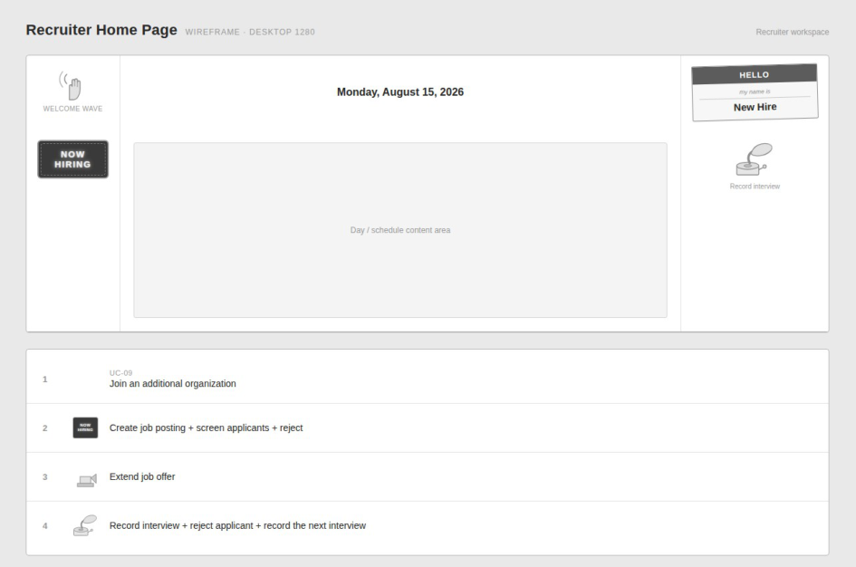

# CareerBridge — UI drafts

> Part of the CareerBridge specification — see the [index](README.md). Section numbers are those of the project documentation, so references such as "section 4.3" work across files.

### 4.4 UI Initial Drafts

Low-fidelity wireframes (desktop, 1280 pixels wide) for the main screens of each actor, one per figure. Each description names the use cases the screen serves.

#### Applicant Home Page

Figure 20. The applicant's workspace. Its icons open Maintain Profile and Resume (UC-03), Apply for Job (UC-04), Track Application Status (UC-05), Withdraw Application (UC-06) and Respond to Job Offer (UC-07) in the central canvas.

**Figure 20: Applicant Home Page wireframe**

#### Job Application Page

Figure 21. The screen for Apply for Job (UC-04): the applicant's resume on file, the chosen posting's description and other open postings (UC-01), with Cancel and Submit application.

**Figure 21: Job Application Page wireframe**

#### Recruiter Home Page

Figure 22. The recruiter's workspace, with entry points for Join Additional Organization (UC-09), Create Job Posting (UC-11), Screen Applications, including rejections and interview records (UC-14), and Extend Job Offer (UC-15).

**Figure 22: Recruiter Home Page wireframe**

#### Applicant Page (recruiter view)

Figure 23. The screen for Screen Applications (UC-14): the applicant pool for the selected posting, a preview of the chosen application with the job description, and the organization's postings.

**Figure 23: Applicant Page (recruiter view) wireframe**

#### Admin

Figure 24. The Administrator's workspace, with its two approval actions: Approve Job Posting (UC-12) and Approve Recruiter/Organization Request (UC-10).

**Figure 24: Admin wireframe**
