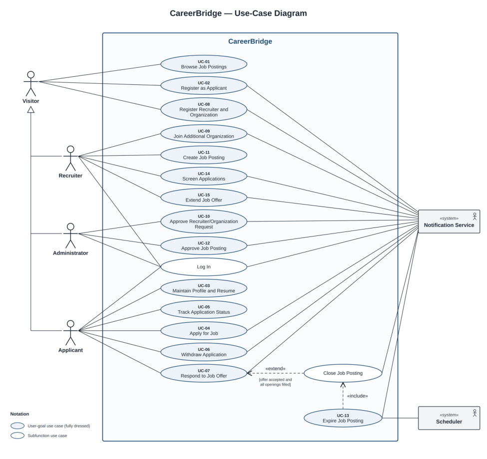
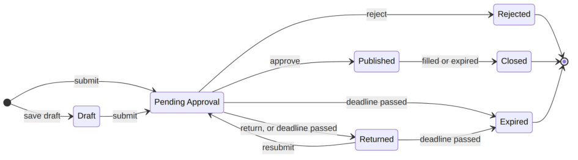

# CareerBridge — Use case model

> Part of the CareerBridge specification — see the [index](README.md). Section numbers are those of the project documentation, so references such as "section 4.3" work across files.

## 4. Use Case Model

This section describes CareerBridge's behavior from each actor's point of view: the use-case diagram (4.1), the fifteen fully-dressed use cases (4.2), the system sequence diagram and operation contracts of each use case (4.3), and the first user-interface drafts (4.4). The use cases follow Larman's fully-dressed format (Applying UML and Patterns, ch. 6), with the rows of the course template. Every customer rule is written into a precondition, a step, an extension or a special requirement and tagged with its business-rule ID (BR-n, Table 2); every team decision is tagged with its assumption ID (A-n, Table 1).

### 4.1 Use Case Diagram

Figure 2 shows the use-case diagram. The rectangle is the CareerBridge system boundary: everything inside it is what the team builds. The human actors stand on the left; the Notification Service and the Scheduler, both system actors, stand on the right, outside the boundary. Solid lines are associations, dashed arrows are «include» and «extend», and hollow-headed arrows are generalizations: Applicant, Recruiter and Administrator are specializations of Visitor, so each can also browse job postings, while the two registration use cases apply only to a person who is not logged in. White ovals are the two subfunctions described at the end of section 4.2.

**Figure 2: CareerBridge use-case diagram**

When one use case hands the actor to another (for example, Screen Applications hands over to Extend Job Offer), the text names the target use case. These hand-offs are navigation, not «include» or «extend» relationships, so they are not drawn. Table 5 lists the use cases with their authors.

**Table 5: Use-case index**

|**ID**|**Use case**|**Primary actor**|
|---|---|---|
|UC-01|Browse Job Postings|Visitor|
|UC-02|Register as Applicant|Visitor|
|UC-03|Maintain Profile and Resume|Applicant|
|UC-04|Apply for Job|Applicant|
|UC-05|Track Application Status|Applicant|
|UC-06|Withdraw Application|Applicant|
|UC-07|Respond to Job Offer|Applicant|

|**ID** ~~a~~ |**Use case**|**Primary actor**|
|---|---|---|
|UC-08 ~~a~~ ~~a~~|Register Recruiter and Organization|Visitor|
|UC-09  ~~a~~|Join Additional Organization|Recruiter|
|UC-10 ~~a~~|Approve Recruiter/Organization Request |Administrator |
|UC-11 |Create Job Posting ~~P~~|Recruiter ~~T~~|
|UC-12  ~~a~~|Approve Job Posting |Administrator |
|UC-13  ~~a~~|Expire Job Posting|Scheduler|
|UC-14 ~~a~~|Screen Applications |Recruiter |
|UC-15 |Extend Job Offer |Recruiter |
|— |Log In (subfunction) ~~p~~|Applicant, Recruiter, Administrator |— ~~p~~|
|— |Close Job Posting (subfunction) |— (used by UC-07 and UC-13) |— |

#### Application pipeline (BR-8)

An application is **active** while it is in Applied, Screening, Interview or Offer (A7). Hired, Rejected, Withdrawn and Offer Declined are terminal; an application that reaches one of them no longer counts toward the limit of 5 (BR-4). Every move follows an arrow in Figure 3, one stage at a time, and no move is ever undone (A8). At the Offer stage the applicant declines through UC-07 rather than withdrawing. After its response deadline an offer can no longer be accepted; it stays in Offer until a recruiter rejects it (A14).

**Figure 3: Application pipeline (BR-8)**

#### Job posting lifecycle (BR-9, BR-10, A9)

Recruiters save and submit postings in UC-11, and the Administrator approves, returns or rejects them in UC-12 (Figure 4). A posting accepts applications and appears in public listings only while it is **Published** ; a Rejected posting cannot be resubmitted. A Closed posting records why it closed: Filled, when its accepted offers equal its openings (UC-07, A2), or Expired, when its application deadline passes after publication (UC-13). A posting whose deadline passes before it is published is returned for a new deadline if the Administrator tries to approve it (UC-12, extension 6a), or marked Expired by the next expiration run (UC-13, extension 2b).

**Figure 4: Job posting lifecycle (BR-9, BR-10, A9)**

### 4.2 Fully-Dressed Use Cases

Each use case below follows the template's table: name, actor, preconditions, postconditions, main success scenario, extensions and special requirements, with the stakeholders' interests and the frequency of occurrence added from Larman's format. The Actor row names the primary actor first and then the supporting actors. The use cases are grouped by author, three per team member; the questions each one raised for the customer are listed in Table 3.

#### UC-01 to UC-03

**Table 6: UC-01 Browse Job Postings**

|**Use Case Name**|UC-01: Browse Job Postings|
|---|---|
|**Actor**|Primary: Visitor (also Applicant, Recruiter and Administrator, through generalization). Supporting: None.|
|**Stakeholders and Interests**| **Visitor:** wants to find relevant open jobs across all organizations quickly, without creating an account (BR-1, BR-3).  **Applicant:** wants the same, plus a direct route to apply and a clear sign of postings they have already applied to.  **Recruiter / Organization:** wants its published postings seen by as many qualified people as possible, and never wants drafts or unapproved postings shown.  **Administrator:** wants only approved, open postings made public (BR-9, BR-10), and no applicant or application data exposed on public pages (BR-15).|
|**Preconditions**|None. The job board is a public page (BR-3).|
|**Postconditions**|The visitor has viewed a list of open postings matching their criteria and, optionally, the full details of one posting. No data has changed. Only published postings that are before their deadline and not filled were shown (BR-9, BR-10).|
|**Main Success Scenario**|1. Visitor opens the CareerBridge job board. 2. System shows open postings from all organizations, newest first. Each entry shows title, organization, location, employment type and application deadline. 3. Visitor enters search criteria: keywords, location, organization and/or employment type. 4. System shows the open postings that match the criteria. 5. Visitor selects a posting. 6. System shows the posting's full details: description, requirements, organization, location, employment type, deadline and number of openings, and offers to apply. Visitor repeats steps 3–6 until done.|
|**Extensions**|**\*a.** At any time, the system fails: 1. System shows an error message and keeps the visitor's search criteria. 2. Visitor retries; the use case resumes at the failed step. **2a.** No postings are open: 1. System shows "No open positions right now." The use case ends. **4a.** No postings match the criteria: 1. System shows "No matching postings" and suggests removing filters. 2. Visitor revises the criteria; the use case resumes at step 3. **5a.** The selected posting closed after the list was shown (deadline passed or filled, BR-10): 1. System shows "This posting is no longer accepting applications" and returns to the refreshed list at step 4. **6a.** Visitor asks to apply while not logged in: 1. System asks the visitor to log in or register (UC-02). 2. After the visitor logs in as an Applicant, the Apply for Job use case (UC-04) begins for this posting. **6b.** A logged-in Applicant already applied to this posting: 1. System shows the application's current stage instead of offering to apply, with a link to Track Application Status (UC-05). **6c.** A logged-in Recruiter or Administrator asks to apply: 1. System explains that only Applicant accounts can apply. The use case ends.|
|**Special Requirements**| Pages in this use case require no login (BR-3) and must show no applicant or application data.  Search results appear within 2 seconds for up to 10,000 open postings (team target).  Pages work on current desktop and mobile browsers and meet WCAG 2.1 AA.|
|**Frequency of Occurrence**|Continuous. This is the most frequent use case in the system.|

**Table 7: UC-02 Register as Applicant**

|**Use Case Name**|UC-02: Register as Applicant|
|---|---|
|**Actor**|Primary: Visitor. Supporting: Notification Service.|
|**Stakeholders and Interests**| **Visitor:** wants to create an account quickly so they can apply, without waiting for anyone's approval (BR-14).  **Administrator:** wants one account per email address, valid contact details and securely stored credentials, without reviewing every applicant.  **Recruiter / Organization:** wants applicant contact details to be real, so offers and notices reach the right person.|
|**Preconditions**|The visitor is not logged in.|
|**Postconditions**|An active Applicant account exists with a unique, verified email address and a securely hashed password. An empty applicant profile with no resume has been created. The new Applicant is logged in.|
|**Main Success Scenario**|1. Visitor asks to register as an applicant. 2. System asks for full name, email address and password. 3. Visitor enters full name, email address and password. 4. System validates the data: required fields are present, the email is well formed and not already registered, and the password meets the password policy. 5. System creates the Applicant account in Pending Verification state and asks the Notification Service to send a verification email with a link valid for 24 hours. 6. Notification Service delivers the verification email. 7. Visitor opens the verification link. 8. System activates the account, logs the Applicant in and invites them to add a resume (UC-03).|
|**Extensions**|**\*a.** At any time, the system fails: 1. System shows an error message. No partial account is saved unless step 5 completed. **3a.** Visitor wants a recruiter account instead: 1. System directs the visitor to Register Recruiter and Organization (UC-08). This use case ends. **4a.** A required field is missing or malformed: 1. System reports each invalid field and the reason. 2. Visitor corrects the data; the use case resumes at step 4. **4b.** The email address is already registered: 1. System reports that an account already exists for that email and suggests logging in. No new account is created. The use case ends. **4c.** The password does not meet the policy: 1. System shows the policy (at least 10 characters, including a letter and a number). 2. Visitor enters a new password; the use case resumes at step 4. **7a.** The verification link has expired: 1. System issues a new verification link valid for 24 hours and asks the Notification Service to send it; the use case resumes at step 6.|

|**Special Requirements**| Passwords are stored only as salted hashes, and all traffic uses HTTPS.|
|---|---|
|| The system hands the verification email to the Notification Service within 1 minute of registration.  Pages work on current desktop and mobile browsers and meet WCAG 2.1 AA.|
|**Frequency of Occurrence**|Often. Every new applicant does this once.|

**Table 8: UC-03 Maintain Profile and Resume**

|**Use Case Name**|UC-03: Maintain Profile and Resume|
|---|---|
|**Actor**|Primary: Applicant. Supporting: None.|
|**Stakeholders and Interests**| **Applicant:** wants profile details and their resume to stay current and easy to replace.  **Recruiter / Organization:** wants an accurate resume for each application it reviews, and wants that resume to stay the same after submission (BR-5).  **Administrator:** wants uploaded files to be safe (correct type, limited size, no malware) and resumes visible only to people entitled to see them (BR-15).|
|**Preconditions**|The Applicant is logged in (Log In).|
|**Postconditions**|The applicant's profile details are saved. The applicant has at most one resume on file (BR-6); an uploaded resume has replaced any previous one. Resume copies attached to already-submitted applications are unchanged (BR-5, A6).|
|**Main Success Scenario**|1. Applicant asks to view their profile. 2. System shows the current profile (name, email, phone, location, headline, skills, education and work experience) and the resume on file, if any. 3. Applicant edits profile details. 4. System validates and saves the details and confirms the save. 5. Applicant uploads a resume file. 6. System checks the file type and size, scans the file for malware, and stores it as the applicant's only resume. 7. System shows the resume's file name and upload date.|
|**Extensions**|**\*a.** At any time, the system fails: 1. System shows an error message. Profile data saved before the failure is kept, and the previous resume stays on file. **4a.** A field is invalid (for example, name left empty or phone number malformed): 1. System reports the field and the reason. 2. Applicant corrects it; the use case resumes at step 4. **6a.** The file is not a PDF or DOCX, or is larger than 5 MB: 1. System rejects the file, states the accepted types and size limit, and keeps the current resume. Applicant selects another file; the use case resumes at step 5. **6b.** The malware scan flags the file: 1. System rejects the file and keeps the current resume. Applicant selects another file; the use case resumes at step 5.|
|**Special Requirements**| The system validates, scans and stores a 5 MB resume within 10 seconds after receiving it.  Resume files are encrypted at rest. Only the applicant and the Administrator can open the resume on file; a recruiter sees only the resume copy attached to an application to their organization's posting (BR-15, A6).|
|**Frequency of Occurrence**|Occasional. Usually once after registration, then a few times a year.|

#### UC-04, UC-14 and UC-15

**Table 9: UC-04 Apply for Job**

|**Use Case Name**|UC-04: Apply for Job|
|---|---|
|**Actor**|Primary: Applicant. Supporting: Notification Service.|
|**Stakeholders and Interests**| **Applicant:** wants to apply quickly using the resume on file, get a confirmation, and know how many application slots remain (BR-4).  **Recruiter / Organization:** wants complete applications only for open postings, with no duplicates, and visible only to the posting's recruiters (BR-15, A10).  **Administrator:** wants the 5-application limit enforced consistently, even when submissions arrive at the same moment.  **Other applicants:** benefit from the limit, which keeps applicant pools focused.|
|**Preconditions**| The Applicant is logged in (Log In).  The Applicant has chosen an open posting (UC-01).|
|**Postconditions**|A new application exists in the Applied stage, linked to the Applicant and the posting, with a copy of the resume as it was at submission (A6). The Applicant has at most 5 active applications (BR-4, A7). A confirmation has been sent to the Applicant. The application is visible only to the Applicant, the Administrator and the posting's recruiters (BR-15, A10).|
|**Main Success Scenario**|1. Applicant asks to apply to the chosen posting. 2. System presents an application summary: posting title and organization, the applicant's contact details, the resume on file and how many of the 5 active applications the applicant is using (for example, "3 of 5 active"). 3. Applicant confirms the submission, acknowledging that a submitted application cannot be edited (BR-5). 4. System verifies that the posting is still open, that the applicant still has fewer than 5 active applications (BR-4) and that the applicant has not applied to this posting before (A5). 5. System creates the application in the Applied stage, keeps a copy of the resume and records the submission time. 6. System asks the Notification Service to send the Applicant a confirmation. 7. System confirms the submission with the updated count (for example, "4 of 5 active") and a link to Track Application Status (UC-05).|
|**Extensions**|**\*a.** At any time, the system fails before step 5 completes: 1. No application is created, and the applicant's active applications are unchanged. System asks the applicant to try again. **2a.** Applicant has no resume on file (BR-6): 1. System explains that a resume is required and hands the applicant to Maintain Profile and Resume (UC-03). 2. After the upload, the use case resumes at step 2. **2b.** Applicant already has 5 active applications (BR-4): 1. System blocks the application and lists the applicant's active applications. 2. System explains that a slot frees up when an application is withdrawn (UC-06) or reaches Hired, Rejected or Offer Declined (A7). The use case ends. **3a.** Applicant wants to update the resume first: 1. Applicant goes to Maintain Profile and Resume (UC-03); the use case then resumes at step 2. **3b.** Applicant cancels: 1. Nothing is saved. The use case ends. **4a.** The posting closed after step 1 (deadline passed or filled, BR-10): 1. System reports that the posting no longer accepts applications. No application is created. **4b.** The applicant reached 5 active applications after step 2, for example through another submission made at the same time (BR-4): 1. The use case continues as in 2b. **4c.** Applicant has already applied to this posting, including a withdrawn application (A5): 1. System reports the existing application's stage and does not create a new one. **6a.** The Notification Service is unavailable: 1. The application stays saved. System queues the confirmation and retries; the confirmation is also given at step 7.|
|**Special Requirements**| The limit of 5 active applications holds even when several submissions from the same applicant arrive at the same moment (BR-4).  The confirmation email arrives within 1 minute under normal load (A11).  If the Notification Service is unavailable, held notices are sent within 15 minutes after it is available again.|
|**Frequency of Occurrence**|High. Several times per applicant, with peaks right after postings are published.|

**Table 10: UC-14 Screen Applications**

|**Use Case Name**|UC-14: Screen Applications|
|---|---|
|**Actor**|Primary: Recruiter. Supporting: Notification Service.|
|**Stakeholders and Interests**| **Recruiter:** wants to review the applications to their organization's postings and move qualified candidates forward one stage at a time (BR-8).  **Applicant:** wants the application reviewed and wants to learn of each stage change within a known time (BR-7, A11).  **Organization:** wants every posting to follow the same fixed pipeline (BR-8) and its applications hidden from other organizations (BR-15).  **Administrator:** wants each stage change attributable to a specific recruiter for audit.|
|**Preconditions**|The Recruiter is logged in and is an Active member of the organization they are acting for (BR- 14, A16).|
|**Postconditions**|Each application the recruiter advanced has moved exactly one stage forward: Applied to Screening, or Screening to Interview (BR-8, A8). Each change is recorded with its date and the recruiter, and the applicant's notice has been sent or scheduled within the time A11 allows (BR-7). Each application the recruiter rejected is Rejected with its reason recorded, and its notice has been sent or scheduled (BR-11, A11). Each interview recorded holds its details and any outcome (BR- 12). The recruiter has seen nothing from other organizations and nothing about the applicant's applications to them (BR-15).|
|**Main Success Scenario**|1. Recruiter asks to review the applications to one of their organization's postings. 2. System presents all postings of the organization the recruiter is acting for (A10), each with the number of applications at each stage. 3. Recruiter takes up one application to review. 4. System presents the resume copy submitted with the application (A6), the applicant's profile details and this application's stage history. Nothing about the applicant's other applications is shown (BR-15). 5. Recruiter optionally adds an internal note and advances the application to the next stage. 6. System confirms that the move is to the next stage of the fixed pipeline (BR-8) and records the new stage, the date and the recruiter. 7. System asks the Notification Service to notify the applicant of the new stage within the time A11 allows (BR-7). Recruiter repeats steps 3–7 until done.|
|**Extensions**|**\*a.** Recruiter asks for a posting or application of an organization they are not an Active member of (BR-15): 1. System reveals nothing, reports that it was not found and records the attempt. **2a.** Recruiter belongs to more than one organization (BR-2, A16): 1. Recruiter switches the organization they are acting for; System presents only that organization's postings. **3a.** The posting has no applications: 1. System reports that there are none. The use case ends. **5a.** Recruiter decides to reject the application, at any active stage (BR-11): 1. Recruiter chooses a reason (A18), optionally adds a comment for the applicant, and confirms. At the Offer stage, System first warns that rejecting rescinds the offer. 2. System moves the application to Rejected, which frees the applicant's slot (BR-4), and records the stage, reason, date and recruiter. It asks the Notification Service to send the applicant the reason within the time A11 allows for that stage. The rejection is final (A8). 3. The use case resumes at step 3. **5b.** Recruiter tries to skip or reverse a stage, for example Applied straight to Interview, or Interview back to Screening (BR-8, A8): 1. System allows only the next stage and explains that the pipeline is fixed and stage changes are final. **5c.** The application is at the Interview stage: 1. Recruiter records an interview already arranged with the applicant (date and time, format, location or meeting link, interviewers) or, once it has taken place, its outcome (Passed, Not passed or No-show) and notes (BR-12). An application has at most two interview rounds (A13). 2. System saves the record and, for a newly arranged interview, asks the Notification Service to send the applicant the details (A11). Outcomes and notes are never shown to the applicant (A12). 3. Recruiter may extend an offer (UC-15) or reject the application (5a) instead of an advance. **5d.** Recruiter chooses several applications to advance together: 1. System applies steps 6–7 to each and reports any it could not move. **6a.** Since step 3, the application was withdrawn, rejected or moved by another recruiter: 1. System reports the current stage. Nothing changes. **7a.** The Notification Service is unavailable: 1. The stage change stays recorded. System queues the notice and retries within the time A11 allows.|
|**Special Requirements**| Notices of an advance reach the applicant within 4 business days (A11); the new stage is visible to the applicant in UC-05 within 1 minute.  Internal notes and interview outcomes are never shown to applicants (UC-05, A12) or to other organizations.  Every stage change, rejection and interview record is written to the audit log.  The applications to a posting with up to 1,000 applications are listed within 2 seconds. **Technology and data variations:**  4a. The resume copy is available as a PDF or DOCX, in the format the applicant uploaded (UC-03).|
|**Frequency of Occurrence**|Very high. Recruiters screen applications daily.|

**Table 11: UC-15 Extend Job Offer**

|**Use Case Name**|UC-15: Extend Job Offer|
|---|---|
|**Actor**|Primary: Recruiter. Supporting: Notification Service.|
|**Stakeholders and Interests**| **Recruiter:** wants to send an offer with its terms, revise it while it is unanswered, and track the response in one place (BR-13, A14).  **Applicant:** wants the offer terms in writing, delivered promptly, with a known response deadline.  **Organization:** wants no more acceptances than it has openings (A2), and offer terms visible only to the candidate, the posting's recruiters and the Administrator (BR-15, A10).  **Administrator:** wants each offer and each revision attributable to a recruiter for audit.|
|**Preconditions**|The Recruiter is logged in and is an Active member of at least one organization (BR-14).|
|**Postconditions**|The application is in the Offer stage with its terms recorded: job title, start date, compensation, other terms, response deadline and an optional offer letter. The offer, or its revision, is recorded with the date and the recruiter. The applicant has been sent the offer within 1 minute (A11) and can respond through UC-07 until the response deadline (A14).|

|**Main Success Scenario**|1. Recruiter asks to extend an offer on an application at the Interview stage (from UC-14). 2. System presents the offer terms to fill in, with the job title taken from the posting and the posting's openings, accepted offers and outstanding offers. 3. Recruiter enters the start date, compensation, other terms and response deadline (7 days by default, A14), and optionally attaches an offer letter. 4. Recruiter reviews the offer as the applicant will see it and confirms. 5. System validates the offer: required fields are present, the response deadline is in the future, the start date is after the response deadline (A14), and Interview to Offer is an allowed move (BR- 8). 6. System moves the application to the Offer stage and records the terms, the date and the recruiter. 7. System asks the Notification Service to send the applicant the offer, with a link to Respond to Job Offer (UC-07). 8. System confirms that the offer was sent.|
|---|---|
|**Extensions**|**\*a.** Recruiter asks for an application of an organization they are not an Active member of (BR- 15): 1. System reveals nothing, reports that it was not found and records the attempt. **1a.** The application is neither at the Interview stage nor holding an unanswered offer (BR-8): 1. System explains that offers can be made only at the Interview stage and offers Screen Applications (UC-14). **1b.** The application already holds an unanswered offer, and the recruiter revises it (A14): 1. System presents the current terms for editing. 2. Recruiter changes the terms, the response deadline or the offer letter; the use case continues at step 4. 3. At step 6, System keeps the application in Offer, records the revised terms and the revision with the date and the recruiter. At step 7, the notice tells the applicant what changed. **2a.** No interview with the outcome Passed is recorded (UC-14, extension 5c): 1. System warns the recruiter, who may continue or cancel. **2b.** Accepted plus outstanding offers already equal the number of openings (A2): 1. System warns that if the posting fills, the remaining offers will be rejected automatically with the reason "Posting closed" (A3). 2. Recruiter continues or cancels. **4a.** Recruiter cancels: 1. Nothing changes. The use case ends. **5a.** A field is missing or invalid: 1. System identifies the problem; the recruiter corrects it and the use case resumes at step 4. **5b.** Since step 1, the application was withdrawn or rejected, the applicant answered the offer, or the posting was filled: 1. System reports the current status. No offer is made or revised. **7a.** The Notification Service is unavailable: 1. The offer stays recorded. System queues the notice and retries; the applicant can also see the offer in UC-05.|
|**Special Requirements**| Any active recruiter of the organization that owns the posting can extend offers on its applications (A10).  Offer terms are visible only to the applicant, the posting's recruiters and the Administrator (BR-15, A10).  The offer reaches the applicant within 1 minute under normal load (A11).  The offer letter is a PDF of at most 5 MB.  Every offer and revision is written to the audit log.  If the Notification Service is unavailable, held notices are sent within 15 minutes after it is available again. **Technology and data variations:**  3a. Compensation is given as an amount, a currency and a period (hourly, monthly or yearly).|
|**Frequency of Occurrence**|Low. Roughly once per opening, plus any offers that are declined or revised.|

#### UC-05 to UC-07

**Table 12: UC-05 Track Application Status**

|**Use Case Name**|UC-05: Track Application Status|
|---|---|
|**Actor**|Primary: Applicant. Supporting: None.|
|**Stakeholders and Interests**| **Applicant:** wants to see every pipeline stage of each application (BR-7), know why an application was rejected (BR-11) and reach the next action, such as withdrawing or responding to an offer.  **Recruiter / Organization:** wants applicants kept informed, which cuts status inquiries, while its internal notes and interview outcomes stay private (A12).  **Other applicants and organizations:** want no application visible to anyone other than its owner, the posting's recruiters and the Administrator (BR-15, A10).|
|**Preconditions**|The Applicant is logged in (Log In).|
|**Postconditions**|The Applicant has seen the current stage and stage history of their own applications, and only their own. No data has changed.|
|**Main Success Scenario**|1. Applicant asks to see their applications. 2. System presents all of the applicant's applications, active ones first, with how many of the 5 active applications are in use. Each entry gives posting title, organization, submission date, current stage and date of the last change. 3. Applicant asks for the history of one application. 4. System presents the application's stage history: each stage reached (Applied, Screening, Interview, Offer, Hired) with the date it was entered, and the date, time, format and location of any recorded interview (BR-12). Interview outcomes are not shown (A12). 5. System presents the actions allowed at the current stage. Applicant repeats steps 3–5 until done.|
|**Extensions**|**\*a.** Applicant asks for an application that is not theirs (BR-15): 1. System reveals nothing about the application, reports that it was not found and records the attempt. **2a.** Applicant has no applications: 1. System says so and links to Browse Job Postings (UC-01). The use case ends. **2b.** Applicant filters the list to active or terminal applications: 1. System lists only the matching applications; the use case continues at step 3. **4a.** The application was rejected by a recruiter (BR-11): 1. System presents the rejection date, the stage at which it was rejected and the recorded reason. **4b.** The posting was filled while the application was active (BR-10, A3): 1. System presents the application as Rejected with the reason "Posting closed." **4c.** The application was withdrawn: 1. System presents the withdrawal date. No further actions are offered. **5a.** The application is in Applied, Screening or Interview: 1. System offers Withdraw (UC-06). Editing is never offered (BR-5). **5b.** The application is at the Offer stage (BR-13): 1. System presents the offer's current terms and response deadline, with Accept and Decline (UC-07).|
|**Special Requirements**| A stage change made by a recruiter is visible here within 1 minute; the notices about it follow the timing in A11.  The list appears within 2 seconds for an applicant with up to 200 applications.  Recruiters' internal notes and interview outcomes are never shown to applicants (A12). **Technology and data variations:**  1a. Applicant may reach step 4 directly from a link in a notification email.|
|**Frequency of Occurrence**|Very high. Several times a week for each applicant with active applications.|

**Table 13: UC-06 Withdraw Application**

|**Use Case Name**|UC-06: Withdraw Application|
|---|---|
|**Actor**|Primary: Applicant. Supporting: Notification Service.|
|**Stakeholders and Interests**| **Applicant:** wants to withdraw an application quickly, free an application slot (BR-4) and understand beforehand that withdrawal is final (A5).  **Recruiter / Organization:** wants to know promptly so it stops spending review time on the candidate, and wants the withdrawn application kept on record.  **Administrator:** wants the 5-application limit to stay accurate and an audit trail of every withdrawal.|
|**Preconditions**| The Applicant is logged in (Log In).  The application belongs to the Applicant and is in the Applied, Screening or Interview stage. At the Offer stage the applicant declines through UC-07 instead.|
|**Postconditions**|The application is in the Withdrawn stage, with the withdrawal date and any reason given (A18). It no longer counts toward the applicant's 5 active applications (BR-4, A7). The posting's recruiters have been notified, and the application stays in their records as read-only. The Applicant cannot apply to this posting again (A5).|
|**Main Success Scenario**|1. Applicant asks to withdraw one of their active applications (from UC-05). 2. System presents the posting title, organization and current stage. It explains that withdrawal cannot be undone and that the applicant cannot reapply to this posting (A5). 3. Applicant optionally gives a reason and confirms the withdrawal. 4. System verifies that the application is still in Applied, Screening or Interview. 5. System moves the application to Withdrawn and records the date and reason. 6. System asks the Notification Service to notify the posting's recruiters (A10) and to send the Applicant a confirmation. 7. System confirms the withdrawal with the updated count (for example, "2 of 5 active").|
|**Extensions**|**\*a.** At any time, the system fails before step 5 completes: 1. The application is unchanged and still counts as active. System asks the applicant to try again. **1a.** Applicant wants to change a submitted application instead of withdrawing it (BR-5): 1. System explains that submitted applications cannot be edited, only withdrawn. 2. Applicant either continues at step 2 or leaves, and the use case ends. **3a.** Applicant cancels: 1. Nothing changes. The use case ends. **4a.** The application moved to the Offer stage after step 1: 1. System explains that the applicant must decline the offer instead and links to Respond to Job Offer (UC-07). Nothing changes. **4b.** The application reached a terminal stage after step 1 (rejected, including because the posting closed, or withdrawn in another session): 1. System reports the current stage. Nothing changes. **6a.** The Notification Service is unavailable: 1. The withdrawal stays recorded. System queues the notices and retries.|
|**Special Requirements**| A withdrawal is recorded completely or not at all, so the application's stage and the applicant's count of active applications always agree.  Recruiters see the Withdrawn stage within 1 minute.  Withdrawn applications are kept for audit and are never deleted by this use case.  If the Notification Service is unavailable, held notices are sent within 15 minutes after it is available again. **Technology and data variations:**  3a. Reasons come from a short list (accepted another offer, no longer interested, other) with an optional comment (A18).|

|**Frequency of Occurrence**|Occasional. Most often when an applicant is at the limit of 5 active applications and wants to apply elsewhere.|
|---|---|

**Table 14: UC-07 Respond to Job Offer**

|**Use Case Name**|UC-07: Respond to Job Offer|
|---|---|
|**Actor**|Primary: Applicant. Supporting: Notification Service.|
|**Stakeholders and Interests**| **Applicant:** wants to see the full, current offer terms and accept or decline clearly, knowing the decision is final (BR-13).  **Recruiter / Organization:** wants a prompt, recorded answer, and wants the posting closed as soon as it is filled so no more applications arrive (BR-10).  **Other applicants to the posting:** want to learn promptly that the position is filled, which also frees their application slots (A3, BR-4).  **Administrator:** wants no posting to end up with more hires than openings (A2).|
|**Preconditions**| The Applicant is logged in (Log In).  The application belongs to the Applicant and is in the Offer stage (UC-15).|
|**Postconditions**| **If accepted:** the application is in the Hired stage with the acceptance date, and it no longer counts toward the applicant's 5 active applications (A7). If the posting now has as many accepted offers as openings, it has been closed through Close Job Posting (A2). The posting's recruiters have been notified.  **If declined:** the application is in the Offer Declined stage and no longer counts toward the limit (BR-4, A7). The posting's recruiters have been notified, and the posting stays open.|
|**Main Success Scenario**|1. Applicant asks to respond to an offer, from UC-05 or from the offer notification. 2. System presents the offer: posting and organization, job title, start date, compensation, other terms and the response deadline. 3. Applicant accepts the offer. 4. System asks the Applicant to confirm that acceptance is final. 5. Applicant confirms. 6. System moves the application to Hired and records the acceptance date. 7. System asks the Notification Service to notify the posting's recruiters (A10) and to send the Applicant a confirmation. 8. System confirms the acceptance.|
|**Extensions**|Extension point:_Posting Filled_, extension 6c, after step 6. The Close Job Posting subfunction extends this use case when the acceptance fills the last opening (BR-10, A2). **\*a.** At any time, the system fails before step 6 completes: 1. The application stays in the Offer stage with no change. System asks the applicant to try again. **3a.** Applicant declines (BR-13): 1. System asks for an optional reason and confirmation that declining is final. 2. Applicant confirms. 3. System moves the application to Offer Declined and records the date and reason. 4. The use case continues at step 7. The posting stays open. **3b.** Applicant leaves without responding: 1. Nothing changes. After the response deadline the offer can no longer be accepted (A14). **5a.** Applicant does not confirm: 1. The use case resumes at step 2. **6a.** Since step 1, the offer stopped being open: the recruiter rescinded it (UC-14, extension 5a), the posting closed, or the response deadline passed (A14): 1. System reports the current stage. Nothing changes. **6b.** The recruiter revised the offer after step 2 (UC-15, A14): 1. System presents the revised terms; the use case resumes at step 2. **6c.** _Posting Filled:_the posting now has as many accepted offers as openings (BR-10, A2): 1. Close Job Posting runs with the reason Filled: the posting becomes Closed and leaves public listings. Everyremainingactive application to it is rejected with the reason "Posting closed" (A3), and those applicants are notified (BR-11, A11). 2. The use case continues at step 7. **7a.** The Notification Service is unavailable: 1. The decision stays recorded. System queues the notices and retries.|
|**Special Requirements**| A posting never records more hires than openings, even when two applicants accept at the same moment.  A filled posting leaves public listings within 1 minute of the acceptance that filled it.  If the Notification Service is unavailable, held notices are sent within 15 minutes after it is available again. **Technology and data variations:**  2a. Offer terms are shown as the recruiter entered them in UC-15; an offer letter may be attached as a PDF.|
|**Frequency of Occurrence**|Low. Once per offer extended.|

#### UC-08 to UC-10

**Table 15: UC-08 Register Recruiter and Organization**

|**Use Case Name**|UC-08: Register Recruiter and Organization|
|---|---|
|**Actor**|Primary: Visitor. Supporting: Notification Service.|
|**Stakeholders and Interests**| **Prospective recruiter:** wants to set up a recruiter account, and their organization if it is new, in one pass and to hear back quickly.  **Organization:** wants only people it has authorized to post jobs or see applications in its name.  **Administrator:** wants enough information to confirm that the person and organization are genuine before granting access (BR-14), and wants no duplicate organizations.  **Applicants:** want every posting to come from a legitimate employer, not a scam.|
|**Preconditions**|The visitor is not logged in.|
|**Postconditions**|A recruiter account with a verified work email exists in the Pending Approval state. Either a new organization in Pending Approval, or a pending membership in an existing organization, is linked to it. The request is in the Administrator's approval queue (UC-10). The recruiter cannot use recruiter functions until approved (BR-14).|
|**Main Success Scenario**|1. Visitor chooses to register as a recruiter. 2. System shows the recruiter registration form. 3. Visitor enters personal details (full name, work email, phone, job title, password) and organization details (legal name, website, industry, headquarters location, size and a short description). 4. System validates the data: required fields are present, the email is not already registered, the password meets the policy and the organization is not already registered. 5. System creates the recruiter account and the organization, both in Pending Approval, asks the Notification Service to send a verification email and tells the visitor to open the link in it. 6. Visitor opens the verification link. 7. System marks the email verified, adds the request to the Administrator's approval queue and asks the Notification Service to alert the Administrator. 8. System tells the visitor that the request is under review and that the decision will arrive by email.|
|**Extensions**|**\*a.** Before approval, the pending recruiter logs in and tries to use recruiter functions: 1. System shows the request's status and allows no recruiter actions (BR-14). **4a.** A required field is missing or invalid, or the password fails the policy: 1. System highlights each problem; the visitor corrects it and the use case resumes at step 4. **4b.** The email address is already registered: 1. System offers Log In instead. If the account belongs to an approved recruiter, System points to Join Additional Organization (UC-09). No new account is created. **4c.** The organization is already registered: 1. System offers to request membership in the existing organization instead. 2. Visitor accepts; the use case continues at step 5, creating only the recruiter account with a pending membership (A4). **4d.** The work email's domain does not match the organization's website domain (A17): 1. System accepts the request but flags it for closer review by the Administrator. **6a.** The verification link has expired: 1. System offers a new link; the use case resumes at step 5. **7a.** The Notification Service is unavailable: 1. The request still enters the queue. System queues the emails and retries.|

|**Special Requirements**| Password storage and transport follow the same rules as UC-02.  The request appears in the Administrator's queue within 1 minute of email verification. **Technology and data variations:**|
|---|---|
|| 3a. Organization logo upload is optional (PNG or JPG, up to 1 MB).  4a. Duplicate organizations are detected by matching the website domain and normalized legal name.|
|**Frequency of Occurrence**|Occasional. A few requests per week.|

**Table 16: UC-09 Join Additional Organization**

|**Use Case Name**|UC-09: Join Additional Organization|
|---|---|
|**Actor**|Primary: Recruiter. Supporting: Notification Service.|
|**Stakeholders and Interests**| **Recruiter:** wants to recruit for another organization, such as a client or a sister company, with the same login (BR-2).  **Target organization:** wants only authorized people to act for it, and wants to know who has joined.  **Administrator:** wants to confirm the recruiter's affiliation before granting access (A4).  **Applicants:** want recruiters to see only applications to organizations they actually belong to (BR-15).|
|**Preconditions**|The Recruiter is logged in, the account is approved, and the recruiter belongs to at least one organization.|
|**Postconditions**|A pending membership request links the Recruiter to the target organization and is in the Administrator's approval queue (UC-10). The Recruiter has no access to that organization's postings or applications until the request is approved (BR-15).|
|**Main Success Scenario**|1. Recruiter chooses Join Organization. 2. System shows a search of registered organizations. 3. Recruiter searches for and selects the target organization. 4. System shows the organization's summary and the recruiter's current memberships. 5. Recruiter enters their role at the target organization and a short justification, then submits. 6. System verifies that the recruiter is not already a member and has no pending request for this organization. 7. System creates the pending membership request, adds it to the Administrator's approval queue, and asks the Notification Service to alert the Administrator and confirm to the Recruiter. 8. System lists the organization as Pending in the recruiter's memberships.|
|**Extensions**|**\*a.** Recruiter cancels a pending request before a decision: 1. System removes the request from the queue and from the recruiter's memberships. **3a.** The organization is not registered: 1. Recruiter enters the new organization's details, as in UC-08 step 3. 2. System creates the organization in Pending Approval; the use case continues at step 7 as a new-organization request. **6a.** Recruiter is already a member of the organization: 1. System says so. The use case ends. **6b.** A request for this organization is already pending: 1. System shows that request's status. No new request is created. **7a.** The Notification Service is unavailable: 1. The request still enters the queue. System queues the emails and retries.|

|**Special Requirements**| Every recruiter screen works in one organization at a time. The recruiter switches between approved organizations, and each view shows only that organization's postings and applications (BR-15).|
|---|---|
|| A recruiter's access to one organization never reveals data from another organization they belong to. **Technology and data variations:**  3a. Organization search matches on name and website domain.|
|**Frequency of Occurrence**|Rare. A few times per recruiter over the life of the account.|

**Table 17: UC-10 Approve Recruiter/Organization Request**

|**Use Case Name**|UC-10: Approve Recruiter/Organization Request|
|---|---|
|**Actor**|Primary: Administrator. Supporting: Notification Service.|
|**Stakeholders and Interests**| **Administrator:** wants a clear queue with enough information to decide each request quickly and defensibly.  **Requesting recruiter:** wants a fast decision, and a reason if denied.  **Organization:** wants no one acting in its name without authorization.  **Applicants:** want only genuine employers able to post jobs and read their applications (BR- 14, BR-15).|
|**Preconditions**|The Administrator is logged in with the Administrator role (Log In).|
|**Postconditions**|Each decided request is recorded as Approved or Denied, with the date, the deciding Administrator and, if denied, the reason. If approved, the recruiter account, the organization if new, and the membership are Active. The requester has been notified, and the decision is in the audit log.|
|**Main Success Scenario**|1. Administrator opens the approval queue. 2. System lists pending requests, oldest first. Each shows the request type (a new recruiter with a new organization from UC-08, a new recruiter joining an existing organization from UC-08 extension 4c, or an existing recruiter joining another organization from UC-09), requester, organization, submission date and any review flag, such as the email-domain mismatch from UC-08 extension 4d. 3. Administrator selects a request. 4. System shows the details: requester's name, work email, job title and existing memberships; the organization's details; and the requester's justification. 5. Administrator checks the information and approves the request. 6. System activates the recruiter account if new, the organization if new, and the membership, then records the decision. 7. System asks the Notification Service to tell the requester the request was approved. 8. System returns to the queue without the decided request. Administrator repeats steps 3–8 until done.|
|**Extensions**|**2a.** The queue is empty: 1. System shows "No pending requests." The use case ends. **5a.** Administrator denies the request: 1. System requires a reason. 2. Administrator enters the reason. 3. System marks the request Denied. An account or organization created only for this request stays inactive. 4. System asks the Notification Service to send the requester the decision and reason; the use case continues at step 8. **5b.** Administrator needs more information: 1. Administrator writes a question; System asks the Notification Service to email it to the requester. 2. The request stays pending, marked "Information requested." The use case continues at step 8. **5c.** The requested new organization duplicates one already registered: 1. Administrator approves the membership in the existing organization instead; System discards the duplicate organization record. 2. The use case continues at step 7. **6a.** The request was cancelled by the requester, or decided by another Administrator, after step 3: 1. System shows the request's current status. Nothing changes. **7a.** The Notification Service is unavailable: 1. The decision stays recorded. System queues the email and retries.|
|**Special Requirements**| Only accounts with the Administrator role can open the approval queue.  Every decision is logged with who decided, when, the decision and any reason.  Target: requests are decided within 2 business days. **Technology and data variations:**  5a. The Administrator may open the organization's website from the request to check it.|
|**Frequency of Occurrence**|Several times a week, rising as more organizations join.|

#### UC-11 to UC-13

**Table 18: UC-11 Create Job Posting**

|**Use Case Name**|UC-11: Create Job Posting|
|---|---|
|**Actor**|Primary: Recruiter. Supporting: None.|
|**Stakeholders and Interests**| **Recruiter:** wants to draft a posting for one of their organizations, save it and submit it for approval with little effort (BR-2).  **Organization:** wants postings in its name created only by its own approved recruiters, with accurate details (BR-15).  **Administrator:** wants complete, lawful postings to review before anything goes public (BR- 9, A1).  **Applicants:** want clear information: role, location, type, requirements and deadline.|
|**Preconditions**|The Recruiter is logged in, the account is approved, and the recruiter is an active member of at least one organization (BR-14).|
|**Postconditions**|A posting exists, linked to the chosen organization and the creating recruiter, in the Pending Approval state. It has a title, description, requirements, location, employment type, application deadline and number of openings (A2). It is in the Administrator's posting approval queue (UC- 12) and is not publicly visible (BR-9).|
|**Main Success Scenario**|1. Recruiter chooses Create Posting. 2. System shows the posting form for the recruiter's current organization. 3. Recruiter enters the title, description, requirements, location (on-site, hybrid or remote), employment type, optional salary range, application deadline and number of openings (default 1). 4. Recruiter submits the posting for approval. 5. System validates the posting: required fields are present, the deadline is between 1 and 90 days away, and openings are at least 1. 6. System saves the posting as Pending Approval and adds it to the Administrator's posting approval queue (UC-12). 7. System shows the posting as Pending Approval in the organization's postings list.|
|**Extensions**|**\*a.** The recruiter's membership in the organization is revoked before step 6: 1. System refuses to save the posting and explains why. **2a.** Recruiter belongs to more than one organization (BR-2): 1. System asks which organization the posting is for, listing only approved memberships. 2. Recruiter selects one; the use case continues at step 3. **3a.** Recruiter starts from an earlier posting of the same organization: 1. System copies that posting's fields into the form, except the deadline. **3b.** Recruiter saves a draft instead of submitting: 1. System saves the posting as Draft, visible only to that organization's recruiters, and does not queue it. 2. Later, a recruiter reopens the draft and the use case resumes at step 3. **5a.** A required field is missing or invalid: 1. System highlights each problem; the recruiter corrects it and the use case resumes at step 4. **5b.** The deadline is in the past, less than 1 day away or more than 90 days away: 1. System states the allowed range; the recruiter corrects it and the use case resumes at step 4. **6a.** The posting was returned by the Administrator with comments (UC-12, extension 5a): 1. Recruiter opens the returned posting; System shows the Administrator's comments. 2. Recruiter revises it; the use case resumes at step 4.|

|**Special Requirements**| Drafts and pending postings are visible only to recruiters of the owning organization and to the Administrator (BR-15).|
|---|---|
|| The form keeps unsaved input if the session times out: a recruiter who logs in again within 24 hours recovers everything entered up to 30 seconds before the timeout. **Technology and data variations:**  3a. The description supports basic formatting (headings, bullets, bold) and is limited to 10,000 characters.  3b. Location is stored as city, region and country, plus a remote flag.|
|**Frequency of Occurrence**|Moderate. Several times a week for each active organization.|

**Table 19: UC-12 Approve Job Posting**

|**Use Case Name**|UC-12: Approve Job Posting|
|---|---|
|**Actor**|Primary: Administrator. Supporting: Notification Service.|
|**Stakeholders and Interests**| **Administrator:** wants to see each posting exactly as the public will, and to decide quickly against clear guidelines (BR-9).  **Recruiter / Organization:** wants a fast decision, and specific comments when changes are needed.  **Applicants:** want only legitimate, non-discriminatory postings published.|
|**Preconditions**|The Administrator is logged in with the Administrator role (Log In).|
|**Postconditions**|Each decided posting is either Published, appearing in public listings and accepting applications until its deadline (BR-3, BR-9), or Returned with comments. The decision is logged with the date and the deciding Administrator, and the organization's recruiters have been notified.|
|**Main Success Scenario**|1. Administrator opens the posting approval queue. 2. System lists pending postings, oldest first, with title, organization, submitting recruiter, submission date and application deadline. 3. Administrator selects a posting. 4. System shows the posting exactly as it will appear publicly, together with the organization's account status. 5. Administrator reviews the posting against the posting guidelines and approves it. 6. System sets the posting to Published, records the publication date and adds it to public listings (UC-01). 7. System asks the Notification Service to tell the organization's recruiters that the posting is live. 8. System returns to the queue without the decided posting. Administrator repeats steps 3-8 until done.|
|**Extensions**|**2a.** The queue is empty: 1. System shows "No postings awaiting approval." The use case ends. **5a.** Administrator returns the posting for changes: 1. System requires comments; the Administrator enters them. 2. System sets the posting to Returned and asks the Notification Service to send the comments to the organization's recruiters, who revise it in UC-11. 3. The use case continues at step 8. **5b.** The posting is fraudulent or breaks the guidelines: 1. Administrator rejects it and enters a reason. 2. System sets the posting to Rejected, which cannot be resubmitted, and notifies the recruiters; the use case continues at step 8. **6a.** The deadline passed while the posting was waiting: 1. System blocks approval and returns the posting to the recruiters, asking for a new deadline. **6b.** The organization or the submitting recruiter is no longer active: 1. System blocks publication and shows the reason. The posting stays pending. **6c.** Another Administrator decided the posting after step 3: 1. System shows the current status. Nothing changes. **7a.** The Notification Service is unavailable: 1. The posting stays published. System queues the notice and retries.|
|**Special Requirements**| Only accounts with the Administrator role can approve, return or reject postings.  Every decision is logged with who decided, when, the decision and any comments.  Target: postings are decided within 1 business day.  If the Notification Service is unavailable, held notices are sent within 15 minutes after it is available again. **Technology and data variations:**  4a. The preview uses the same page template as UC-01, step 6.|
|**Frequency of Occurrence**|High. Several times a day.|

**Table 20: UC-13 Expire Job Posting**

|**Use Case Name**|UC-13: Expire Job Posting|
|---|---|
|**Actor**|Primary: Scheduler (system actor). Supporting: Notification Service.|
|**Stakeholders and Interests**| **Organization / Recruiter:** wants the posting to stop taking applications exactly at its deadline, while it keeps processing applications already received.  **Applicants:** want no chance to apply to a posting whose deadline has passed; applicants who already applied want their applications to continue (A3).  **Administrator:** wants no stale postings in public listings, and less wasted storage and effort (D0 Q12).|
|**Preconditions**|The Scheduler is running.|
|**Postconditions**|Every posting whose deadline has passed is Closed with reason Expired, is out of public listings and accepts no new applications (BR-10). Applications already submitted keep their stages (A3). The organizations' recruiters have been notified, and the run is logged.|
|**Main Success Scenario**|Includes  Close Job Posting, at step 3, with reason Expired. 1. Scheduler starts the expiration job at its regular interval (every 15 minutes). 2. System finds every Published posting whose application deadline has passed. 3. For each posting, System runs Close Job Posting with reason Expired: the posting becomes Closed, leaves public listings and stops accepting applications. 4. System asks the Notification Service to tell each organization's recruiters which postings closed and how many applications on each are still active. 5. System logs the run: start time, postings closed and any errors.|
|**Extensions**|**1a.** Earlier runs were missed, for example during downtime: 1. This run processes every overdue posting. The recorded closing time is the actual time, and the deadline is kept. 2. No late applications get in, because UC-04 step 4 checks the deadline itself. **2a.** No postings are overdue: 1. System logs the run. The use case ends. **2b.** A posting still in Pending Approval or Returned has passed its deadline: 1. System marks it Expired without publishing it and notifies its recruiters that a new deadline is needed. **3a.** A posting was filled and closed through UC-07 after step 2: 1. System skips it. **3b.** Closing one posting fails: 1. System logs the error, continues with the other postings and retries the failed one on the next run. **4a.** The Notification Service is unavailable: 1. Closures stay recorded. System queues the notices and retries.|

|**Special Requirements**| The job runs at least every 15 minutes and is safe to run twice: a posting that is already closed is never closed again.|
|---|---|
|| A run that closes up to 1,000 overdue postings finishes within 1 minute.  If the Notification Service is unavailable, held notices are sent within 15 minutes after it is available again. **Technology and data variations:**  1a. The Scheduler is a timed job inside the backend, such as a cron job.  2a. A deadline means 23:59 on that date in the organization's time zone, stored in UTC.|
|**Frequency of Occurrence**|Every 15 minutes, 96 runs a day. Most runs close a few postings or none.|

#### Subfunctions

Log In and Close Job Posting appear on the diagram with white fill. They are subfunctions (below sea level in Cockburn's terms), so they are written in brief form rather than fully dressed and have no author of their own.

#### Log In

**Level:** Subfunction. **Actors:** Applicant, Recruiter, Administrator; Notification Service (supporting).

The user enters their email address and password. The system checks the credentials and the account's state, then starts a session with the account's role. The role decides what the user can reach: a recruiter in Pending Approval sees only the request's status (BR-14), and a recruiter's session covers only organizations with Active memberships, one at a time (BR-15, A16). After 5 failed attempts in 15 minutes, the account is locked for 15 minutes (A15). A forgotten password is reset through a link that the Notification Service emails, which is why the diagram links Log In to that actor. The fully-dressed use cases list "logged in (Log In)" as a precondition instead of repeating these steps.

#### Close Job Posting

**Level:** Subfunction. **Used by:** UC-13 Expire Job Posting («include», reason Expired) and UC-07 Respond to Job Offer («extend» at the _Posting Filled_ extension point, reason Filled). **Supporting Actor:** Notification Service.

1. System sets the posting to Closed and records the reason and time (A9).

2. System removes the posting from public listings and the approval queue, and stops accepting applications (BR-10).

3. If the reason is Filled, System rejects every remaining active application to the posting with the reason "Posting closed" (A3), which frees the applicants' slots (BR-4), and sends each applicant the rejection notice within the time A11 allows for its stage (BR-11). If the reason is Expired, submitted applications stay in their stages.

4. System notifies the posting's recruiters that the posting closed (A10).

Closing a posting that is already closed does nothing, so an expiration check and an acceptance can never close the same posting twice.
